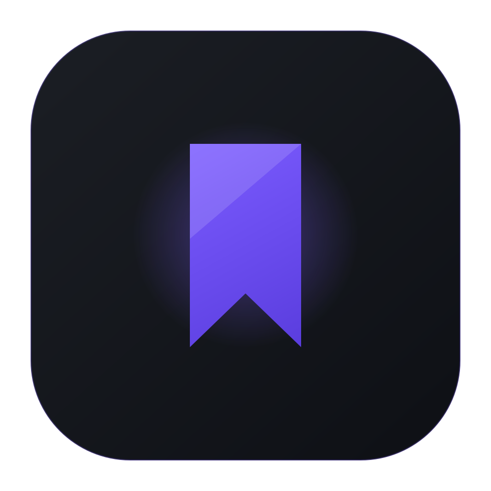
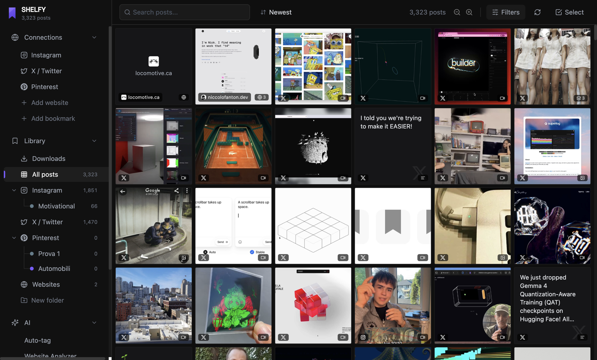
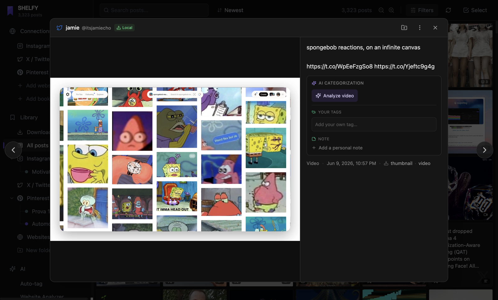
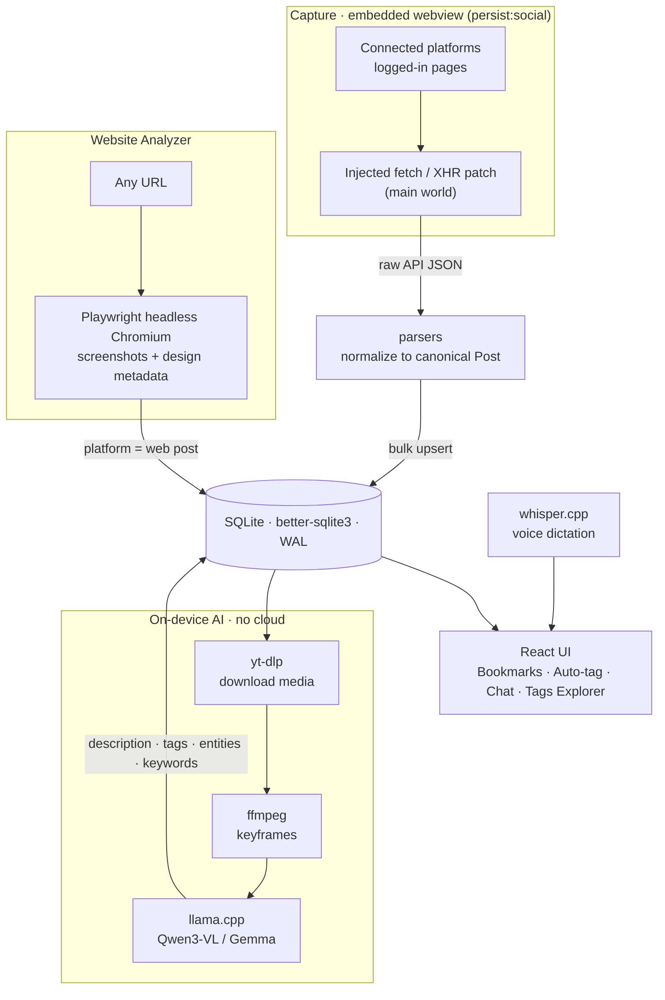

<div align="center">



# Shelfy

**Everything you save, finally findable. Archived, understood and searched on your own machine.**

Shelfy pulls the posts you've saved on social platforms (and any website you point it at) into a
private, local library, then enriches every item with an **on-device** vision-language model:
descriptions, tags, entities and search keywords. No cloud inference, no third-party API, no
telemetry — just scattered saves turned into a library you can actually search, filter and reason
about, entirely offline.

<p>
  
  
  
  
  
  <a href="LICENSE"></a>
  <a href="https://github.com/niccolofanton/shelfy/stargazers"></a>
</p>

**by Niccolò Fanton**

<p>
  <a href="https://niccolofanton.dev"></a>
  <a href="https://x.com/niccolofanton"></a>
  <a href="https://www.instagram.com/niccolofanton/"></a>
</p>

<sub>
  <a href="#highlights">Highlights</a> ·
  <a href="#screenshots">Screenshots</a> ·
  <a href="#connectors">Connectors</a> ·
  <a href="#website-analyzer">Website Analyzer</a> ·
  <a href="#features">Features</a> ·
  <a href="#install">Install</a> ·
  <a href="#getting-started">Getting started</a> ·
  <a href="#license">License</a>
</sub>

</div>

> [!IMPORTANT]
> Shelfy archives content **you** have personally saved in **your own** authenticated accounts, for
> **private, personal use only**. Automated access, interception of platforms' internal APIs, feed
> crawling and media downloading **may violate the Terms of Service** of the platforms involved and
> may get **your account suspended**. You are **solely responsible** for your use and for complying
> with each platform's terms and third-party rights. The software is provided **"as is", with no
> warranty and no liability**. **Not legal advice** — see **[DISCLAIMER.md](DISCLAIMER.md)** before
> you install or build.

## Highlights

- **100% on-device AI, no cloud, no Python.** A bundled `llama.cpp` server runs a quantized vision
  model (default Qwen3-VL 4B, four selectable models up to Gemma 4 12B) and auto-tags every saved
  item — images, carousels, videos (via `ffmpeg` keyframes) and text-only posts.
- **Passive, credential-free capture.** You log in inside a hardened embedded browser; Shelfy reads
  the platforms' own saved/bookmark API responses. No pixel scraping, no API keys, and your
  credentials never touch the app.
- **A real background-job engine.** Downloads, AI tagging and web captures run as persistent queues
  that survive crashes, resume automatically, and report through one Activity Center with progress,
  ETA and pause/resume/cancel/retry.
- **Hardware-adaptive and self-provisioning.** Shelfy probes your CPU/RAM/GPU, tunes the AI engine,
  picks a GPU build (CPU / CUDA / Vulkan / Metal) with automatic CPU fallback, and downloads the
  heavy binaries and models on first use — nothing bulky ships in the installer.

## Screenshots

<div align="center">



<sub>The unified library — every post you saved on Instagram, X, Pinterest and the web, in one filterable, searchable grid.</sub>

<br /><br />



<sub>Per-post detail with on-device AI categorization, your own tags and notes.</sub>

</div>

## Connectors

You sign in to each platform inside a hardened embedded browser, and Shelfy reads the platform's own
saved/bookmark API responses, normalizing them into canonical posts.

| Connector | What it captures | Status |
|-----------|------------------|--------|
| Instagram | Saved posts and saved folders (carousels expanded slide by slide, reels/videos) | Stable |
| X | Bookmarks timeline (author, text, image/video) | Stable |
| Pinterest | Board and section pins (standard, video, carousel, idea pins) | Best-effort¹ |

<sub>¹ Pinterest is fully wired end to end but tracks the platform's private internal endpoints, so
it is the most likely to need maintenance if those endpoints change.</sub>

## Website Analyzer

Websites are handled differently from social connectors: instead of reading a private API, Shelfy
renders and screenshots the live site. Paste a URL (with an optional page budget) and a gallery card
appears immediately while the pipeline runs in the background:

1. **Page discovery** — follows redirects, reads `robots.txt` and sitemaps (recursing index files
   and `.gz`), falls back to crawling, and ranks 5–8 representative pages (home, about, work,
   pricing, contact), locale-aware.
2. **Real-browser screenshots** — each page is shot full-page in a headless Chromium (Playwright)
   that renders WebGL/canvas, dismisses cookie banners, neutralizes scroll-jacking and waits out
   preloaders. Blank captures are detected and re-shot, with an `og:image` fallback.
3. **Deterministic enrichment** — extracts brand palette (with roles), typography (with provider),
   tech stack (Next.js, React, Webflow, Framer, Shopify, GSAP, Three.js, Vercel, Cloudflare) and
   award badges (Awwwards, CSS Design Awards, FWA). No AI required.
4. **AI pass** — the on-device vision model runs over the screenshots and adds a description, tags,
   a purpose and an industry.
5. **Timeline & version history** — a dedicated view streams every step; re-capturing a site
   archives the previous version into a dated snapshot.

## Features

Shelfy is organized into the sidebar views: **Sources** (capture), **Bookmarks** (the library),
**Downloads**, and the **AI** group (Auto-tag, Website Analyzer, Chat, Tags Explorer).

**Capture & import** — Sign in inside an Electron `<webview>` with a persisted, hardened session
(context isolation on, node integration off; navigation confined to an allow-list). An injected
script patches `fetch`/`XHR` in the page's main world and reads the saved/bookmark responses
directly. Auto-import auto-scrolls with hard ceilings (wall-clock, iteration and stall limits) and a
live HUD; a *Select* mode cherry-picks items, and JSON import brings in the companion
Chrome-extension export.

**Library (Bookmarks)** — Virtualized infinite-scroll masonry grid (2–6 columns) with hover previews
and per-card badges (platform, media type, offline-vs-link, AI state). Faceted filters plus a
debounced free-text search ranked with IDF-style relevance over captions, descriptions, tags and
keywords; AI suggested filter chips (AND/OR) appear as you type when a model is installed. Color-coded
collections (multi-membership), bulk actions with select-all-matching across pagination, a rich
detail modal, and library export to JSON.

**Downloads** — `yt-dlp` plus a queued HTTP downloader fetch thumbnails, full images (every carousel
slide) and videos, upgrading to original resolution. Global concurrency is capped and paced with an
SSRF guard on every request. A queue you control (live progress, per-row cancel/retry, Download
All / Missing / Pause / Resume / Clear) survives restarts and skips assets already on disk.

**On-device AI tagging (Auto-tag)** — A bundled `llama.cpp` server loads a quantized GGUF vision
model, queried over an OpenAI-compatible endpoint with **JSON-schema-constrained** output. Four
selectable models in Settings: Qwen3-VL 4B (default), Qwen3-VL 8B (recommended), Gemma 4 E4B and
Gemma 4 12B. Every item gets a description, general/specific tag tiers, entities, keywords, a
save reason and a detected language, via a live queue with parallel inference (1–10),
pause/resume/retry and restart recovery.

**Conversational search & voice (Chat)** — Describe what you want in natural language; a local chat
model proposes tags and keywords grounded in your archive's real vocabulary (so suggestions never
return zero results), driving a hybrid SQLite search. Degrades to deterministic matching with no
model present. Voice dictation runs on a local `whisper.cpp` server, fully offline.

**Tags Explorer** — Coverage stats, an entity index and a tag-health panel (untagged / rare /
orphan). Hybrid clustering from a co-occurrence graph (Jaccard) optionally fused with local text
embeddings (`multilingual-e5-small`), named with one LLM call and proposed for review. Synonym
folding and lexical near-duplicate merges rewrite tags across affected posts.

**Background jobs** — Downloads, AI tagging and web captures mirror every state change into a SQLite
`jobs` table; on boot they re-enqueue unfinished work and resume, and a paused queue stays paused
across restarts. A single Activity Center aggregates every background task with progress, ETA,
actions and a badge count.

## Install

> **Just want to use the app?** Download the latest build for your OS from
> **[⬇️ Releases](https://github.com/niccolofanton/shelfy/releases)** and follow the per-platform
> steps below. The builds are **not signed** with a paid certificate (Apple Developer ID / Windows
> code-signing), so each OS shows a **one-time warning** on first launch — the steps below clear it.
> This is a limit of free distribution, **not** a sign the app is unsafe. Full guide:
> **[docs/install.md](docs/install.md)**.

### macOS (Apple Silicon)

1. Download `SHELFY-<version>-arm64.dmg`, open it and drag **SHELFY** into **Applications**.
2. On first launch macOS blocks the app because it isn't notarized. You'll hit one of two messages:

   **“SHELFY Not Opened — Apple could not verify SHELFY is free of malware…”** (macOS 15 Sequoia and later):
   - Click **Done**, then open **System Settings → Privacy & Security**.
   - Scroll to the bottom and click **Open Anyway** next to the SHELFY notice, then authenticate
     with password / Touch ID. *(Do it right after the failed launch — the button only shows for a
     few minutes.)* You only need to do this once.
   - On older macOS (≤ 14) you can instead **right-click** (or Ctrl+click) SHELFY in Applications →
     **Open** → **Open**.

   **“SHELFY is damaged and can't be opened”:**
   - This is just Gatekeeper's *quarantine* flag on an ad-hoc-signed app. Clear it from Terminal:
     ```bash
     xattr -dr com.apple.quarantine /Applications/SHELFY.app
     ```
   - Then open the app normally. This command also works as a one-shot fix for the
     “could not verify” case above.

> AI features require **Apple Silicon (arm64)** — running under Rosetta/Intel isn't supported.

### Windows

1. Download and run `SHELFY-Setup-<version>.exe`.
2. **SmartScreen** may show *“Windows protected your PC”* because the installer isn't signed.
   Click **More info → Run anyway**. Only the first time.

> Windows updates are a local *self-rebuild* and need **Node.js 22+** installed on the PC — see
> **[docs/windows.md](docs/windows.md)**.

### Linux

1. Download `SHELFY-<version>-x86_64.AppImage`.
2. Make it executable and run it:
   ```bash
   chmod +x SHELFY-*.AppImage
   ./SHELFY-*.AppImage
   ```

> Linux has no in-app self-update yet: grab the new AppImage from **Releases** when a version ships.

Once installed, Shelfy keeps itself up to date from the GitHub Releases feed on **macOS and Windows**
(Settings → *Aggiornamenti*, Stable/Beta channel). See **[Auto-update](#auto-update)** for details.

## How it works



You log into a connected platform inside Shelfy's webview (or paste a URL into the Website Analyzer);
an injected script intercepts the platform's own API responses while the web engine renders and
screenshots arbitrary pages. Parsers normalize everything into canonical posts and bulk-upsert into
SQLite. On demand, media is downloaded, `ffmpeg` samples keyframes, and the local vision model tags
the item — then the React UI lets you browse, filter and search (by text or voice) offline.

## Tech stack

| Layer | Technology |
|-------|------------|
| Shell | Electron 31 (main / preload `contextBridge` / renderer) |
| UI | React 18 · Vite 5 · Tailwind CSS 3 · `@tanstack/react-virtual` |
| Storage | SQLite via `better-sqlite3` (WAL, foreign keys) |
| Media | `yt-dlp` · `ffmpeg` |
| Web capture | `playwright-core` (headless Chromium) |
| AI, vision | `llama.cpp` running Qwen3-VL / Gemma (GGUF) |
| AI, voice | `whisper.cpp` speech-to-text |
| AI, embeddings | `multilingual-e5-small` (tag clustering) |
| Updates | GitHub Releases feed (Windows self-rebuild · macOS `.dmg` · Linux AppImage) |
| Tests | Vitest (unit) · Playwright (e2e) |

## Getting started

> **Just want to use the app?** See **[Install](#install)** — grab a prebuilt binary from
> **[Releases](https://github.com/niccolofanton/shelfy/releases)** and clear the first-launch
> warning. The steps below are for **building from source**.

**Prerequisites:** Node.js 22+ and npm 10+.

```bash
npm install
npx electron-rebuild        # rebuild better-sqlite3 against Electron's ABI
npm run dev                 # Vite + Electron with hot reload (main auto-restarts)
```

### Sidecar binaries

In a **packaged** build, `yt-dlp`, `ffmpeg`, `llama-server` and `whisper-server` are provisioned
automatically into `<userData>/runtime-bin/` on first launch (Windows pulls them from upstream per
GPU variant; macOS pulls a single per-arch pack). In **development** you supply them yourself, or
point the app at existing binaries via `YTDLP_BIN`, `FFMPEG_BIN`, `LLAMA_SERVER_BIN`,
`WHISPER_SERVER_BIN`:

```bash
brew install yt-dlp                  # or set YTDLP_BIN
# llama.cpp: download build b9500 and place llama-server at .vlm/llama-b9500/llama-server,
#   or set LLAMA_SERVER_BIN (likewise WHISPER_SERVER_BIN for whisper.cpp).
```

On the first AI analysis Shelfy downloads the default Qwen3-VL model (~3.3 GB) from Hugging Face into
its data dir; tagging is unavailable until that finishes. Whisper and embedding models are downloaded
on first use from Settings.

> **macOS AI requires Apple Silicon (arm64).** The published mac binary pack is `darwin-arm64`;
> running the AI features under Rosetta/Intel is not supported.

### First run

1. Open a **Sources** tab and log into a connected platform in the embedded view.
2. Go to your Saved / Bookmarks; Shelfy auto-scrolls and captures posts as they load.
3. Switch to **Bookmarks** to browse; select posts to **download** media or run **Auto-tag**.
4. Try **Chat** to search by description or voice, and **Tags Explorer** to organize tags.
5. Paste a URL into the **Website Analyzer** to capture a site as a design reference.

## Building

**macOS** — `npm run build` → `release/SHELFY-<version>.dmg` (+ `.zip`), Apple Silicon. The build is
**ad-hoc signed** (`identity: "-"`), not Developer-ID signed or notarized (see
[Auto-update](#auto-update) for the Gatekeeper first-launch note).

**Windows** — native modules can't be cross-compiled from macOS, so build on Windows. The installer
is lightweight (sidecar binaries are fetched at runtime) and native deps use prebuilts (no Visual
Studio). Day-to-day Windows *updates* don't need a Windows build at all (see below).

```powershell
.\build-windows.ps1                  # → release\SHELFY-Setup-<version>.exe
.\build-windows.ps1 -Version X.Y.Z   # build a specific version
```

See **[docs/windows.md](docs/windows.md)** for the full guide.

## Auto-update

Shelfy updates itself from a public **GitHub Releases** feed, polled every 60s. State surfaces via a
non-intrusive toast and in *Settings → Aggiornamenti* (`electron/updater.ts`). All artifacts are
**sha512-verified**, the updater refuses any non-HTTPS feed, and two channels (**Stable**, **Beta**)
are persisted by the main process.

- **macOS** downloads the new `.dmg` in-app (verified), opens it, and asks to quit so the app can be
  replaced in `/Applications` (no Squirrel auto-install — that would require notarization).
- **Windows** publishes only the *source*: the client downloads it, finds a usable Node 22+ (fnm /
  nvm-windows / volta / scoop / system), rebuilds a lightweight NSIS installer locally and runs it.
- **Linux** AppImage has no in-app self-replace: Shelfy reads `latest-linux.yml` and points you to
  the Releases page to download the new build.

Releasing is **tag-driven via GitHub Actions** (`.github/workflows/release.yml`): pushing a version
tag builds every OS and publishes a *draft* GitHub Release.

```bash
npm version patch        # bump package.json + create tag vX.Y.Z
git push --follow-tags   # CI builds + publishes the draft; click Publish to ship
```

Full details (Gatekeeper workaround, Windows self-rebuild) are in **[docs/install.md](docs/install.md)**,
**[docs/architecture.md](docs/architecture.md)** and **[docs/windows.md](docs/windows.md)**.

## Data & privacy

Shelfy is **local-first** with **no analytics or telemetry**. Your social session, the database
(`shelfy.sqlite`), downloaded media and all AI models live under the app's data directory, and every
inference (vision, speech-to-text, embeddings) runs on your machine — your saved content never
reaches a Shelfy or third-party server. The only outbound calls are the ones it needs to function:
loading the connected platforms (where *you* log in) and their CDNs, a one-time download of binaries
and models from Hugging Face/GitHub, and polling the GitHub Releases feed.

Hardening includes an SSRF guard, a restrictive renderer CSP, host allow-listing for the social
webview, a sandboxed `asset://` protocol confined to the data dir, and integrity-verified
update/binary artifacts.

> **Security note:** your logged-in social session is persisted on disk (`persist:social`). Treat the
> app's data directory like a credential store; anyone with access to it could reuse your session.

## Documentation

Full docs live in **[docs/](docs/README.md)**:

- [docs/architecture.md](docs/architecture.md) — process model, IPC contract, modules, pipelines, auto-update.
- [docs/install.md](docs/install.md) — install & first-launch unlock (macOS / Windows / Linux).
- [docs/windows.md](docs/windows.md) — Windows build & self-rebuild updates.
- [CONTRIBUTING.md](CONTRIBUTING.md) — dev setup, quality commands, commit conventions.
- [CHANGELOG.md](CHANGELOG.md) — release history.

## Testing & quality

```bash
npm run test:run  # Vitest once (npm test = watch)
npm run test:e2e  # Playwright e2e
npm run lint      # ESLint
npm run typecheck # tsc --noEmit
```

The repo also ships measurable AI evaluation harnesses (`npm run eval:search` / `eval:extract` /
`eval:cluster` / `eval:capture`). See [CONTRIBUTING.md](CONTRIBUTING.md) for the full workflow and
known pre-existing test failures.

## Roadmap

- TikTok capture (Instagram, X and Pinterest are implemented today)
- Vector/semantic search over posts (embeddings currently power tag clustering only)
- Export / backup tooling beyond JSON

## Author

Built by **Niccolò Fanton** — [niccolofanton.dev](https://niccolofanton.dev) ·
[X](https://x.com/niccolofanton) · [Instagram](https://www.instagram.com/niccolofanton/).

## License

Shelfy is released under the **[Apache License 2.0](LICENSE)** — free to use, modify and
redistribute under its terms. Third-party components Shelfy bundles or downloads at runtime (ffmpeg,
yt-dlp, llama.cpp, whisper.cpp, Playwright, and the AI model weights) keep their own licenses; see
[THIRD-PARTY-NOTICES.md](THIRD-PARTY-NOTICES.md). Note in particular that the bundled/downloaded
**ffmpeg** binary is distributed under the GPL/LGPL and that some model weights (e.g. Gemma) are
covered by their own non-OSI usage terms.

## Disclaimer

> **This is not legal advice.** The summary below does not replace the full terms in
> **[DISCLAIMER.md](DISCLAIMER.md)** (EN/IT), which govern your use of the software.

Shelfy is a local-first, single-user personal archiving tool for content **you** have personally
saved in **your own authenticated accounts**. It is **not** for collecting anyone else's data, nor
for any commercial, bulk, or redistribution purpose.

- **Platform terms.** Automated access, interception of internal APIs, feed crawling and media
  downloading **may violate** the Terms of Service of the platforms involved and may result in
  **suspension of your account**. You are solely responsible for complying with them.
- **Copyright & IP.** Captured content belongs to its rights holders. You are solely responsible for
  ensuring your copying, storage and use of third-party content is lawful.
- **Privacy / GDPR.** Captured content may contain third parties' personal data. Purely personal,
  local use typically falls under the GDPR household exemption; professional or published use does
  not, and makes **you** the data controller.
- **No warranty, no liability.** The software is provided **"as is"**. To the maximum extent
  permitted by law, the author accepts **no liability** for any claim, damage, account action or
  loss arising from your use.
- **No affiliation.** Shelfy is independent and **not affiliated with, endorsed by, or sponsored by**
  any platform. All trademarks belong to their respective owners.

By installing, building or using Shelfy you accept the full terms in
**[DISCLAIMER.md](DISCLAIMER.md)**. If you do not agree, do not install or use it.
