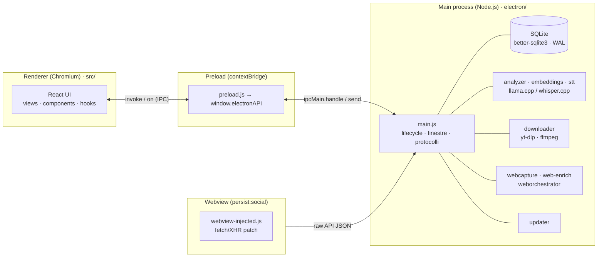
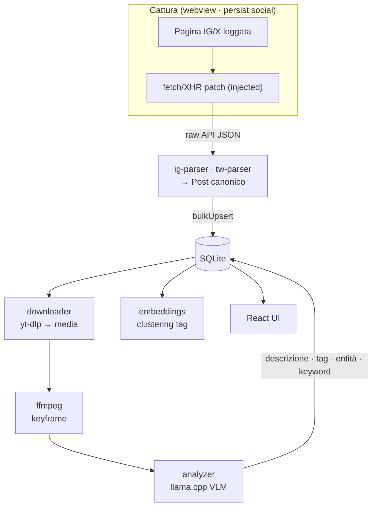

# Architettura

Shelfy è un'app desktop **Electron + React** che cattura i tuoi post salvati su
Instagram / X (e siti web come reference), li normalizza in un database SQLite
locale e li arricchisce con **AI on-device** (vision tagging, embeddings,
trascrizione). Tutto è **local-first**: nessuna inferenza cloud, nessuna
telemetria.

Questo documento descrive il modello a processi, il contratto IPC, i moduli e le
pipeline. Per build/rilascio Windows vedi [windows.md](windows.md); per il README
introduttivo vedi [../README.md](../README.md).

---

## Modello a 3 processi

Come ogni app Electron, Shelfy gira su tre tipi di processo con confini di
sicurezza netti:



- **Main** (`electron/`, CommonJS, Node.js completo): possiede il database, i
  filesystem, lo spawn dei server AI e dei binari sidecar, la rete, l'updater.
  È l'unico processo con privilegi.
- **Preload** (`electron/preload.js`): gira in un contesto isolato e, via
  `contextBridge.exposeInMainWorld`, espone al renderer **solo** un oggetto
  `window.electronAPI` con metodi tipizzati. Il renderer **non** ha accesso a
  Node né a `ipcRenderer` diretto.
- **Renderer** (`src/`, ESM, React 18 + Vite): solo UI. Ogni operazione
  privilegiata passa per `window.electronAPI`.
- **Webview** (`persist:social`): un `<webview>` Chromium con sessione persistita
  dove l'utente fa login su Instagram/X. Uno script iniettato
  (`webview-injected.js`) intercetta le risposte API della piattaforma e le
  inoltra al main.

---

## Contratto IPC (`window.electronAPI`)

Il renderer comunica col main **solo** attraverso `window.electronAPI`, definito
in [`electron/preload.js`](../electron/preload.js) e implementato in
[`electron/ipc.js`](../electron/ipc.js). Due forme:

- **Request/response**: `preload` chiama `ipcRenderer.invoke('canale', args)` →
  `ipcMain.handle('canale', …)` in `ipc.js` esegue e ritorna una Promise.
  Es. `getPosts`, `analyze:enqueue`, `search:suggest`, `createCollection`,
  `web:add`.
- **Push main→renderer**: il main fa `webContents.send('canale', payload)` e il
  preload espone un subscribe `onXxx(cb)` che registra/pulisce il listener. Es.
  `onAnalyzeProgress`, `onDownloadProgress`, `onWebProgress`,
  `interceptor:newPosts`, `updater:state`.

Gli hook in `src/hooks/` incapsulano queste chiamate (un hook per dominio:
`usePosts`, `useDownloads`, `useAnalysis`, `useAiTags`, `useAiSearch`,
`useWebJobs`, `useCollections`, `useActivity`, `useDictation`).

---

## Moduli principali

### Main process — `electron/`

| Modulo | Ruolo |
|--------|-------|
| `main.js` | Lifecycle app, creazione finestra, protocollo `asset://`, hardening dei webContents. |
| `ipc.js` | Tutti gli `ipcMain.handle` / `send`: la superficie IPC server-side. |
| `preload.js` | `contextBridge` → `window.electronAPI` (l'unico ponte renderer↔main). |
| `interceptor.js` | Configura la sessione `persist:social` del webview: partizione, permessi (allowlist minima), header. |
| `webview-injected.js` / `webview-preload.js` / `webview-select.js` | Script iniettati nel webview: patch fetch/XHR, bridge verso il main, selezione/auto-scroll. |
| `ig-parser.js` / `tw-parser.js` | Normalizzano il payload Instagram / X nel `Post` canonico (incl. propagazione campi AI in import/export). |
| `db.js` | Schema SQLite (WAL, FK), migrazioni idempotenti, query, upsert, ricerca ibrida, analytics e clustering tag. |
| `downloader.js` | Coda yt-dlp + ffmpeg per scaricare thumbnail/immagini/video (con pausa/retry). |
| `analyzer.js` | Pipeline VLM: keyframe via ffmpeg → `llama-server` (Qwen3-VL) → descrizione/tag/entità/keyword/save_reason. |
| `embeddings.js` | Embedding di testo locali (multilingual-e5-small via `llama-server --embedding`) per il clustering tag. |
| `stt.js` | Speech-to-text locale (whisper.cpp) per la dettatura delle ricerche. |
| `serverUtils.js` | Helper condivisi per spawn dei server di modello + download pesi. |
| `hardware.js` | Probe HW (RAM/core/GPU/VRAM) + flag adattivi per llama/whisper (con override in Settings). |
| `binaries.js` | Provisioner runtime: scarica yt-dlp/ffmpeg/llama/whisper in `<userData>/runtime-bin/`. |
| `net-safety.js` | Guard SSRF condivisa: blocca loopback/link-local/privati prima di ogni richiesta o navigazione. |
| `webcapture.js` | Cattura web: discovery sitemap/crawl + screenshot full-page via BrowserWindow offscreen. |
| `web-enrich.js` | Arricchimento web: estrazione contenuti/meta, palette/font/tech stack, awards. |
| `weborchestrator.js` | Coda async dei job web (placeholder-first: post grezzo subito, arricchimento in background). |
| `updater.js` | Auto-update in-app (vedi sotto). |
| `logger.js` | Logger su file (`<userData>/logs/main.log`), per diagnosticare build pacchettizzate. |

### Renderer — `src/`

- **`App.jsx` / `main.jsx`** — router a stato con keep-alive delle viste.
- **`views/`** — `Browser` (login + cattura webview), `Gallery` (griglia +
  filtri + ricerca), `Downloads`, `AiTags` / `AiTagsQueue` (dashboard tag),
  `AiSearch` (ricerca NL), `AiWebsites` (job di cattura siti), `Settings`.
- **`components/`** — `Sidebar`, `ActivityCenter`, `PostCard`,
  `VirtualPostGrid` (griglie virtualizzate), `PostModal`, `FilterBar`,
  `Popover` (menu via portal), `Chip`, `AddSiteModal`, modali di
  collection/import, `Logo`, `PostGridSkeleton`.
- **`hooks/`** — un hook per dominio IPC (vedi sopra).
- **`lib/`** — `asset.js` (URL `asset://`), `duration.js`, `dictation/`.
- **`index.css`** — token + utility di motion condivise (`.u-*`); niente
  framer-motion.

---

## Pipeline cattura → parse → DB → AI



1. L'utente fa login su Instagram/X nel webview (`persist:social`).
2. Mentre scorre il feed Saved/Bookmarks, lo script iniettato intercetta le
   risposte API della piattaforma e le manda al main.
3. I parser le normalizzano in `Post` e fanno bulk-upsert in SQLite.
4. Su richiesta: il downloader scarica i media, ffmpeg campiona i keyframe, il
   VLM locale produce descrizione/tag/entità/keyword/save_reason → salvati nel DB
   (con resync di `post_tags`/`post_entities` e canonicalizzazione `tag_alias`).
5. Gli embeddings alimentano il clustering dei tag; la UI naviga/filtra/cerca
   offline.

**Siti web come reference** seguono la stessa spina dorsale: un sito è un nuovo
`source` con `platform='web'`, non un prodotto separato. `weborchestrator`
crea subito il post grezzo, poi `webcapture`/`web-enrich` lo arricchiscono e
`analyzer` lo tagga, riusando `posts`/`post_tags`/Gallery/ricerca.

---

## Auto-update

La logica è in [`electron/updater.js`](../electron/updater.js); il feed è su
**GitHub Releases** (provider `generic`, URL `…/releases/latest/download`),
pollato ogni 60s. Lo stato è esposto al renderer via `updater:state` (toast +
*Impostazioni → Aggiornamenti*). Due canali — **stable** / **beta** —
persistiti in `update-channel.json` (beta → canale `beta` nella gerarchia
electron-builder). Il canale beta legge da un tag rolling
`…/releases/download/beta` (le pre-release non risolvono come `latest`).

Il meccanismo differisce per piattaforma perché né un `.app` macOS né un `.exe`
Windows con moduli nativi si cross-compilano dal Mac:

- **macOS** — build **ad-hoc signed** (non notarizzata): niente Squirrel
  auto-install. L'updater legge `latest-mac.yml` / `beta-mac.yml`; se c'è una
  versione più nuova scarica il `.dmg` in-app (sha512), lo apre e chiede di
  uscire per sostituire `/Applications/SHELFY.app`.
- **Windows** — **self-rebuild**: l'updater legge `source.json`
  (`{version, zip, sha512}`), scarica il source zip (sha512-verificato), lo
  estrae in `<userData>/rebuild/` e lancia `build-windows.ps1` per ricompilare
  un installer NSIS leggero, poi lo esegue per aggiornarsi in place. Serve
  Node.js 20+ (localizzato anche sotto fnm/nvm/volta/scoop). Dettaglio in
  [windows.md](windows.md).
- **Linux** — l'AppImage non si auto-sostituisce mentre gira: l'updater legge
  `latest-linux.yml` / `beta-linux.yml` e, se c'è una versione più nuova, mostra
  un avviso "manuale" che apre la pagina **Releases** nel browser (l'utente
  scarica la nuova AppImage).

### Rilascio

Il rilascio è **tag-driven via GitHub Actions**
([`.github/workflows/release.yml`](../.github/workflows/release.yml)): un tag
`vX.Y.Z` scatena la build nativa su ogni OS (macOS arm64 `.dmg`/`.zip`, Linux
AppImage), genera il feed sorgente Windows (`scripts/make-source-feed.mjs` →
`source.json` + `SHELFY-src-<ver>.zip`) e i mini-pack sidecar mac/Linux
(`scripts/make-binary-packs.mjs` → `binaries.json`), poi pubblica una **GitHub
Release** con tutti gli artefatti.

```bash
npm version patch                     # bump + tag vX.Y.Z (stable, release in DRAFT)
npm version prerelease --preid beta   # bump + tag vX.Y.Z-beta.N (beta, pre-release rolling)
git push --follow-tags
```

Una release **stable** nasce come *draft* (la rivedi e poi "Publish"); una
**beta** (tag pre-release) va su un tag rolling `beta`. Niente più infra
Cloudflare R2 né credenziali: gli asset stanno su GitHub.

---

## Dati e sessioni

Tutto vive sotto la `userData` dell'app (vedi `electron/binaries.js` /
`updater.js` per i percorsi):

- `shelfy.sqlite` — il database (WAL).
- `Partitions/social/` — la sessione webview persistita (`persist:social`):
  contiene i cookie di login IG/X. **Trattala come un credential store.**
- `runtime-bin/` — binari sidecar scaricati (yt-dlp/ffmpeg/llama/whisper).
- `models/` — pesi dei modelli AI (VLM ~3 GB, embedder, whisper).
- `rebuild/` — (Windows) source + log del self-rebuild.
- `logs/main.log` — log del main process.

---

## Test

Vedi [../CONTRIBUTING.md](../CONTRIBUTING.md) per i comandi. In breve: **Vitest**
per unit (`tests/`, escludi gli e2e con `npx vitest run tests/`), **Playwright**
per e2e (`npm run test:e2e`). I file Electron sono CommonJS: validazione rapida
con `node --check <file>`. Gli **harness di valutazione** AI vivono in
`scripts/*/README.md`:
[search-eval](../scripts/search-eval/README.md) (retrieval),
[extract-eval](../scripts/extract-eval/README.md) (estrazione tag/keyword),
[cluster-eval](../scripts/cluster-eval/README.md) (clustering tag).
