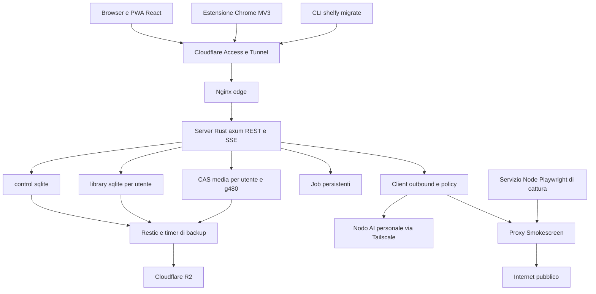

# Shelfy handoff completo del porting web e del motore AI

**Data di riferimento:** 3 ottobre 2026. **Fuso orario:** Europe/Rome, UTC+2. **Destinatario:** chi riprende lo sviluppo di Shelfy dopo l'interruzione di Claude Code. **Redazione:** Codex, da sessioni locali, documentazione e stato Git.

Il porting ha una libreria web già utilizzabile e una prima produzione registrata su `refs.niccolofanton.dev`. La libreria personale è stata migrata e i backup verificati. Una parte consistente del lavoro successivo è integrata nel ramo `/Users/fant/work/experiments/shelfy-web-local/integration/web/foundations`, ma non nell'ultima release registrata, `server-v0.1.0-rc.5`.

**La priorità lasciata aperta è completare P3-13, verificare la qualità dell'harness AI, distribuire il motore e avviare il tagging degli import Instagram reali. Il tagging non è stato avviato.** Il lavoro parziale è ancora presente, senza commit, nel worktree `agent-a2e92bf18a78302bf`. L'agente si è fermato il 3 ottobre alle 16:12 per HTTP 429 e limite settimanale di Claude.

Questo documento ricostruisce il lavoro del 2 e 3 ottobre, separa implementazione, test e deploy, conserva le decisioni che hanno sostituito il piano iniziale e indica esattamente cosa manca per riprendere. L'incarico di redazione non ha modificato il codice applicativo, effettuato deploy o avviato analisi sui dati personali.

## Indice

- [0 Aggiornamento della ripresa](#0-aggiornamento-della-ripresa--3-ottobre-stato-corrente)
- [1 Stato da conoscere prima di riprendere](#1-stato-da-conoscere-prima-di-riprendere)
- [2 Fonti e significato degli stati](#2-fonti-e-significato-degli-stati)
- [3 Obiettivo del prodotto e decisioni da preservare](#3-obiettivo-del-prodotto-e-decisioni-da-preservare)
- [4 Checkout directory e artefatti locali](#4-checkout-directory-e-artefatti-locali)
- [5 Architettura realizzata e confini del porting](#5-architettura-realizzata-e-confini-del-porting)
- [6 Cronologia del lavoro](#6-cronologia-del-lavoro)
- [7 Lavoro precedente sul desktop e website analyzer](#7-lavoro-precedente-sul-desktop-e-website-analyzer)
- [8 P0 completata e prima libreria web](#8-p0-completata-e-prima-libreria-web)
- [9 P1 libreria web auth backup e distribuzione](#9-p1-libreria-web-auth-backup-e-distribuzione)
- [10 P2 sync social estensione e archiviazione](#10-p2-sync-social-estensione-e-archiviazione)
- [11 P3 AI condivisa provider benchmark e stato del tagging](#11-p3-ai-condivisa-provider-benchmark-e-stato-del-tagging)
- [12 P4 siti video import quote e cattura](#12-p4-siti-video-import-quote-e-cattura)
- [13 UI mobile audit e miglioramenti](#13-ui-mobile-audit-e-miglioramenti)
- [14 Punto esatto di interruzione di P3-13](#14-punto-esatto-di-interruzione-di-p3-13)
- [15 CI verifiche prestazioni e limiti dei risultati](#15-ci-verifiche-prestazioni-e-limiti-dei-risultati)
- [16 Backlog di problemi residui](#16-backlog-di-problemi-residui)
- [17 Sequenza concreta per riprendere](#17-sequenza-concreta-per-riprendere)
- [18 Comandi e convenzioni per chi riprende](#18-comandi-e-convenzioni-per-chi-riprende)
- [19 Incongruenze dei registri da correggere nella ripresa](#19-incongruenze-dei-registri-da-correggere-nella-ripresa)
- [20 Attività collaterali della sessione](#20-attività-collaterali-della-sessione)
- [21 Criteri di consegna per il prossimo responsabile](#21-criteri-di-consegna-per-il-prossimo-responsabile)
- [Appendice A Fonti da aprire](#appendice-a-fonti-da-aprire)
- [Appendice B Inventario completo delle schede di fase](#appendice-b-inventario-completo-delle-schede-di-fase)
- [Appendice C Commit integrati del porting](#appendice-c-commit-integrati-del-porting)

## 0 Aggiornamento della ripresa — 3 ottobre, stato corrente

Le sezioni successive conservano la ricostruzione dell'interruzione di Claude. **Questo aggiornamento prevale sui loro stati storici.** Il registro operativo aggiornato è [EXECUTION](/Users/fant/work/experiments/shelfy-web-local/integration/docs/web-port/EXECUTION.md); l'evidenza della ripresa è nel [tracking corrente](/Users/fant/work/experiments/shelfy-web-local/integration/docs/web-port/reports/continuation-2026-10-03.md).

| Voce | Aggiornamento verificato |
|---|---|
| Foundation | Aggiornata da `86b5ab6` a `abdd810`; ripresa locale e P2-14/F22/F20 integrati fino a `cc4f594` |
| P3-13 | I 17 file sono nel commit `68c6c59`, pubblicato sul branch `web/p3-13-ai-drain` alle 18:02; il problema del trasporto è risolto |
| Ripresa del motore | Lane Codex `codex/p3-13-resume`, worktree `/Users/fant/.codex/worktrees/p3-13-resume/shelfy`, partial preservato e rebased (`bbefe84`); implementazione in corso |
| Fix chiusi nel codice | F8, F10, F12, F15, F16, F19 |
| Funzioni aggiunte | P2-12 Connections e P2-13 controller di sync; UX-4 card e UX-6 Trash/Jobs |
| F12 dati live | Il bug di migrazione è corretto; il singolo sito già migrato richiede ancora backfill, anche nel mock se applicabile |
| F21 | Codice pronto `6f651ac`; scope library read/write verificati. Integrazione attende control 0005 exports di P4-11 prima della control 0006 library_tokens |
| X4 | Audit e UX-1/2/3/4/5/6 conclusi nel codice; UX-0 recuperata e in verifica locale; UX residue aperte |
| E19 | L'utente autorizza nuovamente la prosecuzione con agenti in parallelo; supera l'attesa per nuove lane di E18 |
| E20 e cloud | Il proprietario conferma i crediti Claude esauriti e chiede la ripresa di tutte le lane da Codex; recuperati i branch pubblicati P2-14 e UX-0, gli altri task entrano nella coda locale |
| P2-14/F22 | API task estensione e upload integrate `30b4e97`; leaseId obbligatorio e fence finale, 64 test mirati verdi |
| F20 | Fix CI integrato `cc4f594`: 92 probe SSRF e 38 test video verdi; CI remota da rieseguire |
| E21 | Limite alzato a 10 subagenti, runtime verificato dopo riavvio; nuove lane GPT-6.1 Sol / high |
| E22 | Priorità ribadita: migliorare harness tagging e poi avviarlo su tutti i salvati Instagram del profilo proprietario |
| X1 benchmark | Due prove iniziali escluse dal confronto per bug del runner; ripetizione con preflight media corretto, nessun falso gate di qualità dichiarato |
| Release e tagging | Nessun nuovo deploy o run massivo dimostrato da questi aggiornamenti; rc.5 rimane l'ultima release registrata |

L'[inventario completo delle implementazioni](/Users/fant/work/experiments/shelfy-web-local/integration/docs/web-port/reports/implementation-inventory-2026-10-03.md) elenca ogni scheda: 51 integrate, 16 pending, 47 da fare e una eliminata, più i follow-up e le attività fuori fase. Il vecchio 46% non viene usato per stimare la consegna.

## 1 Stato da conoscere prima di riprendere

| Area | Stato al momento dell'handoff | Conseguenza operativa |
|---|---|---|
| Checkout principale | `/Users/fant/work/experiments/shelfy`, ramo `dev`, commit `60d569d` | Contiene il desktop e il primo piano; non contiene il porting integrato |
| Porting integrato | `/Users/fant/work/experiments/shelfy-web-local/integration`, ramo `/Users/fant/work/experiments/shelfy-web-local/integration/web/foundations`, commit `86b5ab6` | È il checkout da usare per il server, la SPA e la documentazione aggiornata |
| Motore AI parziale | `/Users/fant/work/experiments/shelfy/.claude/worktrees/agent-a2e92bf18a78302bf`, ramo `/Users/fant/work/experiments/shelfy-web-local/integration/web/p3-13-ai-drain` | Recuperare qui le modifiche; non ricominciare da zero e non eliminare il worktree |
| Ultima release server registrata | `server-v0.1.0-rc.5`, commit `58d3e2c` | È la versione indicata dai log e dal pin IaC locale; la produzione non è stata interrogata di nuovo per questo handoff |
| Release successiva | `rc.6` non taggata nelle ref locali; CI bloccata da F20 | Non dichiarare distribuiti i miglioramenti successivi a rc.5 |
| Libreria personale migrata | 6.138 post, 5.379 oggetti, 980,9 MiB | Migrazione riconciliata e restore drill positivo secondo il rapporto P1-25 |
| Account demo | `mock@shelfy.test`, 500 post | Disponibile nei log per automazione e prove; il collaudo completo è ancora da fare |
| AI server | Adattatori e servizio P3-09 integrati | Manca la catena completa che legge i post, chiama il provider e salva i tag |
| Nodo personale | Qwen per visione, Ornith per testo, Whisper per STT | Usarlo con pacing conservativo e proteggere Hermes |
| Desktop come client SaaS | Decisione approvata, X5 non implementato | La build desktop aggiornata continua a usare la propria libreria locale |
| Test interattivo finale | X3 non eseguito | Le suite esistenti non certificano tutte le 381 funzionalità |
| Test di sicurezza finale | X7 non eseguito | Le verifiche authz e SSRF già fatte coprono componenti specifici |

**Identità Git verificate localmente:**

- `dev`: `60d569d0ed1c92615047aa04d4adbc20fa671206` (abbreviato `60d569d`).
- `/Users/fant/work/experiments/shelfy-web-local/integration/web/foundations` e la ref locale `origin/web/foundations`: `86b5ab6e4ac11d1860ee10ec1423e18aaf558008`.
- HEAD del worktree P3-13: lo stesso `86b5ab6`; tutto il suo contributo è nel working tree.
- 386 commit in `dev..web/foundations` e 37 commit in `server-v0.1.0-rc.5..web/foundations` al rilevamento.
- La coincidenza con `origin/web/foundations` è una verifica delle ref locali, senza nuovo fetch.

## 2 Fonti e significato degli stati

Le fonti principali sono elencate nell'appendice. Per orientarsi, leggere prima il [registro di esecuzione del checkout integrato](/Users/fant/work/experiments/shelfy-web-local/integration/docs/web-port/EXECUTION.md), poi il [piano operativo](/Users/fant/work/experiments/shelfy-web-local/integration/docs/web-port/IMPLEMENTATION-PLAN.md) e la scheda della fase interessata.

| Etichetta usata | Significato |
|---|---|
| Verificato nel checkout | File, diff, ref Git o configurazione letti durante questo handoff |
| Integrato | Il contributo è nel ramo `/Users/fant/work/experiments/shelfy-web-local/integration/web/foundations`; non implica che sia distribuito |
| Test riportato | Esito contenuto in un report di lane o nella sessione, con il suo perimetro e momento |
| Distribuito nei log | Esiste una registrazione di deploy e una release coerente; non è un nuovo controllo live |
| Parziale | Modifiche recuperabili, con integrazione, test o componenti ancora mancanti |
| Da fare | Nessun completamento dimostrato dalle fonti consultate |

La sessione principale è `42b907b5-92d3-4271-acdc-07872a1a52c1`: inizia il 2 ottobre alle 09:50 e contiene anche il lavoro notturno e del 3 ottobre. Nell'ultima lettura contiene un heartbeat delle 17:20 del 3 ottobre che incontra ancora il limite settimanale. La sessione precedente `dab0be00-4765-45e3-84d6-cf120f54c937`, dalle 09:39 alle 12:38 del 2 ottobre, documenta l'integrazione del nodo remoto e il rifacimento del website analyzer desktop.

Nel contenitore della sessione principale sono presenti 95 trascrizioni di subagent. I messaggi principali includono report di completamento, revisioni, blocchi e riprese. Alcuni messaggi sono ripetuti dopo la compattazione: non contare due volte lo stesso report o lo stesso task.

I numeri di test riportati crescono durante le integrazioni: non vanno sommati. Un report di lane dimostra le verifiche di quel contributo su quel commit, non una certificazione unica di tutti i checkout successivi. Nessuna suite applicativa è stata rieseguita per la sola redazione dell'handoff.

## 3 Obiettivo del prodotto e decisioni da preservare

L'utente ha chiesto il porting di tutte le funzionalità praticabili dell'app Electron sul proprio VPS Hetzner, evitando dipendenze applicative da un singolo vendor. Rust è stato scelto per massimizzare la capacità del piccolo VPS. La cattura siti resta in Node e Playwright per riusare il motore esistente. Cloudflare è il livello di accesso e rete, non il backend applicativo.

L'indice iniziale contiene **381 funzionalità**: dati e IPC 58, sync e download 60, AI 63, siti e import 64, shell e UI 136. La superficie Electron inventariata è di 155 invoke e 15 push. I social realmente implementati sono Instagram, X e Pinterest.

### 3.1 Decisioni dell'utente che prevalgono sul piano iniziale

| Decisione | Vincolo vigente |
|---|---|
| E1 | Spike e misure sul VPS osn esistente, con limiti di risorse; nessun server temporaneo a pagamento |
| E2 | Deploy, restart e configurazione del VPS già autorizzati nella sessione storica; Hermes deve continuare a funzionare |
| E3 | Estensione caricata unpacked; niente pubblicazione sul Chrome Web Store per ora |
| E4 | Uso riservato al proprietario; niente inviti o beta aperta |
| E5 | Host pubblico `refs.niccolofanton.dev` |
| E6 | Account mock sul sito live con circa 500 post personali campionati; automazione autorizzata su questo account |
| E7 ed E10 | Il desktop diventa esclusivamente client del server, mantiene il modello AI locale e sostituisce il client precedente; pubblicare la release desktop resta un passo del proprietario |
| E8 | Migliorare mobile e qualità UX/UI senza stravolgere il prodotto |
| E9 | Si può svegliare il nodo AI tramite il percorso previsto quando serve ai test |
| E11 poi E14 | L'analisi finale si estende da References a tutti i post della libreria, dopo la messa a punto AI; segue il collaudo interattivo completo sul mock |
| E12 | MCP Shelfy locale, trasporto stdio, token API con scope limitati, per Claude Code e Claude Desktop |
| E13 | Tolta la settimana di uso quotidiano come criterio di uscita della P1 |
| E15 | Priorità esplicita a finire tag engine, migliorare harness, verificare gold set, distribuire e lanciare gli import IG reali anche dopo il tetto di budget di Claude |

**E15 è datata erroneamente 2026-10-04 nel registro:** richiesta, commit `86b5ab6` e avvio della lane appartengono al 3 ottobre. L'eccezione riguarda quella catena di lavoro; non dimostra un nuovo consenso a spese o nuove ondate indiscriminate.

La richiesta generale E14 su tutti i post resta l'obiettivo finale. L'ultima richiesta operativa restringe la prima passata urgente agli import Instagram reali. Il motore P3-13 in costruzione è sociale; il catalogo dei siti web richiede anche P3-27 e il percorso di cattura P4. Non trasformare il primo lancio IG in una dichiarazione di classificazione completata su tutta la libreria.

### 3.2 Decisioni tecniche principali

- Autenticazione deny by default, con registri espliciti di route pubbliche e bearer.
- Magic link nel fragment `#token`, riscattato con POST dopo un'azione; niente GET che autentica.
- Passkey con user verification, credenziali discoverable e recent auth di cinque minuti per operazioni sensibili.
- `CF-Connecting-IP` fidato solo dai proxy configurati; IPv6 rate limit per /64.
- Un solo client outbound, con allowlist, limiti, breaker e integrazione del proxy SSRF.
- Uno stesso percorso tus per migrazione, sessioni e token, con registry dei purpose.
- Quote e prenotazioni prima di archiviare byte; il drain non può oltrepassarle.
- Nodo AI operatore definito da env e segreti osn; URL inseriti dall'utente restano soggetti alle regole SSRF restrittive.
- Con `--parallel 1` sul nodo, Shelfy invia una richiesta per volta; aumentare il parallelismo solo dopo verifica della capacità del nodo.
- Le richieste vengono raggruppate per modello perché il cambio Qwen/Ornith provoca un caricamento.
- Il progetto desktop sul Rust locale via napi-rs, previsto dal vecchio P6, è stato sostituito da X5, client SaaS.

## 4 Checkout directory e artefatti locali

| Percorso assoluto | Contenuto e uso |
|---|---|
| `/Users/fant/work/experiments/shelfy` | Repo principale sul ramo desktop `dev`; contiene il documento di handoff |
| `/Users/fant/work/experiments/shelfy-web-local/integration` | Worktree di integrazione del porting |
| `/Users/fant/work/experiments/shelfy/.claude/worktrees/agent-a2e92bf18a78302bf` | Unico worktree di lane ancora elencato insieme ai due checkout principali; P3-13 sporco |
| `/Users/fant/work/experiments/shelfy-web-local/ref` | Snapshot privato della libreria desktop e dati di riferimento, fuori dal repo |
| `/Users/fant/work/experiments/shelfy-web-local/bench40` | Campione AI, media, keyframe, trascrizioni, `gold.json`, `gold-notes.json`, `gold/01.json` fino a `40.json` |
| `/Users/fant/work/experiments/shelfy-web-local/data` | Data dir isolati di lane e server di test |
| `/Users/fant/work/experiments/shelfy-web-local/migrate` | Binario di migrazione, checksum e file `access.headers` ancora presente, modo 0600 |
| `/Users/fant/work/experiments/shelfy-web-local/mock` | Materiale locale del subset demo |
| `/Users/fant/work/experiments/shelfy-web-local/ux-audit` | Script e 107 screenshot del primo audit UX |
| `/Users/fant/work/experiments/shelfy-web-local/progress.py` | Calcolo dell'avanzamento dai registri |
| `/Users/fant/work/experiments/shelfy-web-local/progress_server.py` | Pagina di avanzamento su porta 18299 nei log; presenza del processo non ricontrollata |
| `/Users/fant/work/experiments/shelfy-web-local/integrate.sh` | Rebase della lane e fast forward; si ferma sugli errori |
| `/Users/fant/work/experiments/shelfy-web-local/cleanup-lane.sh` | Rimuove una lane soltanto se pulita e integrata |
| `/Users/fant/work/osn-project` | Repository infrastruttura; pin locale `v0.1.0-rc.5`, backup abilitati |
| `/Users/fant/work/experiments/shelfy-web-local/osn-p1-16` | Checkout usato per preparare il primo intervento infrastrutturale |

**Correzione importante:** il gold set effettivo è in `shelfy-web-local/bench40`, non in `shelfy-web-local/ref/bench40` come dicono alcuni paragrafi vecchi. `gold.json` e `gold-notes.json` esistono con permessi 0600.

Il main checkout contiene `.env` privato. Per il nodo, il brief cita `SHELFY_EVAL_ORNITH_*` e `SHELFY_EVAL_WHISPER_URL`. Non copiare credenziali, caption, URL privati, gold personali o cookie nel repository pubblico. Questo documento riporta solo nomi di configurazione, percorsi e aggregati.

## 5 Architettura realizzata e confini del porting



Il diagramma mostra il disegno implementato nei componenti. Il collegamento applicativo dei job di cattura al servizio Node e il deploy della coppia capture/egress restano da completare nella P4; non sono dimostrati come feature live dalla presenza del servizio nel repo.

| Componente | Stato e dettagli |
|---|---|
| [crates/core](/Users/fant/work/experiments/shelfy-web-local/integration/crates/core) | Identità canoniche, DB, repository, ricerca FTS5 e infix, merge, sanitizer, catture e query siti; aggiunte AI parziali nel worktree |
| [crates/server](/Users/fant/work/experiments/shelfy-web-local/integration/crates/server) | Axum, auth, route, OpenAPI, SSE, job, quote, migrazione, archivio, hydration, servizi di provider |
| [crates/media](/Users/fant/work/experiments/shelfy-web-local/integration/crates/media) | CAS, trasformazione immagini, WebP g480, ThumbHash, ffmpeg e yt-dlp |
| [crates/migrate](/Users/fant/work/experiments/shelfy-web-local/integration/crates/migrate) | Lettura legacy, plan, login device, bundle, upload riprendibile, install e merge |
| [crates/ai](/Users/fant/work/experiments/shelfy-web-local/integration/crates/ai) | OpenAI compatible, Anthropic, Whisper, validazione, streaming e stub di test |
| `web` | SPA Vite e client HTTP generato; riuso della UI React tramite `ShelfyClient` |
| `extension` | MV3, ID fisso, pairing, client API, coda offline e cattura passiva; controller di sync completo ancora assente |
| `capture` | Servizio Node che riusa capture v2 con shim per le API Electron, protocollo NDJSON |
| [shared/ai](/Users/fant/work/experiments/shelfy-web-local/integration/shared/ai) | Prompt e schema v2 condivisi tra desktop e Rust |
| `deploy` | Docker, compose di test, proxy, backup, metriche, dashboard, template per osn |

Toolchain Rust fissata a **1.99.0**, edition 2024. Il runtime Node locale storico corretto è **24.20.0**; la CI usa Node 22 per i job JS. Le versioni di dipendenza sono nel lockfile del checkout integrato, non nel vecchio `dev`.

`control.sqlite` contiene utenti, sessioni, passkey, token e job. Ogni utente ha la propria `library.sqlite`; gli oggetti sono deduplicati nel CAS per utente. Non adottare la deduplicazione globale proposta dal primo piano poi scartato. La rendition principale è `g480`, WebP a 480 px, con ThumbHash. I video sono on demand secondo il prodotto, mentre la catena web completa di playback richiede P4-16 e P4-24.

Schema library nel ramo integrato: migrazioni fino a **v4**, con `0002_search_infix`, `0003_cover_fetch`, `0004_sync`. L'ultima release registrata rc.5 usa la library v3. Anche il control schema arriva a v4, per gli installation record dell'estensione. Un eventuale rollback richiede valutare esplicitamente le migrazioni e i dati derivati.

## 6 Cronologia del lavoro

Gli orari seguenti sono convertiti dal timestamp UTC dei log a Europe/Rome; quando viene usato un commit, è indicato come tale.

| Data e ora | Evento |
|---|---|
| 2 ottobre 09:39–12:38 | Sessione desktop: verifica nodo, policy di fallback esplicito, capture v2, metadati, AI e UI siti; build locale aggiornata |
| 2 ottobre 10:26 circa | Indice delle 381 feature completato |
| 2 ottobre 11:00–12:30 circa | Valutazione self hosted, rimozione infrastruttura AppFlowy e revisione del piano |
| 2 ottobre 12:31 | L'utente adotta il piano indipendente; il precedente diventa superseded |
| 2 ottobre 12:58 | Via libera a implementare il piano completo usando agenti |
| 2 ottobre pomeriggio | Fondamenta P0, primitive server, media, ricerca, auth e prima SPA; poi prime lane P1 |
| 2 ottobre sera | Più pause per il limite delle cinque ore e cambio modalità; ripresa delle lane dai worktree |
| 2 ottobre 23:18 | Commit osn che sincronizza i fix backup F4; primo deploy rc.1 e accesso del proprietario riportati subito dopo |
| 3 ottobre 00:23–00:30 | Backup abilitati e service token Access creato; rc.2 distribuita nei log |
| 3 ottobre 00:43–00:45 | rc.3 e schermate auth distribuite; avvio dell'approvazione device per migrare |
| 3 ottobre 00:49 | Upload libreria personale avviato secondo la sessione |
| 3 ottobre 01:21 | Migrazione dichiarata completata: 6.138 post e riconciliazione positiva |
| 3 ottobre notte | Piani P2/P3/P4, componenti social, media, AI, mock tooling, audit UX e gold set |
| 3 ottobre 09:48 | Commit osn `abc2ec6`, deploy rc.4; messaggi della sessione lo confermano |
| 3 ottobre 10:05–10:09 | Proprietario conferma passkey sui dispositivi e un sign in con passkey |
| 3 ottobre 10:38 | Commit osn `d28a1bc`, deploy rc.5 |
| 3 ottobre 10:41 | rc.5 dichiarata online; archiviate 217 copertine IG, backlog IG a zero |
| 3 ottobre 10:55–10:58 | Cap al 100% e ondata di sette lane |
| 3 ottobre 12:35 | Ultima ondata integrata: AI service, ingest, capture, proxy, UX e CI |
| 3 ottobre 12:44 | CI rossa F20 e limite settimanale 100%; rc.6 non taggata |
| 3 ottobre 13:44 | Richiesta di avviare tagging IG; il lead segnala la mancanza del motore |
| 3 ottobre 15:32–15:34 | Richiesta di finire il tag engine; eccezione al cap e partenza di P3-13 |
| 3 ottobre 16:12:45 | Creato `/Users/fant/work/experiments/shelfy-web-local/integration/crates/server/src/ai/queue.rs` nella lane |
| 3 ottobre 16:12:57 | Ultima ispezione: firme `UserDb::read`, `state::blocking`, `AppState::user_db` |
| 3 ottobre 16:12:58 | Subagent terminato con HTTP 429, weekly limit |
| 3 ottobre 16:20 e 17:20 | Heartbeat ancora bloccati dal limite; nessun completamento successivo |

Il reset riportato da Claude è **giovedì 8 ottobre 2026 alle 08:00 Europe/Rome**. È il limite dell'account Claude di quella sessione, non un vincolo tecnico del repository né una misura dei limiti Codex.

## 7 Lavoro precedente sul desktop e website analyzer

La sessione `dab0be00` è importante perché il porting riusa il codice che aveva appena migliorato. Le modifiche sono confluite nel commit desktop `45fbcb9`, poi base del lavoro web insieme a `60d569d` per la documentazione.

### 7.1 Nodo AI remoto e scelta del locale

- Test live del vero analyzer e dei provider sul nodo, anche con screenshot reali di Linear.
- Corretto Settings: emetteva `ai-providers-changed` senza listener utile; aggiunto l'evento che aggiorna lo stato del modello.
- Se il nodo configurato è disponibile, analisi, screenshot QC e chat lo usano.
- Se è indisponibile, analisi in attesa e chat in fallback di ricerca per parole chiave; banner con retry e scelta esplicita del modello locale.
- La scelta del locale vale fino al riavvio o a nuova selezione del nodo; non c'è più fallback automatico silenzioso.
- Probe all'avvio, ogni 15 secondi offline e ogni 60 online, secondo il report.
- Risolto il falso offline quando l'app avviata da Finder non trovava `tailscale` nel PATH: ricerca in percorsi assoluti e cache del controllo.
- Build `/Applications/SHELFY.app` aggiornata; numero di versione rimasto `1.0.2-beta.4`, backup nella cartella `Shelfy-App-Backups` dell'utente.

### 7.2 Audit e step up dei siti

Audit di circa 85 debolezze, con prove reali su siti e riferimenti in [docs/website-analyzer-audit.md](/Users/fant/work/experiments/shelfy-web-local/integration/docs/website-analyzer-audit.md). Problemi rilevanti: immagini AI troppo piccole, palette/font scadenti, pagine interne poco rappresentative, catalogazione errata dei challenge, capture senza sandbox, bulk analysis sul percorso sociale, job bloccati dopo cancel.

Il lavoro realizzato sul desktop include:

- Capture v2: hero fedele a 2×, full page a bande, footer, sezioni, video di scroll e preview.
- Gestione consenso in opt out, blocco di advertising/popup/chat, reveal dei contenuti attivati dallo scroll e timeout per pagina.
- Sandbox Chromium attiva sul desktop.
- Stato `blocked` per challenge; sblocco umano nel Chrome di sistema e prosecuzione nella stessa scheda.
- Palette da pixel, font effettivi con provider e scala, circa 80 tecnologie, verifica dei premi.
- `ai_web_json`, faccette e prompt web v2 con fatti estratti, descrizioni concrete e indicazioni di riuso.
- Query su testo, font e tecnologie, filtri per faccette, colore in OKLab e siti simili.
- Nuova vista Websites: griglia con hover video e dettaglio Panoramica, Pagine, Sezioni, Design, Simili, Cattura.
- Corretto onboarding: non propone il setup locale quando il nodo remoto è pronto.

Verifiche storiche: il report finale riporta 513 test, typecheck e lint verdi, prove su sette siti e controllo visuale della nuova vista. L'app installata non è stata sempre osservabile a schermo per permessi di screen recording. Un'istanza di test ha aperto per circa 15 secondi il profilo reale, aggiungendo la colonna e la tabella della migrazione; il report dichiara nessuna modifica o cancellazione dei dati esistenti.

Limiti ereditati: vecchio motore v1 ancora usato da script/test, vecchie catture da ricatturare per ottenere i nuovi media, catalogazione stilistica variabile, assenza allora di un benchmark strutturato per le descrizioni. Il server, CPU only, usa budget e scala diversi dal desktop: non copiare direttamente i risultati GPU desktop come misure VPS.

## 8 P0 completata e prima libreria web

| Task | Risultato integrato |
|---|---|
| T1 | Workspace Cargo, toolchain fissata, cargo deny, CI e scheletro deploy |
| T2 | Lettore legacy read only, chiavi canoniche e `shelfy-migrate plan` |
| T3 | Schema v1, `UserDb`, repository, manutenzione FTS e harness golden |
| T4 | Relevance search eval e tuning FTS |
| T5 | Spike estensione MV3 e strumenti di confronto; parity personale solo parziale |
| T6 | Prove CDN e SSE sul VPS |
| T7 | Server axum, health, metriche, errori, OpenAPI e admin CLI |
| T8 | CAS, rendition WebP, ThumbHash e serving autenticato `/media/*` |
| T9 | Migrazione v0 e libreria personale installata localmente |
| T10 | Magic link, sessioni, CSRF e auth iniziale |
| T11 | Read API e client TS generato |
| T12 | Slice SPA dietro `ShelfyClient`, senza interrompere il desktop |

P0 exit check riportato sul server locale release: 6.138 post browsable/searchable, 5.379 oggetti, 4.545 rendition g480, galleria/cartella/ricerca/modale accessibili dopo login. Lista: p50 1,2 ms, p95 2,6 ms su 203 richieste. Ricerca p95 4,5 ms e stats p95 9,0 ms. Questi tempi sono localhost, non misure aggiornate attraverso il Tunnel.

SPIKE-1 riconcilia 19.976 righe e 121 colonne mappate o eliminate intenzionalmente. Nessun gruppo duplicato e shortcodes IG decodificabili. I 264 file video mancanti rappresentano percorsi legacy di video non conservati; non sono perdita prodotta dalla migrazione.

SPIKE-5: sul frozen pair nDCG@10 0,653 e MRR 0,861, contro desktop 0,620 e 0,861. Sullo snapshot più recente la prima FTS perdeva i match interni agli hashtag composti; P1-05 ha aggiunto il trigram infix per recuperare quella parità. Conservare golden e search eval per il futuro tuning dopo l'AI.

## 9 P1 libreria web auth backup e distribuzione

La maggior parte della P1 è implementata. La prova di prestazioni VPS P1-26 ha strumenti pronti ma non un rapporto finale completo. F17 resta aperto per le grandi cancellazioni di cartelle; F20 impedisce la nuova release. P1-27 è stato eliminato dall'utente come criterio di attesa.

### 9.1 Funzioni integrate

- Realtime per utente, eventi SSE con replay e resync, notifiche, segnalazione errori client e versione.
- Scheduler persistente, lease, cancel, retry e controlli delle code.
- Modifiche a note, tag, AI manuale e cartelle attraverso transazioni del core.
- Selector, stats, ETag e invalidazione coerente anche se il chiamante si disconnette.
- Ricerca completa, filtri rigorosi, infix, harness di relevance, `admin synth` e `admin bench`.
- Auth account, passkey, reauth, sessioni, token e device flow per CLI.
- Shell responsive e PWA minima, routing e deep link della modale e delle cartelle.
- Galleria con lazy views e limiti di bundle.
- Trash e bulk per selector: inline fino a 500, job per richieste più grandi, undo tramite stamp.
- UI di selezione singola e multipla, select all matching con esclusioni, azioni di cartella e cestino.
- Backup, restore di utenti e librerie, upgrade schema e tooling operativo.
- Serving SPA, CSP e header, immagine server e workflow release multiarch.
- Metriche, redazione dei log e limiti di richieste.

Le azioni AI o media che richiedono task futuri rimangono capability gated; il fatto che un menu o un'interfaccia le descriva non dimostra che funzionino sul web.

### 9.2 Hardening già integrato

| Gruppo | Problema corretto |
|---|---|
| F1 | Magic link protetti da scanner, CSRF su unsafe request, proxy fidati, session revocation e auth deny by default |
| F4 e F3 | Restore isolato dagli handle precedenti, backup interrotto non segnato come successo, migrazioni concorrenti serializzate, job che attendono unlock senza consumare tentativi, install che rispetta i lock |
| F5 | ID passkey non riutilizzati nel control schema v3 |
| F6 | Write/eviction race, commit senza annuncio su disconnect, generation invalidata, PATCH no op senza falsi bump, provider su edit manuale e merge ripetuto idempotente |
| F11 | Snapshot del purge, checkpoint bulk, undo che cancella job queued, 423 non memorizzato per 24 h, retention dalla mossa reale e annunci nel task che committa |
| F2 | Aggiornati sette test desktop obsoleti; baseline portata a 76 passed e 1 skipped |
| F7 | `useDownloadPrefs` con updater puro e persistenza in effect; corretta anche la race dei toggle nello stesso render |
| F14 | Namespace i18n lazy insieme alle viste; recuperato margine nel bundle e corrette stringhe mancanti share/lightbox |

Le review storiche su backup e trash avevano trovato vulnerabilità o bug di stato anche di severità alta. I fix principali sono integrati; F17 e la riconciliazione automatica dei dati derivati dopo rollback richiedono ancora lavoro. Non riaprire tutti i finding già risolti soltanto perché compaiono nei report originali.

### 9.3 Migrazione reale e backup

Fonte: [rapporto P1 sul VPS](/Users/fant/work/experiments/shelfy-web-local/integration/docs/web-port/reports/p1-vps.md).

| Dato | Valore riconciliato |
|---|---:|
| Post Instagram | 3.997 |
| Post X | 2.140 |
| Post web | 1 |
| Totale post | 6.138 |
| Slide | 11.482 |
| Cartelle | 1 |
| Membership | 2.264 |
| Tag legacy | 33 |
| Entità legacy | 10 |
| Catture web | 1 |
| Oggetti media installati | 5.379 |
| Byte media trasferiti | 980,9 MiB |

Plan sul DB desktop chiuso, read only e immutable: 121 colonne, 99 mappate, 22 eliminate intenzionalmente, zero unmapped e zero duplicate groups. Bundle in 4,4 s. Upload attraverso Access in 1.658,8 s, 3,2 oggetti/s e 0,59 MiB/s. Install in 147,4 s. Tutte le linee di riconciliazione coincidono tra desktop, bundle e installato.

Rendering: 4.545 g480 riuscite e una fallita; 4.100 ThumbHash. Copertine p50 10,7 KiB e p95 33,7 KiB. Non migrati 19 file non referenziati, 987,1 MiB. L'upload predefinito non conserva tutta la libreria video: è una scelta del modello on demand.

Prova di restore sui dati reali: due DB, zero problemi; 5.379 oggetti referenziati, zero oggetti e zero rendition mancanti. Snapshot DB 26 MiB in due secondi; backup media 9.924 file e 1,02 GiB in 52 secondi.

I timer riportati nel runbook sono: snapshot DB ogni ora, media ogni giorno alle 03:30 UTC, manutenzione domenicale 04:30 UTC, restore drill il primo del mese alle 05:30 UTC. Nel fuso Europe/Rome del 3 ottobre corrispondono rispettivamente a 05:30, 06:30 e 07:30; l'offset cambia con l'ora legale. La configurazione dei timer resta in UTC.

Le chiavi di cifratura e backup sono nei segreti osn; la sessione ha anche creato una copia privata nel `.env` del main checkout. Non riprodurne i valori nell'handoff. La custodia esterna al Mac è stata raccomandata nella sessione ma non è dimostrata dai file letti.

### 9.4 Release registrate

| Tag | Commit Shelfy | Risultato registrato |
|---|---|---|
| `server-v0.1.0-rc.1` | `fa3b286` | Primo API e SPA sul VPS, account owner e metriche |
| `server-v0.1.0-rc.2` | `61c7898` | Migrazione completa, search/account e fix backup; backup attivati |
| `server-v0.1.0-rc.3` | `0254d02` | Auth UI, passkey/device e responsive; migrazione personale effettuata con questa versione |
| `server-v0.1.0-rc.4` | `39ace44` | Lavoro notturno: trash/bulk, performance, componenti P2, AI adapters/shared seam, media/upload/quote/Jobs |
| `server-v0.1.0-rc.5` | `58d3e2c` | Archive drain e hydration link; library v3 |
| `server-v0.1.0-rc.6` | Assente nelle ref locali | Release prevista ma bloccata dalla CI F20 |

I tag server sono separati dalle release Electron e non vengono inviati dal vecchio updater desktop. Il package GHCR `shelfy-api` è stato reso pubblico dal proprietario secondo la sessione, consentendo pull diretto sul VPS.

Il pin locale osn è `shelfy_version: "v0.1.0-rc.5"`; `shelfy_backups_enabled: true`. Commit infrastrutturale finale rilevato: `d28a1bc`. Il container applicativo previsto è `osn-shelfy-api-1`, uid 10100, root read only, `/tmp` noexec, 768 MiB con 256 MiB aggiuntivi di swap e 1,5 CPU. Dati in `/data/shelfy`. Nginx inoltra a `shelfy-api:8080`, metriche a 9464. Subnet edge e trusted proxies: `10.91.0.0/24`.

## 10 P2 sync social estensione e archiviazione

### 10.1 Contributi completati

| Task | Risultato e limiti |
|---|---|
| P2-01 come SPIKE-9 | Risoluzione video e hydration dal VPS senza cookie; nota integrata |
| P2-02 | Sanitizer byte identical con il desktop su 13 golden batch; derivazione unica degli archive state |
| P2-03 | Pairing monouso di 60 secondi, config, kill switch, versione minima 426, presenza e `extension.status`; control v4 |
| P2-04 e P4-01 | Client outbound unico, CDN fetcher, rate e concurrency per host, breaker e policy SSRF |
| P2-05 | Video URL diretti per slide e entry parser IG REST `window.__ssEmitInstagramRest` |
| P2-06 | Estensione MV3 con build, pairing, API client, offline queue e passive capture |
| P2-07 | Service worker, Android share target, share page e bookmarklet |
| P2-09 | API ingest, lifecycle sync run, mapping cartelle/board, resume cursor e `sync.progress`; library v4 |
| P2-10 | Archive drain, copertine prima per scadenza, CAS/g480/ThumbHash, quote e handoff al client per breaker |
| P2-11 | `POST /links` salva placeholder e job `link.hydrate`; hydration tramite endpoint pubblici di IG/X/Pinterest |

ID fisso estensione: `ckdhhkeliaagkhdgogjacajofoidkbem`. Build in [extension/dist](/Users/fant/work/experiments/shelfy-web-local/integration/extension/dist), caricata unpacked. Report P2-06: 207 test unitari e 29 smoke Playwright. La presenza del core non equivale a un sync end to end completo: le entry `syncStart`/`syncStop` e parti del worker attendono le task successive.

### 10.2 Contratto di ingest da riusare

- `POST /sync-runs` con token ingest e header `X-Shelfy-Extension`: restituisce id, incremental, stopAfterKnown, collectionId e resumeCursor.
- `PATCH /sync-runs/{id}` chiude o aggiorna il run; `end_of_feed` marca la fonte full, `page_cap` conserva il cursore.
- `GET /sync-runs` per sessione e `GET /extension/sources` per il planner.
- `POST /ingest/batches`: syncRunId, platform, source, hasNextPage e fino a 500 items; risposta inserted, updated, known, results per indice e rejected.
- Il merge e la derivazione archivio avvengono nella stessa `library::write`; il job archive viene armato se c'è lavoro server.
- Incremental stop deve usare `results[].outcome`, non soltanto il totale.
- `sync.progress` è limitato a un evento al secondo per run. `TopicSet` nel ramo integrato è u16 con sette topic replayable.
- Il version gate richiede `X-Shelfy-Extension` anche su upload con token extension; per X5 il desktop dovrà inviarlo o introdurre un token kind coerente.

Bench riportato P2-09 su debug, libreria di 6k post e trenta batch da 500: mediana 88 ms, p95 280 ms, massimo 281 ms, entro il budget di 300 ms.

### 10.3 Risultati delle prove social e dell'archivio live

SPIKE-2: dal datacenter rispondono 280/280 URL IG e 300/300 X che funzionano da rete domestica, senza blocchi osservati. Partenza conservativa a due richieste/s per host. Le firme scadute non devono aprire un breaker: usare l'expiry prima della fetch.

SPIKE-3 personale: folder IG con 123 post, replay 123/123. Passive capture da sola 0/123 per la forma GraphQL osservata. Il replay è quindi richiesto; non eliminare quel percorso. X ha prodotto 20 bookmark nella prima pagina, ma mancava la baseline completa; Pinterest non collaudato sull'account personale.

SPIKE-9: video IG 30/30, X 29/30 con un account sospeso, Pinterest 30/30; hydration coerente. In 360 run di route, nessun challenge o 429 riportato. Queste prove descrivono campioni storici, non una garanzia permanente delle API social.

Nel deploy rc.5 l'archivio IG è riportato a backlog zero, con 217 cover archiviate, cinque blocked e una gone nella tabella del registro. Successivamente la sessione riporta backlog zero anche su X. **Backlog zero significa assenza di lavoro server pendente in quel momento, non completezza di tutti i media:** post client, gated, gone o con URL scaduti possono ancora richiedere refresh dell'estensione.

### 10.4 Prossimo lavoro P2

Pronti da progettare/implementare senza attendere altre fondamenta: P2-08 Activity center, P2-12 Connections settings, P2-13 sync controller. P2-14 tasks API va integrata con i purpose tus e le quote, senza creare un secondo uploader. Seguono source sync/reminder/web triggers, selection overlay, worker di refresh/upload, controlli web e parity/e2e CI.

Il campione personale O1 per X fino in fondo e Pinterest resta parziale. Access rimane attivo finché il prodotto è owner only: la rimozione prevista dal primo piano non va applicata automaticamente. I client non browser devono usare cookie Access o service token secondo il percorso collaudato.

## 11 P3 AI condivisa provider benchmark e stato del tagging

### 11.1 Già integrato

| Task | Contenuto |
|---|---|
| P3-01 | `shelfy-ai`: OpenAI compatible, Anthropic, whisper.cpp, schemi, streaming, error classification, retry e stub |
| P3-03 | Prompt/schema v2 in [shared/ai](/Users/fant/work/experiments/shelfy-web-local/integration/shared/ai), desktop allineato, builder Rust, normalizzazione catalogo e scorer |
| P3-08 | Seam `useShelfy().ai` per queue, tags, search, suggest e dictation; desktop preservato |
| P3-09 | `AiService`, operator provider da env, task routing, consent, usage, metriche, pacing, breaker, status e recovery |

P3-03 riporta 22 richieste desktop registrate byte identical e 154 casi golden. Non confondere la condivisione dei prompt con la costruzione del drain. P3-08 lascia le capability AI web disattivate per le funzioni senza backend.

Il servizio P3-09 passa per `state.ai()`. `Task::Catalog` e QC scelgono il modello vision, chat/suggest/cluster/alias quello testuale. I provider BYOK e il vault sono ancora task P3-02/P3-19. La verifica del servizio contro stub è riportata positiva; la lane P3-09 non ha eseguito un nuovo probe del nodo live, lasciandolo al lead.

### 11.2 Nodo personale e configurazione necessaria

| Variabile | Uso |
|---|---|
| `SHELFY_OPERATOR_AI_URL` | Base OpenAI compatible del nodo, comprensiva di `/v1` |
| `SHELFY_OPERATOR_AI_KEY` | Bearer key da segreti osn |
| `SHELFY_OPERATOR_AI_MODEL` | `ornith-1.5-35b-a3b`, testo |
| `SHELFY_OPERATOR_AI_VISION_MODEL` | `qwen3.8-27b`, visione |
| `SHELFY_OPERATOR_AI_EMBED_MODEL` | Opzionale; degradazione senza embedding |
| `SHELFY_OPERATOR_AI_LABEL` | Nome mostrato all'utente |
| `SHELFY_OPERATOR_AI_CONCURRENCY` | Inizialmente 1 |
| `SHELFY_OPERATOR_AI_TIMEOUT` | Impostare esplicitamente un valore adatto al catalogo, almeno nell'ordine di 180 s e verificato dal benchmark |
| `SHELFY_OPERATOR_STT_URL` e `_KEY` | Whisper `/inference` e sua chiave |
| `SHELFY_EGRESS_ALLOW_ORIGINS` | Origini esatte AI e STT autorizzate; se mancano la configurazione può essere rifiutata |

Nel template env osn letto non risultano ancora i nuovi nomi `SHELFY_OPERATOR_*`. La sessione stessa dice che il provider server non era stato configurato sul VPS. Il default documentato del timeout è 60 secondi: **non assumere che sia già 180 solo perché il brief della lane lo dice**.

Le prove P3-01 hanno trovato:

- Il nodo rifiuta WebP con 400: convertire master/rendition in JPEG prima della richiesta.
- Qwen attiva thinking di default: inviare `chat_template_kwargs: {enable_thinking: false}` tramite il percorso previsto.
- Qwen circa cinque token/s; un output da 768 token può richiedere circa 150 secondi, oltre al prompt e ai media.
- Ornith circa 48 token/s nelle prove, con model switch intorno a 8,7 secondi.
- Whisper testato con Bearer e clip sintetica; il dato riportato è sei secondi per 3,7 secondi di audio.

Con `--parallel 1` una richiesta seriale Shelfy limita il carico ma non crea uno slot fisicamente riservato a Hermes. Se il nodo passa a N slot, applicare la regola N−1 verificando anche i limiti 1/2 accettati dal servizio e il batching reale. La concorrenza degli agenti di sviluppo non è la concorrenza del provider.

### 11.3 Gold set X1

Campione deterministico di 40 post IG, originariamente dalla cartella References: 24 video, 12 caroselli e quattro immagini. Il report registra 38 complete e due login gated, 37 video scaricati, 296 keyframe, 31 trascrizioni, sei video silenziosi e circa 168 MiB.

Quattro labeler hanno preparato dieci post ciascuno; il gold finale è `bench40/gold.json`, con note in `gold-notes.json`. Lo scorer su risposta costruita dal gold ottiene 1,000. **È un self check del formato e del matcher, non il punteggio del nodo.** Non esiste un risultato finale della passata completa sul nodo prodotto da P3-13.

Il gold personale resta fuori dal repository. I test CI devono usare fixture sintetiche. La qualità deve essere riportata per campo, media type e peggiori casi, oltre al composite, conservando anche versione schema e digest dei prompt.

### 11.4 Miglioramenti harness richiesti e ancora da validare

| Finding | Correzione richiesta | Stato nel worktree P3-13 |
|---|---|---|
| Testo illeggibile nei frame a 448 px | Usare master o immagini più grandi, circa 1024 px quando utile; non ingrandire una g480 aspettandosi dettagli nuovi | Helpers JPEG scritti; pipeline finale e prova qualità assenti |
| Video nei caroselli ignorati | Selezionare anche quelle slide e produrre keyframe | Selezione `Frame::Video` scritta; estrazione nel drain assente |
| Cover duplicata con prima slide | Deduplicare per digest e mantenere la title card quando distinta | Dedup immagini scritta; copertura effettiva da testare |
| Caption occupata da hashtag | Trim della coda di hashtag o peso ridotto nel prompt | `trim_hashtag_wall` scritto con un test unitario |
| Whisper inventa su silenzio/musica | Auto language, filtro no speech/frasette e slot transcript condiviso solo se opportuno | Nessun cambiamento del transcript o dei prompt nel diff presente |
| Entità ambigue | Regole esplicite per titoli, handle accreditati e tool citati solo negli hashtag | Nessun cambiamento dei prompt/normalizer specifico trovato nel diff |
| Scorer: accenti, ™/®, dotted handle | Normalizzazione e controllo degli edge case | Scorer non modificato nella lane |
| Empty entities tutto o niente e language sempre EN | Rivedere metrica/pesi senza nascondere errori | Da affrontare durante tuning |

Il trim corrente elimina almeno cinque hashtag finali: serve verificare casi editoriali reali senza introdurre fixture personali nel repo. La selezione dichiara massimo sei frame source e otto slide; il numero finale di immagini dopo keyframe deve ancora rispettare un budget misurato.

### 11.5 Cosa manca al prodotto AI oltre al motore

Vault BYOK, explorer tag, ranking, cluster/alias, chat retrieval, chat SSE, suggestion API, dictation, provider settings, AI queue UI, AI Search web, cluster UI, extract eval, operations, catalogo web/QC e tuning search sui nuovi campi. La tabella completa delle schede si trova nell'appendice; solo quattro task P3 risultano integrati e P3-13 è parziale.

## 12 P4 siti video import quote e cattura

### 12.1 Contributi integrati

| Task | Risultato |
|---|---|
| P4-01 | Assorbito nel client outbound P2-04 |
| P4-02 | Immagine/policy Smokescreen, wrapper porte 80/443, suite SSRF e job CI |
| P4-03 | Servizio Node su capture v2, shim Electron, NDJSON, limiti e codici |
| P4-04 | Modello core delle catture versionate e delete modes |
| P4-05 | Listing siti, faccette, colore OKLab e similarità weighted Jaccard |
| P4-06 | Tools ffmpeg/yt-dlp, process group, cancel, semaphore, limiti e classificatore errori |
| P4-07 | Quote, usage esatto, reservation, budget globale e admin limits |
| P4-08 | Tus con sessioni e token/purpose, upload claim e consumed una volta |
| P4-09 | Vista Jobs su web, filtri, paging, SSE e queue controls |

La vista Websites desktop già esiste, ma API e UI Websites complete sul web sono P4-15/P4-23. Un servizio capture standalone e repository core non realizzano ancora il flusso utente "aggiungi sito → job → artifact ingest → catalogo → dettaglio".

### 12.2 Sicurezza e costi misurati

SPIKE-4 ha testato Chromium sandboxed sul VPS senza cambiare il sistema host, con uid 10100, capabilities rimosse, no new privileges, root read only, seccomp e rete isolata. Totale 263 prove SSRF: 245 pass, zero fail, 18 informative. Alcuni processi Chromium restano protetti dal container anziché dalla sandbox interna; preservare il confine di rete.

Suite integrata P4-02: 92 probe e zero fallimenti nel report locale. Il resolver, i positive control e i fixture container fanno parte della suite. Il job CI ha poi incontrato un fixture unhealthy: la regressione è F20, da diagnosticare e stabilizzare senza indebolire la policy.

SPIKE-11 sul VPS CPU only ha rivisto i budget:

- Una pagina per volta e scala 1× per il servizio server.
- Budget sito 12 minuti, tenendo le pagine già finite al timeout.
- Pagina principale 180 secondi, altre 150 secondi.
- Container previsto 1,75 GiB, peak target entro 1,45 GiB.
- Budget p50 entro sei minuti e p95 entro dodici; circa dieci core minuti e otto/nove siti all'ora nelle stime ricavate.
- Siti WebGL pesanti possono usare og image come fallback.
- Video scroll server a uno/due e mezzo fps nelle prove: decisione O6 ancora aperta, impostazione off di default.

P4-03 ha 26 test di servizio più capture headless reale di fixture; report `eval:capture` desktop 6/6. Il tempo di circa 8,4 secondi e 195 MB RSS del fixture è su Mac, non sul VPS. La misurazione dell'intera produzione capture è ancora P4-31.

I tools video usano `-S "proto:https,vcodec:h264,res:1080" -f "bv*+ba/b"`; concorrenza di tool due, nice e process group, cap 300 MiB. La catena completa cache → URL → resolver → yt-dlp → estensione → originale è da integrare in P4-16.

### 12.3 Quote e limiti da riusare

Le reservation non devono essere bypassate da nuove fetch, catture o import. Il report include cinquanta reservation concorrenti senza overshoot e `507 storage_full` sul budget globale. `quota::new_bytes` calcola i byte nuovi prima di registrare gli oggetti, commit o commit part avviene in transazione; drop rilascia la reservation.

Per import e bookmark usare `claim`, `release` e `discard` degli upload esistenti. "Remove stored copies" libera quote quando il GC elimina righe/file, non soltanto quando una reference viene rimossa. L'archive drain non fa GC.

### 12.4 P4 ancora aperta

Import v1 e export v2, GC, immagine capture e isolamento finale, capture job e artifact ingest, Websites API/UI, video chain/UI, manual bookmark, round trip import v2, account reset/danger zone, data settings, relay feedback, Android file share, secondo PR osn e misure finali. I componenti fondamentali sono pronti; questa parte non va dichiarata completata.

## 13 UI mobile audit e miglioramenti

L'audit X4a usa una libreria sintetica di 2.000 post, quattro viewport e anche il desktop Electron, producendo 107 screenshot. La UI è dark only. Tre difetti prioritari: menu sopra il contenuto, toolbar di 748 px a viewport 390 e gestione `100vh`/safe area.

| Lane | Risultato integrato | Distribuzione |
|---|---|---|
| UX-1 | Menu in flow, drawer dialog accessibile, `100dvh`, safe area, Search che mette focus, offline pill e loading | Successiva al tag rc.5; distribuzione non registrata |
| UX-2 | Design token, contrasto muted da 2,7 a oltre 5, accent scuro, focus ring, layering, Button/IconButton/EmptyState/Notice/Spinner/PageHeader/toast/dialog/popover sheet | Successiva al tag rc.5 |
| UX-3 | Toolbar 390 px, filtri sheet/overlay/panel per larghezza, selezione in basso e empty state | Successiva al tag rc.5 |
| UX-5 | Modale full screen sopra la shell, safe area, swipe, fallback media leggibile e split note/tag personali da AI | Successiva al tag rc.5 |

UX-0 harness visual/accessibilità, UX-4 card, UX-6 Trash/Jobs, UX-7 Settings, UX-8 auth/share/device, UX-9 dialog/cartelle e UX-10 sweep desktop/token non hanno un completamento di lane registrato.

Suite riportate: UX-1 aggiunge 29 controlli su quattro viewport e desktop 76 pass/1 skip; UX-2 web 92 pass/5 skip e desktop 76/1; UX-5 web 108/5, desktop 76/1; UX-3 e UX-5 combinati sono stati verificati su 76 test mobile. La prova sui device reali con Safari, PWA, barra indirizzo e tastiera non è sostituita dall'emulazione.

Non reintrodurre backdrop filter per card: era un costo noto di compositor durante lo scroll. Conservare la soluzione di clip arrotondato `.u-clip-aa`. Le nuove viste lazy devono caricare anche il namespace i18n con `withMessages`; i test unitari precaricano tutti i namespace e possono non rilevare stringhe mancanti nel browser reale.

## 14 Punto esatto di interruzione di P3-13

### 14.1 Identità del lavoro sospeso

| Campo | Valore |
|---|---|
| Task | P3-13, social cataloging, analyze e queue |
| Agente | `a2e92bf18a78302bf` |
| Branch | `/Users/fant/work/experiments/shelfy/.claude/worktrees/agent-a2e92bf18a78302bf/web/p3-13-ai-drain` |
| Base | `86b5ab6`, uguale al tip integrato al rilevamento |
| Worktree | `/Users/fant/work/experiments/shelfy/.claude/worktrees/agent-a2e92bf18a78302bf` |
| Porta assegnata | 18413 |
| Data dir assegnato | `/Users/fant/work/experiments/shelfy-web-local/data/p3-13` |
| Avvio | 3 ottobre 15:34 circa |
| Arresto | 3 ottobre 16:12:58 Europe/Rome |
| Causa | HTTP 429, weekly usage limit Claude |
| Commit della lane | Nessuno |
| Stato working tree | 13 tracked modificati e quattro untracked |

Diff dei soli tracked: 378 righe aggiunte, 33 eliminate. I quattro file nuovi sommano **1.534 righe** e non sono inclusi in `git diff --stat` normale. Salvare soltanto la patch Git perderebbe proprio le nuove parti della queue.

### 14.2 File nuovi recuperabili

| File nel worktree | Righe | Contenuto scritto |
|---|---:|---|
| [crates/core/src/ai/queue.rs](/Users/fant/work/experiments/shelfy/.claude/worktrees/agent-a2e92bf18a78302bf/crates/core/src/ai/queue.rs) | 630 | State machine sociale, counts, list, pending/claim/apply/backoff/fail/release/recover/cancel/retry |
| [crates/core/src/ai/inputs.rs](/Users/fant/work/experiments/shelfy/.claude/worktrees/agent-a2e92bf18a78302bf/crates/core/src/ai/inputs.rs) | 278 | Selezione immagini/video e poster, digest dedup, caption trim, vocabulary |
| [crates/core/src/ai/estimate.rs](/Users/fant/work/experiments/shelfy/.claude/worktrees/agent-a2e92bf18a78302bf/crates/core/src/ai/estimate.rs) | 146 | Token e ETA, prezzo opzionale, pace su campioni recenti, tre unit test |
| [crates/server/src/ai/queue.rs](/Users/fant/work/experiments/shelfy/.claude/worktrees/agent-a2e92bf18a78302bf/crates/server/src/ai/queue.rs) | 480 | Orchestrazione analyze/queue, counts, confirmation token, enqueue/cancel/retry e queue view |

### 14.3 File tracked modificati

| File | Modifica |
|---|---|
| [crates/core/src/ai/mod.rs](/Users/fant/work/experiments/shelfy/.claude/worktrees/agent-a2e92bf18a78302bf/crates/core/src/ai/mod.rs) | Export dei moduli queue/input/estimate |
| [crates/media/src/render.rs](/Users/fant/work/experiments/shelfy/.claude/worktrees/agent-a2e92bf18a78302bf/crates/media/src/render.rs) | Decode/fit condiviso e conversione JPEG per i provider senza WebP |
| [crates/media/src/pool.rs](/Users/fant/work/experiments/shelfy/.claude/worktrees/agent-a2e92bf18a78302bf/crates/media/src/pool.rs) | Helper JPEG eseguiti sul pool immagini |
| [crates/server/src/error.rs](/Users/fant/work/experiments/shelfy/.claude/worktrees/agent-a2e92bf18a78302bf/crates/server/src/error.rs) | `ConfirmTokenInvalid` e mapping 422 |
| [crates/server/src/events/model.rs](/Users/fant/work/experiments/shelfy/.claude/worktrees/agent-a2e92bf18a78302bf/crates/server/src/events/model.rs) | `AiStreamEvent`, topic opt in e live only |
| [crates/server/src/events/bus.rs](/Users/fant/work/experiments/shelfy/.claude/worktrees/agent-a2e92bf18a78302bf/crates/server/src/events/bus.rs) | Pubblicazione AI stream senza replay |
| [crates/server/src/events/mod.rs](/Users/fant/work/experiments/shelfy/.claude/worktrees/agent-a2e92bf18a78302bf/crates/server/src/events/mod.rs) | Helper evento AI e topic |
| [crates/server/src/routes/events.rs](/Users/fant/work/experiments/shelfy/.claude/worktrees/agent-a2e92bf18a78302bf/crates/server/src/routes/events.rs) | Supporto streaming AI nella route eventi |
| [crates/server/src/routes/mod.rs](/Users/fant/work/experiments/shelfy/.claude/worktrees/agent-a2e92bf18a78302bf/crates/server/src/routes/mod.rs) | Schema `AiStreamEvent`; non registra ancora analyze/queue |
| [crates/server/src/jobs/context.rs](/Users/fant/work/experiments/shelfy/.claude/worktrees/agent-a2e92bf18a78302bf/crates/server/src/jobs/context.rs) | `CancelContext` per reset dello stato degli item |
| [crates/server/src/jobs/registry.rs](/Users/fant/work/experiments/shelfy/.claude/worktrees/agent-a2e92bf18a78302bf/crates/server/src/jobs/registry.rs) | Trait e hook cancel opzionale su `Kind` |
| [crates/server/src/jobs/mod.rs](/Users/fant/work/experiments/shelfy/.claude/worktrees/agent-a2e92bf18a78302bf/crates/server/src/jobs/mod.rs) | Export dei nuovi tipi |
| [crates/server/src/routes/jobs.rs](/Users/fant/work/experiments/shelfy/.claude/worktrees/agent-a2e92bf18a78302bf/crates/server/src/routes/jobs.rs) | Invocazione hook nelle cancellazioni |

### 14.4 Ultima attività e ultima verifica

1. Alle 16:10 l'agente aggiunge `core_queue::list`.
2. Alle 16:11 esegue `cargo check -p shelfy-core`: termina con successo e due warning.
3. Rimuove l'import `RepoError` inutilizzato e il `mut` inutilizzato della closure `push_image`.
4. Alle 16:12:45 scrive il modulo server `ai/queue.rs`.
5. Alle 16:12:54 scrive che deve controllare `UserDb::read` e `state::blocking` per sistemare helper e percorsi.
6. Alle 16:12:57 legge le firme; subito dopo arriva il blocco API.

Le firme che aveva appena trovato sono:

```rust
UserDb::read<T, E>(&self, f: impl FnOnce(&Connection) -> Result<T, E>) -> Result<T, E>

state::blocking<T, E, F>(f: F) -> Result<T, ApiError>
where
    F: FnOnce() -> Result<T, E> + Send + 'static,
    T: Send + 'static,
    E: Into<ApiError> + Send + 'static

AppState::user_db(&self, user_id: &str) -> Result<Arc<UserDb>, ApiError>
```

**Non c'è un `cargo check` finale del server dopo la scrittura del modulo.** Il check del core non verifica quel file né i riferimenti ai moduli ancora assenti. Non classificare la lane come "implementata, mancano solo i test".

### 14.5 Componenti ancora assenti verificati nel checkout

- `/Users/fant/work/experiments/shelfy/.claude/worktrees/agent-a2e92bf18a78302bf/crates/server/src/jobs/ai_drain.rs`: non esiste.
- `jobs/kinds.rs`: `ai.drain` compare nella tabella descrittiva, ma non è registrato; la registry contiene usage, migrate, bulk, purge, hydrate e archive.
- `/Users/fant/work/experiments/shelfy/.claude/worktrees/agent-a2e92bf18a78302bf/crates/server/src/routes/ai.rs`: non esiste; non sono implementate le route analyze/queue.
- `/Users/fant/work/experiments/shelfy/.claude/worktrees/agent-a2e92bf18a78302bf/crates/server/src/admin/ai_status.rs`: non esiste.
- [crates/server/src/ai/mod.rs](/Users/fant/work/experiments/shelfy/.claude/worktrees/agent-a2e92bf18a78302bf/crates/server/src/ai/mod.rs): non esporta `queue`; il file nuovo è ancora scollegato dal modulo.
- `ai/queue.rs` riferisce `jobs::ai_drain::enqueue`, che non esiste.
- Nessun aggiornamento di `openapi.json` o `schema.d.ts` per questi endpoint.
- Nessuna integrazione effettiva degli input con chiamata provider, normalizzazione risultato, annuncio finale e notifica.
- Nessuna run di 500 post contro stub, fault test, restart test o prova del gold set completata nella lane.
- Nessuna modifica ai prompt, allo scorer o al transcript slot richiesta dal tuning.
- Nessun deploy del motore e nessuna analisi massiva.

### 14.6 Contratto da completare secondo la scheda

**State machine:** `NULL` unanalyzed, `pending`, `analyzing` con attempt, `done`, oppure backoff verso pending o error. Cancel ripristina done se esiste un'analisi precedente, altrimenti NULL. Un edit manuale, clear o trash arrivato durante l'inferenza deve vincere sul risultato tardivo.

**Analyze:** body selector, mode missing/selected/all e deep. Primo giro counts, estimate e confirmation token di dieci minuti; secondo giro token e Idempotency Key per enqueue. Singolo post senza ulteriore confirmation. `waitingForMedia` non deve sparire dal report solo perché quegli item non entrano in coda.

**Queue:** items paginati, counts, ETA, provider state; pause/resume/cancel/retry integrati con lo scheduler. La scheda usa query `state`, il helper parziale usa internamente `status`: scegliere il wire contract della scheda e rendere coerenti route/client/test.

**Drain:** uno per utente, dedupe key `ai.drain`, lease dieci minuti rinnovata, sweep dei pending, recovery delle analisi interrotte, rearm al prossimo `ai_next_at`. Offline o breaker non consumano tentativi. Transient usa retry con Retry After, massimo tre tentativi per item. Invalid key/quota fanno pause e notifica, senza svuotare la coda in error.

**Stream:** `ai.stream {postKey, text}` al massimo quattro eventi/s per item, solo opt in e mai nel ring di replay. L'esito salvato arriva come `posts.changed` con reason AI. Notifica `ai.analysis_finished {done, errors}` quando la coda si svuota.

**Admin:** counts, pending age, offline waiting, analyzing senza drain e errori per codice, tutti aggregati.

### 14.7 Punti del codice parziale da verificare prima di fidarsene

Questi sono punti di review derivati dall'ispezione, non finding già dimostrati da nuovi test:

- Conferme: il token viene rimosso prima di enqueue; verificare retry/idempotenza quando enqueue fallisce o la risposta si perde.
- Entropia: `new_token` usa una fallback basata sull'ora se `getrandom` fallisce; valutare errore esplicito invece di token prevedibile.
- Mappe confirmation e pace globali: limiti di memoria, cleanup, restart e separazione delle stime dei provider/utenti.
- `deep` non è ancora un parametro del helper server; completarne la propagazione.
- Dedup tra poster, cover distinta e più video, e numero finale di frame dopo l'estrazione.
- Budget CPU con immagini più grandi e decode JPEG; la qualità non va ottenuta ingrandendo un'immagine già ridotta.
- Funzioni per keys e per All: garantire lo stesso perimetro sociale e l'isolamento utente.
- Guarded apply: dimostrare che edit manuali e reset cambino lo stato/guard e rendano realmente scartabile l'inferenza tardiva.
- Hook cancel nel job system: verificare tutti i percorsi di cancel, inclusi job singolo, cancel all e futuro reset account.
- JPEG: il commento dichiara alpha su bianco; confrontare il comportamento effettivo della conversione con un input trasparente.

## 15 CI verifiche prestazioni e limiti dei risultati

### 15.1 Pipeline integrata

| Job | Copertura |
|---|---|
| `test` | Lint, typecheck, vitest, build web, size limit, golden e API drift |
| `rust` | Fmt, clippy con warning come errori, workspace test e cargo deny |
| `ssrf` | Proxy reale con resolver e fixture, prove negative e positive |
| `web-e2e` | Browser con API mock: galleria, filtri, trash/bulk, modale, mobile, service worker e boundary |
| `web-e2e-live` | Release server locale reale: auth/passkey/device/session/Jobs/SSE |
| `lighthouse` | Gallery con 6k synth, mobile slow 4G; non bloccante |

"Live" nel nome della suite significa server reale della suite: non implica che ogni esecuzione tocchi `refs.niccolofanton.dev`.

### 15.2 Risultati rilevanti riportati

| Verifica | Esito riportato e perimetro |
|---|---|
| Desktop e2e dopo F2/F7 | 76 passed, un skipped; successive lane hanno ancora occasionali problemi di load/porta |
| P1-21 web mock | 108 passed, cinque skipped PERF gated |
| P1-21 real server | Nove passed, un fixme collegato a F19 |
| P3-09 Rust | 93 test binary con risultato ok e zero failure nel report |
| P3-09 TS | 1.396 test nel report, lint e typecheck positivi |
| P4-03 capture | 26 test dedicati, headless fixture e eval capture desktop 6/6 |
| P2-09 | Workspace Rust positivo; 1.401 test delle parti verificate; typecheck globale segnala gap capture |
| SSRF integrata | 92 probe, zero failure in locale |
| Schema/OpenAPI | Generazione e check di drift parte della CI; da rifare per P3-13 |
| Migrazione/restore | Conteggi reali tutti coerenti; restore positivo come riportato in P1-VPS |

Il report P2-09 segnala due implicit any nel servizio capture e quattro file vitest capture che non si caricavano nel suo ambiente, mentre P4-03 aveva riportato una suite globale verde. Il lead ha dichiarato il codice locale verde, ma il dettaglio di una verifica unica finale su `86b5ab6` non è sufficiente a risolvere da solo questa divergenza. **Rieseguire la suite globale sul checkout finale prima della release**, senza attribuire automaticamente il problema a P2-09.

### 15.3 Performance

- Galleria P1-08: bundle iniziale da 277 a circa 214 KiB gzip; F14 da 218,3 a 177,1 KiB. Report P1-21 circa 188 KiB contro budget 220. Sono misure su diversi commit.
- Scroll di librerie sintetiche 6k/20k: mediana 119–120 fps, frame peggiore 27–32 ms; nessuna richiesta terza nel report.
- LCP reale Lighthouse simulato: 3,86–4,58 secondi contro obiettivo 2,5. FCP intorno a 2,18 s; TTFB 0,8 ms nella run locale. Il gap è lato caricamento/render sequenziale della SPA, non risolto dai tempi del DB.
- Listing siti core: p95 13–33 ms su 2.000 siti; similar 24–48; facets 43–70 sotto load.
- SSE spike nginx p95 otto ms con resume lossless. Heartbeat venti secondi necessario per il proxy; la misura completa del vero hostname è ancora P1-26.

**P1-26:** strumenti [scripts/live/session.mjs](/Users/fant/work/experiments/shelfy-web-local/integration/scripts/live/session.mjs), `sse-live.mjs` e `budgets.mjs` pronti. Il probe normale dura circa otto/nove minuti, verifica almeno cinquanta eventi, stream cinque minuti con idle oltre cento secondi e Last Event ID. `--quick` non soddisfa quel criterio. Il report P1-VPS contiene migrazione/restore ma non l'intera misurazione finale SSE/budget richiesta: tooling completato non significa gate completato.

### 15.4 Perché rc.6 non è uscita

F20 raccoglie due fallimenti registrati sulla CI del tip:

1. [crates/media/tests/video.rs](/Users/fant/work/experiments/shelfy-web-local/integration/crates/media/tests/video.rs), test `cancel_sends_sigterm_and_removes_partial_files`: timing/ordine SIGTERM.
2. Job SSRF: fixture container unhealthy o non pronto nel runner.

Lighthouse è già non bloccante e il suo budget è F18. Il lead interpreta i primi due come instabilità dei nuovi job e non regressioni feature. Prima di accettare questa diagnosi, acquisire i log e riprodurre i casi. Correggere readiness e sincronizzazione dei test; non sostituire la stabilizzazione con un bypass indiscriminato dei check di sicurezza.

## 16 Backlog di problemi residui

| ID | Problema ancora aperto | Indicazione per ripresa |
|---|---|---|
| F8 | Metriche duration `/media/{file}` senza label variant | Non dichiarare p95 g480 isolato usando il dato aggregato |
| F9 | Token creati da `/me/tokens` senza TTL server side | Aggiungere expiry coerente; revoca del tooling non equivale a TTL |
| F10 | Approve device prima della reauth consuma limite sign in | Disabilitare fino a reauth e rivedere conteggio risposte reauth required |
| F12 | Migrazione capture perde palette/font/tech/awards nelle quattro JSON column | Correggere lettore/writer; valutare riparazione del singolo sito migrato |
| F13 | Test timing/load: backup lock, read API, CDN spacing, webcap hook | Isolare load e sincronizzazioni; non cambiare semantica per far passare un ambiente saturo |
| F15 | Timeout connect AI fisso/err classification e policy di URL test | Coordinare con outbound e operator path, evitando eccezioni SSRF globali |
| F16 | Response schema via JSON Value riordina i campi | Preservare file order con RawValue negli adapter, con golden adeguato |
| F17 | Cancellazione cartella oltre 500 post ancora inline | Implementare job con stamp/checkpoint/idempotenza/undo come specificato |
| F18 | LCP galleria slow 4G oltre 2,5 s | Ottimizzare percorso iniziale, senza confonderlo con DB latency |
| F19 | Cancel/retry singolo Jobs non aggiorna queue summary | Refresh del summary; abilitare il fixme real server |
| F20 | CI rc.6 instabile su video SIGTERM e SSRF readiness | Priorità di release insieme al completamento P3-13 |

Altro carry over da non perdere:

- Rollback di libreria più nuova: viene registrato `schema.older_build`, ma manca la re derivazione automatica dell'indice infix dopo rollback.
- Correlazione SSE del live probe basata su scritture seriali, non request id: evitare concorrenza sullo stesso account durante la prova.
- Offline pill segue `navigator.onLine`, non lo stato reale del stream SSE.
- Prima AI globale servono media sufficienti: la migrazione non ha conservato tutti i video e molti URL IG erano già scaduti.
- O6 scroll video server resta decisione dell'utente; l'impostazione off permette di proseguire sul resto.
- Nei piani di fase alcuni ID O sono locali alla fase: non confondere O6 del video con la voce O6 sulle chiavi cloud citata nella P3.

## 17 Sequenza concreta per riprendere

Questa è la proposta operativa di handoff, non una catena già eseguita. Prima di mutazioni o comandi remoti controllare le istruzioni e i permessi della nuova sessione; il documento non sostituisce le approvazioni richieste dagli strumenti correnti.

### 17.1 Preservare e comprendere il worktree

1. Leggere `EXECUTION.md`, P3-13, il brief originale e l'ultima parte della trascrizione dell'agente.
2. Verificare working tree, diff e untracked. Non applicare checkout/reset/clean/stash.
3. Conservare una copia privata che includa anche i quattro file nuovi prima di un rebase o refactor importante.
4. Controllare la base rispetto al tip attuale: al momento dell'handoff è uguale; potrebbe muoversi con altro lavoro.

Comandi di ispezione:

```sh
cd /Users/fant/work/experiments/shelfy/.claude/worktrees/agent-a2e92bf18a78302bf
git status --short
git diff --stat
git ls-files --others --exclude-standard
git diff --check
git rev-parse HEAD web/foundations
```

### 17.2 Portare il motore a comportamento completo

1. Collegare `ai/queue.rs` e correggere compilazione e contratto wire prima di costruire altri strati.
2. Implementare worker/sweep `jobs/ai_drain.rs`, registro del kind e hook di cancel.
3. Collegare selezione media, conversione JPEG, frame video, prompt condiviso, servizio provider e normalizzazione patch.
4. Scrivere route analyze/queue/cancel/retry con selector/deep/confirmation/idempotenza e authz.
5. Aggiungere admin ai status, notification, usage, streaming throttled ed eventi dopo commit.
6. Provare contro stub e clock controllato la run 500 post con offline, rate limit, invalid key, quota, schema error, restart, cancel, retry, edit durante inferenza e due utenti.
7. Verificare logs senza testo personale e rigenerare OpenAPI/client.

La single owner shortcut non deve eliminare le protezioni multiutente della base: le librerie mock e owner devono restare isolate.

### 17.3 Chiudere harness e gold gate

1. Sistemare scorer e regole entità, mantenendo golden desktop/Rust.
2. Scegliere risoluzione da master e keyframe verificando leggibilità e CPU; usare il pattern sui post di testo, caroselli misti e title card.
3. Se si aggiungono transcript, filtrare hallucination/no speech e aggiornare entrambi i builder; altrimenti lasciarli fuori esplicitamente.
4. Eseguire il campione dei quaranta post sul nodo con una richiesta alla volta, dopo health/models.
5. Salvare report privato con composite, field score, worst cases, completati/gated/error e pace osservata.
6. Stabilire il passaggio al run reale su risultati e failure mode, non sul self score 1,000 del gold.

### 17.4 Ripristinare una release verificabile

- Risolvere F20 e rieseguire i check globali sul tip che sarà taggato, inclusa la divergenza capture segnalata da P2-09.
- Integrare il contributo P3-13 tramite rebase controllato e fast forward, con worktree pulito soltanto a lavoro concluso.
- Aggiornare registro e stato P3-13 da running a completato solo dopo acceptance test.
- Creare la successiva release server sul commit controllato; il nome rc.6 è libero nelle ref locali al momento dell'handoff.
- Aggiornare osn: pin immagine, env operator, origini consentite, timeout e eventuale route Tailscale in presenza del proxy.
- Misurare stato Hermes prima/dopo, health/API, metriche, recovery del nodo e capacità di interrompere il drain.
- Eseguire `admin ai-probe operator`; non mostrare le chiavi.

Se si aggiunge il proxy alle nuove immagini, il bypass dell'operatore/capture richiede una route alla tailnet: documentare la scelta nell'intervento osn, non autorizzare intere reti private per i provider utente.

### 17.5 Avviare davvero il tagging IG

1. Controllare backup recente e versione effettivamente distribuita.
2. Determinare l'utente proprietario tramite il percorso admin senza esporne l'email nei log/documenti pubblici.
3. Chiedere stima e counts su selector Instagram e mode all, secondo l'API finale; annotare `waitingForMedia` e `alreadyQueued`.
4. Confermare con il token restituito e una Idempotency Key stabile.
5. Controllare il job/drain e almeno una sequenza reale pending → analyzing → done con tag salvati.
6. Monitorare done/error/waiting, provider state, backoff, backlog e tempi. Non rilanciare continuamente mode all mentre il primo run è già in coda.
7. Al termine, distinguere analizzati, errori e media mancanti; recuperare i mancanti tramite le task P2/P4 necessarie e fare retry mirato.

Con la stima provvisoria scritta nella lane di **180 secondi per post**, 3.997 post richiederebbero circa **200 ore**, oltre otto giorni continuativi a concurrency uno. È una stima matematica sul default, non un benchmark finale. I report che parlano genericamente di poche ore non giustificano una previsione precisa. Misurare la pace sui quaranta post e aggiornare l'ETA prima del lancio.

Il motore rifiuta di accodare post senza input sufficienti. Nel report di install ci sono 1.641 post nello stato client e 223 pending, e i video non sono stati tutti trasferiti. Il successivo archive drain modifica questi conteggi, ma non dimostra la presenza dei media necessari per tutti i 3.997 IG. Il lancio deve produrre un elenco aggregato di esclusi e un piano di recupero, evitando di chiamare "completo" un subset eleggibile.

### 17.6 Continuare fino alla consegna completa

1. Completare le task P2/P3/P4 aperte, senza riimplementare client outbound/upload/quote/seam.
2. Terminare UX-0/4/6/7/8/9/10 e testare su device reali.
3. Completare X5: desktop server only, account login, sync browser verso ingest, AI locale e test delle feature sull'account mock.
4. Estendere la classificazione da IG al resto del perimetro E14 quando i cataloghi relativi sono pronti.
5. X3: percorre ogni sezione e ogni azione delle feature sul mock, desktop web e mobile; verifica anche il desktop SaaS secondo X5.
6. X7: authz, CSRF, scopes, rate, SSRF, upload, injection, IDOR e leakage; distruttivo solo mock, niente DoS sul VPS condiviso.
7. P5: capacity/chaos/restore/runbook/alert e chiusura finding di severità alta.
8. X6: MCP stdio scoped alla fine della coda.

P5 non è una fase già completata. Le stime di capacità del piano, circa una dozzina di utenti sul disco attuale e circa cento con volume aggiuntivo, restano ipotesi di sizing fino al load test; l'obiettivo attuale continua a essere owner only.

## 18 Comandi e convenzioni per chi riprende

### 18.1 Ambiente locale

```sh
export PATH="/Users/fant/.nvm/versions/node/v24.20.0/bin:$PATH"
cd /Users/fant/work/experiments/shelfy/.claude/worktrees/agent-a2e92bf18a78302bf
export CARGO_TARGET_DIR="$PWD/target"
export CARGO_INCREMENTAL=0
```

Il vecchio PATH della shell o Finder può risolvere Node 14. Un target Cargo condiviso tra lane può sovrascrivere binari di test. Gli incremental precedenti occupavano 1,3–2,5 GiB per lane; una lane Rust intera può occupare 3,5–6 GiB. Storicamente il lead richiedeva almeno otto GiB liberi prima di nuova lane.

Check da eseguire sul contributo completo:

```sh
cargo fmt --all --check
cargo clippy --workspace --all-targets --locked -- -D warnings
cargo test --workspace --locked
cargo deny check
pnpm run lint
pnpm run typecheck
pnpm run test:run
pnpm run web:build
pnpm run size-limit
pnpm exec tsx scripts/golden/run.ts --check
pnpm exec tsx scripts/api-client/generate.ts --check
pnpm run test:e2e:web
pnpm run test:e2e:web:server
```

Non fare diventare tutte le instabilità "preesistenti" senza prova. Una failure di timing va rieseguita isolata e confrontata con la base; non continuare a consumare risorse con suite globali simultanee su un Mac saturo.

### 18.2 E2e Electron

```sh
npx electron-rebuild --force --only better-sqlite3
CI=1 pnpm run test:e2e
pnpm rebuild better-sqlite3
```

Senza `--force --only better-sqlite3` il rebuild ha riportato successo lasciando un ABI Node non compatibile con Electron. Dopo Electron ricostruire per Node prima di Vitest. La porta desktop 5173 era condivisa: con reuseExistingServer si rischia di testare il checkout altrui; senza reuse si può non avviare il server. Verificare il proprietario del processo anziché terminare processi di altre lane.

### 18.3 Operazioni osn e prove live

Runbook: [RUNBOOK Shelfy](/Users/fant/work/osn-project/doc/RUNBOOK-shelfy.md). CLI infra e comandi vengono eseguiti in `/Users/fant/work/osn-project`; alcune recipe sono Mac side, altre VPS side come indicato nel justfile.

- `just shelfy-deploy <tag>` per deploy/rollback secondo il runbook; il tag image nel pin è `v0.1.0-rc.N`, quello Git è `server-v0.1.0-rc.N`.
- `just shelfy-admin ...` sul VPS o `docker exec osn-shelfy-api-1 /app/shelfy-server admin ...`.
- `just shelfy-backup-now` e `just shelfy-restore-drill` sul VPS.
- `just shelfy-sync <Shelfy directory>` per sincronizzare materiale deploy/osn nel repo infra; richiede un percorso che contenga la versione aggiornata, quindi usare il checkout integrato, non il vecchio `dev`.
- SOPS locale richiede la identity Age già disponibile, spesso con `SOPS_AGE_KEY_FILE` impostata al percorso dell'utente; non stampare i segreti.
- Il service token Access ha richiesto `Account Access Service Tokens Edit` sul token utente usato da OpenTofu; non sui token account di DNS e R2.
- Prima dei probe su mock, mint di login link nuovo, redeem e sessione temporanea; revoke a fine prova e rimozione dei file con cookie/token.

Non riusare magic link pubblicati nei vecchi messaggi: erano monouso e scadevano in quindici minuti. Anche il file `access.headers` rimasto è sensibile; la sua presenza è inventariata, non un invito a copiarlo nel repo.

### 18.4 Git e coordinamento

- Il progetto esistente usa branch `/Users/fant/work/experiments/shelfy/.claude/worktrees/agent-a2e92bf18a78302bf/web/<task>-<slug>` per le lane; continuare il branch già aperto di P3-13.
- Commit Conventional Commits in inglese, subject entro cento caratteri, niente trailer Co Authored By.
- Stage di path espliciti; evitare `git add -A`, stash condiviso e `--no-verify`.
- Registry condivisi da unire a rebase; migrazioni append only; generati tramite tool.
- Push senza silenziare output: un pre push fallito aveva lasciato diciassette commit non pubblicati nella sessione storica.
- Usare `set -euo pipefail` negli script; una pipeline con tail aveva nascosto un rebase fallito e favorito la cancellazione prematura di una lane.
- Pulizia worktree solo dopo commit, integrazione e stato pulito; P3-13 non soddisfa questi criteri.
- Il cap venti agenti e Opus/Sonnet sono dettagli della sessione Claude, non limiti o scelte da imporre automaticamente a un'altra piattaforma.

## 19 Incongruenze dei registri da correggere nella ripresa

| Voce | Evidenza e correzione |
|---|---|
| E15 del 4 ottobre | Timestamp e commit dimostrano il 3 ottobre |
| rc.5 alle 08:39 | Il commit osn è 10:38:44 Europe/Rome e il messaggio live è 10:41; il registro mescola orari UTC/locali |
| P3-13 running | La notifica finale dice failed per limite; lavorazione sospesa e uncommitted |
| X1 step 3 needs P3-09 | P3-09 è ora integrato; il blocco è motore/tuning/configurazione, non quel prerequisito |
| X2 "live account waits" | La stessa riga e i log riportano già migrazione dei 500 post su rc.4; è una coda di testo rimasta vecchia |
| Held back P4-02/03 | Entrambe risultano integrate nel registro successivo |
| TopicSet u8 | Note vecchie: integrato u16 con sette topic replayable; lane aggiunge ai.stream live only |
| Gold sotto ref/bench40 | Path reale verificato: sibling `bench40` |
| P1-14 e P1-21 non nella tabella principale P1 | Entrambe done in altre tabelle; il calcolo progress non le acquisisce correttamente |
| 46% e P1 89% | Sono valori dell'algoritmo di credito, non feature coverage; vedi sotto |
| P2 30/P4 35 task in recap | I file correnti hanno 25 schede P2 e 32 P4; i denominatori hanno incluso raggruppamenti diversi |
| Cap heartbeat 90% | Prompt schedulato vecchio; le richieste umane successive portano 95%, 100% ed eccezione E15 |
| Timeout operator già ≥180 | Brief lo afferma; config documentata default 60 e setup VPS ancora pendente |

Il calcolo locale `progress.py` letto ed eseguito in sola lettura produce **46,326%**, 48,642 giorni piano accreditati su 105. Assegna credito running=0,5 a P3-13 interrotto e omette dallo stato P1-14, P1-21 e P1-26. La P1 restituisce 17,8125/20, cioè 89,06%, anche se due delle schede omesse sono effettivamente completate. Inoltre X3/X5/X6/X7 e la nuova ampiezza UX non sono rappresentati integralmente da quel denominatore.

**Non sostituire queste percentuali con una nuova stima arbitraria.** Correggere parser e stati, poi usare task, criteri di acceptance e deployment matrix per decidere la consegna. Anche una percentuale corretta di effort non sarebbe una misura delle 381 feature testate.

## 20 Attività collaterali della sessione

La sessione principale ha anche seguito la rimozione AppFlowy da osn. I report storici indicano rimozione dei container e delle route, rename del compose project in osn, rimozione delle app Access console/minio e del DNS, archiviazione di due repo AppFlowy, salvataggio delle modifiche locali VPS in un branch WIP e ripristino di edge, monitoring e Hermes. È contesto infrastrutturale, non una feature Shelfy.

Le cancellazioni permanenti AppFlowy e del vecchio bucket `coolify-backups` sono state trattate separatamente nella sessione e in parte lanciate dall'utente. Non rieseguirle per "completare Shelfy" senza verificare lo stato effettivo e l'ambito; nessuna cancellazione è necessaria alla ripresa del motore AI.

Il lavoro autonomo notturno è stato gestito da heartbeat Claude. I prompt ancora presenti ripetono cap 90% e vecchie priorità, mentre le istruzioni umane successive li hanno superati. L'handoff non ha creato, modificato o rimosso automazioni.

## 21 Criteri di consegna per il prossimo responsabile

### 21.1 P3-13 e primo run IG possono dirsi completati quando

- Worker, route e queue/admin sono implementati, collegati e verificati.
- I nuovi endpoint sono documentati e i client generati coincidono.
- Fault/restart/cancel/race/authz/privacy test della scheda sono positivi.
- Media e prompt realmente inviati risolvono i finding del gold set; lo scorer è corretto e il punteggio del nodo è registrato.
- Il provider operator è configurato e provato sulla release distribuita.
- Il run reale è stato avviato e i risultati sono stati osservati persistiti.
- È disponibile un riepilogo di done, error, waiting media e scope effettivo; eventuali esclusi hanno un percorso di recupero.
- Hermes resta operativo durante e dopo la prova.

### 21.2 Il porting complessivo può dirsi consegnato quando

- Le funzioni P2/P3/P4 richieste sono effettivamente accessibili nel client web distribuito.
- Il desktop SaaS X5 è implementato e collaudato sulle stesse feature.
- Il mock è stato esercitato interattivamente in ogni sezione, con report dei difetti e relative correzioni.
- Le UX lane residue e la verifica reale mobile sono concluse.
- Capacity, chaos, backup/restore e sicurezza finale hanno esiti documentati e nessun finding alto irrisolto.
- I registri non confondono done/integrato con live e la pagina progress legge gli stati corretti.

La classificazione di un solo subset, l'esistenza di un componente in repo o una suite mock verde non soddisfano da soli questi criteri.

## Appendice A Fonti da aprire

| Fonte | Percorso o riferimento |
|---|---|
| Sessione principale Claude | `/Users/fant/.claude/projects/-Users-fant-work-experiments-shelfy/42b907b5-92d3-4271-acdc-07872a1a52c1.jsonl` |
| Sessione desktop precedente | `/Users/fant/.claude/projects/-Users-fant-work-experiments-shelfy/dab0be00-4765-45e3-84d6-cf120f54c937.jsonl` |
| Trascrizione precisa P3-13 | `/Users/fant/.claude/projects/-Users-fant-work-experiments-shelfy/42b907b5-92d3-4271-acdc-07872a1a52c1/subagents/agent-a2e92bf18a78302bf.jsonl` |
| Registro di esecuzione | [EXECUTION](/Users/fant/work/experiments/shelfy-web-local/integration/docs/web-port/EXECUTION.md) |
| Piano vigente | [IMPLEMENTATION PLAN](/Users/fant/work/experiments/shelfy-web-local/integration/docs/web-port/IMPLEMENTATION-PLAN.md) |
| Schede P1 | [P1](/Users/fant/work/experiments/shelfy-web-local/integration/docs/web-port/phases/P1.md) |
| Schede P2 | [P2](/Users/fant/work/experiments/shelfy-web-local/integration/docs/web-port/phases/P2.md) |
| Schede P3 e acceptance motore | [P3](/Users/fant/work/experiments/shelfy-web-local/integration/docs/web-port/phases/P3.md:486) |
| Schede P4 | [P4](/Users/fant/work/experiments/shelfy-web-local/integration/docs/web-port/phases/P4.md) |
| Indice feature | [Feature index](/Users/fant/work/experiments/shelfy-web-local/integration/docs/web-port/README.md) |
| Audit UX | [UX audit](/Users/fant/work/experiments/shelfy-web-local/integration/docs/web-port/reviews/ux-audit.md) |
| Migrazione e restore reali | [P1 VPS](/Users/fant/work/experiments/shelfy-web-local/integration/docs/web-port/reports/p1-vps.md) |
| Probe/mock runbook | [Live tooling](/Users/fant/work/experiments/shelfy-web-local/integration/scripts/live/README.md) |
| Config provider e servizi | [Deploy README](/Users/fant/work/experiments/shelfy-web-local/integration/deploy/README.md) |
| Ops osn | [Runbook Shelfy](/Users/fant/work/osn-project/doc/RUNBOOK-shelfy.md) |
| Spike note | `integration/docs/web-port/spikes/01`, `02`, `03`, `04`, `05`, `09`, `10`, `11` con i nomi completi nella cartella |
| Website desktop v2 | [Website analyzer](/Users/fant/work/experiments/shelfy/docs/website-analyzer.md) e [audit](/Users/fant/work/experiments/shelfy/docs/website-analyzer-audit.md) |

Le fonti locali e le trascrizioni possono contenere dati personali e credenziali; distribuire l'handoff aggregato, non i log grezzi. Per una copia portabile della documentazione integrata, il commit di riferimento è `86b5ab6e4ac11d1860ee10ec1423e18aaf558008` nella repo `niccolofanton/shelfy`.

## Appendice B Inventario completo delle schede di fase

La tabella seguente viene ricostruita dai file P1–P4 e dal registro al commit di riferimento. È uno snapshot dei risultati, non una modifica degli stati originali. Le dependency sono quelle della scheda; E e L possono aggiornarle. I task lead/owner con rollout o verifiche ripetute possono essere parziali anche se una singola release è già stata effettuata.

### P1: 27 schede

Titoli e dipendenze ripresi dalle schede originali; lo stato è riconciliato con i report e il checkout.

| ID | Task originale | Taglia | Stato effettivo | Dipendenze della scheda |
|---|---|---|---|---|
| P1-01 | Realtime: SSE bus, notifications, client errors, version | M | Concluso nel registro | T7, T11 |
| P1-02 | Responsive shell and a minimal web app manifest | L | Concluso nel registro | T12 |
| P1-03 | Library writes, folders, selector, stats, ETags | L | Concluso nel registro | T3, T11, P1-01 |
| P1-04 | Client seam: routes, SSE client, error boundary, error codes | M | Concluso nel registro | T12, P1-01 |
| P1-05 | Search and filters complete, search-eval gate, `admin synth`/`bench` | L | Concluso nel registro | T4, T11 |
| P1-06 | Post modal, folders and Sidebar on the seam | L | Concluso nel registro | P1-03, P1-04 |
| P1-07 | Job system and jobs API | L | Concluso nel registro | T7, P1-01 |
| P1-08 | Gallery performance and the JS budget | M | Concluso nel registro | P1-02, P1-05 |
| P1-09 | Deployable server: SPA hosting, headers, image, release workflow, `compose.test` | L | Concluso nel registro | T7, T12 |
| P1-10 | Merge rules in the core and golden parity | M | Concluso nel registro | T3 |
| P1-11 | Trash and bulk by selector | L | Concluso nel registro | P1-03, P1-05, P1-07 |
| P1-12 | Backup, restore and schema-upgrade tooling | L | Concluso nel registro | T3, T7 |
| P1-13 | Owner passkeys, re-auth, login-link bootstrap, optional SMTP | L | Concluso nel registro | T10 |
| P1-14 | Gallery selection, bulk actions, facets and trash UI | L | Concluso nel registro | P1-05, P1-06, P1-11 |
| P1-15 | Metrics, log redaction and rate limits | M | Concluso nel registro | P1-07, P1-09 |
| P1-16 | First osn PR, part 1: prepare (code only, no apply) | L | Concluso nel registro | P1-09, P1-12 |
| P1-17 | Account API, API tokens, device-code flow | L | Concluso nel registro | P1-07, P1-13 |
| P1-18 | First osn PR, part 2: apply stage 1 (services) | M | Concluso nel registro | P1-15, P1-16 |
| P1-19 | Migration tool and install job complete | L | Concluso nel registro | T9, P1-07, P1-10, P1-17 |
| P1-20 | Sign-in, re-auth, device approval and Settings | L | Concluso nel registro | P1-04, P1-13, P1-17 |
| P1-21 | Web e2e suite and Lighthouse in CI | L | Concluso nel registro | P1-08, P1-09, P1-14, P1-20 |
| P1-22 | O2: R2 bucket and scoped token for backups (DNS is already handled, E5) | S | Concluso nel registro | — |
| P1-23 | First osn PR, part 3: apply stage 2 (DNS, Access, backups) | M | Concluso nel registro | P1-18, P1-22 |
| P1-24 | SPIKE-8: passkeys on the owner's devices | S | Concluso nel registro | P1-02, P1-13, P1-18, P1-20 |
| P1-25 | Reference library on the VPS and the first restore drill | M | Migrazione e restore conclusi; controllo visivo owner ancora indicato aperto | P1-19, P1-23 |
| P1-26 | §6.2 budgets on the VPS | S | Tooling preparato; misure live e report finale da completare | P1-05, P1-15, P1-25 |
| P1-27 | Owner daily use (exit) | — | Eliminato per E13 | P1-23–P1-26 |

### P2: 25 schede

Titoli e dipendenze ripresi dalle schede originali; lo stato è riconciliato con i report e il checkout.

| ID | Task originale | Taglia | Stato effettivo | Dipendenze della scheda |
|---|---|---|---|---|
| P2-01 | SPIKE-9: on-demand video and link hydration | S | SPIKE-9 concluso | — |
| P2-02 | Ingest sanitizer and archive-state rule in the core | M | Integrato | — |
| P2-03 | Pairing, extension config, kill switches, extension status | L | Integrato | — |
| P2-04 | Outbound HTTP client, CDN fetcher, host limits, breaker | L | Integrato | — |
| P2-05 | Parser: direct video URLs and an IG REST entry | S | Integrato | — |
| P2-06 | Extension core: build, pairing, API client, offline queue, passive capture | L | Integrato | — |
| P2-07 | PWA, Android share target, `/share` page, bookmarklet | M | Integrato | — |
| P2-08 | Activity center on the web: notifications and jobs | M | Da fare | — |
| P2-09 | Ingest API, sync runs, folder and board mapping | L | Integrato | P2-02, P2-03 |
| P2-10 | Archive drain | L | Integrato | P2-02, P2-04 |
| P2-11 | Links API and link hydration | L | Integrato | P2-02, P2-04; P2-01 as input |
| P2-12 | Connections settings: pairing, extension status, Shortcut token | M | Da fare | P2-03, P2-06 |
| P2-13 | Extension sync controller | L | Da fare | P2-06 |
| P2-14 | Extension tasks API and extension uploads | L | Da fare | P2-03, P2-10, P2-11 |
| P2-15 | Extension source sync, reminders, web-triggered syncs | L | Da fare | P2-09, P2-13 |
| P2-16 | Selection overlay in the extension | M | Da fare | P2-06, P2-09 |
| P2-17 | Extension tasks worker: uploads, IG refresh, IG hydration | L | Da fare | P2-05, P2-13, P2-14, P2-15 |
| P2-18 | Web sync controls and sync activity | M | Da fare | P2-08, P2-09, P2-12, P2-15, P1-06, P1-14 |
| P2-19 | Extension e2e in CI and parity tooling | L | Da fare | P2-09–P2-17, P1-21 |
| P2-20 | Lead: deploys and VPS configuration | M | Parziale: rc.5 e archive live; il successivo ingest non distribuito | rc.1: P2-03, P2-09, P2-10 |
| P2-21 | Owner: the rest of SPIKE-3 (O1) | S | Parziale: IG 123/123 e primo campione X; mancano X completo/Pinterest | — |
| P2-22 | Owner: Access probe | S | Da fare | P2-06 |
| P2-23 | Owner: first syncs and devices on the live host | S | Da fare | P2-07, P2-11–P2-13, P2-15, P2-20 rc.2, P2-22 |
| P2-24 | Owner: parity run | S | Da fare | P2-19, P2-23 |
| P2-25 | Owner: 7 days of daily syncs (exit) | — | Da fare | P2-17, P2-18, P2-23 |

### P3: 31 schede

Titoli e dipendenze ripresi dalle schede originali; lo stato è riconciliato con i report e il checkout.

| ID | Task originale | Taglia | Stato effettivo | Dipendenze della scheda |
|---|---|---|---|---|
| P3-01 | Provider adapters and the stub provider | L | Integrato | — |
| P3-02 | Key vault and the master key | M | Da fare | P1-12 |
| P3-03 | [shared/ai](/Users/fant/work/experiments/shelfy-web-local/integration/shared/ai): prompts and schemas v2, the desktop on them, the catalog core | L | Integrato | P1-03, P1-10 |
| P3-04 | Tag data: explorer reads, health, merge, rename, facets | L | Da fare | P1-03, P1-05 |
| P3-05 | Tag ranking in search | M | Da fare | P1-05 |
| P3-06 | Clusters and aliases: core and review API | L | Da fare | P1-03 |
| P3-07 | Chat retrieval core and search-eval pools | L | Da fare | P1-05 |
| P3-08 | The AI seam on the desktop | L | Integrato | P1-04 |
| P3-09 | The AI service and the operator provider | L | Integrato | P3-01 |
| P3-10 | SPIKE-6 on the owner's node | S | Probe nodo preliminari; SPIKE-6 e gate completo da concludere | P3-01, P3-03 |
| P3-11 | Tags explorer on the web | L | Da fare | P3-04, P3-06, P3-08, P1-06 |
| P3-12 | Eval bridge and cluster-eval | M | Da fare | P3-05, P3-06, P3-07 |
| P3-13 | Social cataloging: `ai.drain`, analyze, the queue | L | Sospeso; 17 file uncommitted, worker e route assenti | P3-03, P3-09 |
| P3-14 | Chat search over SSE | M | Da fare | P3-03, P3-07, P3-09 |
| P3-15 | Suggestion chips API | S | Da fare | P3-03, P3-07, P3-09 |
| P3-16 | Cluster and alias runs | M | Da fare | P3-03, P3-06, P3-09 |
| P3-17 | Dictation | M | Da fare | P3-08, P3-09 |
| P3-18 | AI settings: providers, routing, usage, status | M | Da fare | P3-08, P3-09 |
| P3-19 | BYOK providers: API, keys, test, consent | M | Da fare | P3-02, P3-09 |
| P3-20 | AI queue, the post's AI panel, analyzing a selection | L | Da fare | P3-13, P3-18, P1-06, P1-14 |
| P3-21 | Gallery AI: suggestion chips and AI facets | M | Da fare | P3-04, P3-08, P3-15, P1-14 |
| P3-22 | AI Search on the web | L | Da fare | P3-05, P3-14, P3-17, P1-06 |
| P3-23 | Cluster and alias runs in the UI | S | Da fare | P3-11, P3-16 |
| P3-24 | extract-eval on the web pipeline | M | Da fare | P3-13 |
| P3-25 | AI operations: dashboard, alerts, test stack, runbooks | M | Da fare | P3-09, P3-13 |
| P3-26 | BYOK in the UI: add a provider, the connect wizard | M | Da fare | P3-18, P3-19 |
| P3-27 | Website cataloging and screenshot QC | M | Da fare | P3-13, P4 capture ingest |
| P3-28 | On the VPS: deploy, the node, catalog ≥ 5k posts | M | Da fare | P3-13, P3-18, P3-20, P3-25 |
| P3-29 | The real gates | M | Da fare | P3-10, P3-12, P3-16, P3-24, P3-28 |
| P3-30 | FTS weights re-tuned on AI fields | M | Da fare | P3-05, P3-07, P3-12, P3-28 |
| P3-31 | Owner sign-off (exit) | — | Da fare | every other P3 task (P3-27 may follow, after P4) |

### P4: 32 schede

Titoli e dipendenze ripresi dalle schede originali; lo stato è riconciliato con i report e il checkout.

| ID | Task originale | Taglia | Stato effettivo | Dipendenze della scheda |
|---|---|---|---|---|
| P4-01 | Egress client: every outbound request through the proxy | S | Assorbito da P2-04 e integrato (L11) | — |
| P4-02 | Egress proxy image, policy and the SSRF suite | L | Integrato | P4-01 *(late)* |
| P4-03 | Capture service on capture v2 | L | Integrato | — |
| P4-04 | Core: web captures, versions and delete modes | M | Integrato | — |
| P4-05 | Core: sites listing, facets, colour and similar | M | Integrato | — |
| P4-06 | Media: yt-dlp and ffmpeg video tools | M | Integrato | — |
| P4-07 | Quotas, usage accounting and limits | M | Integrato | — |
| P4-08 | Uploads for the web app: tus with sessions and purposes | S | Integrato | — |
| P4-09 | Jobs view (replaces Downloads on the web) | M | Integrato | — |
| P4-10 | Import v1: desktop export, bare arrays, extension exports | L | Da fare | P4-08 *(late)* |
| P4-11 | Export v2 bundle | M | Da fare | — |
| P4-12 | GC | M | Da fare | — |
| P4-13 | Capture image, seccomp and container isolation | M | Da fare | P4-02, P4-03 |
| P4-14 | Capture job and artifact ingest | L | Da fare | P4-03, P4-04, P4-07 |
| P4-15 | Websites API | M | Da fare | P4-04, P4-05 |
| P4-16 | On-demand video chain, cache and keep offline | L | Da fare | P4-01, P4-06, P4-07, P1-11 |
| P4-17 | Remove stored copies and kept videos | M | Da fare | P4-07, P1-11 |
| P4-18 | Manual bookmarks API | M | Da fare | P4-07, P4-08 |
| P4-19 | Import v2 and the lossless round trip | M | Da fare | P4-10, P4-11 |
| P4-20 | Danger zone: account resets | M | Da fare | P4-12, P1-11 |
| P4-21 | Settings → Data: import and export | M | Da fare | P4-10, P4-11 |
| P4-22 | Feedback through the relay | M | Da fare | P4-01 |
| P4-23 | Websites UI | L | Da fare | P4-14, P4-15, P1-06 |
| P4-24 | Video UI: play, keep, remove, kept list | M | Da fare | P4-16, P4-17, P1-06, P1-14 |
| P4-25 | Bookmarks UI | M | Da fare | P4-18, P4-21 *(late)*, P1-06 |
| P4-26 | Settings → Danger zone | S | Da fare | P4-20 |
| P4-27 | Capture e2e in CI and the desktop baseline | M | Da fare | P4-02, P4-13, P4-14 |
| P4-28 | Second osn PR, part 1: prepare (code only) | L | Da fare | P4-02, P4-13, P4-14 |
| P4-29 | Android file share | S | Da fare | P4-25, P2's PWA and share target |
| P4-30 | Second osn PR, part 2: apply | M | Da fare | P4-28, P4-16, P4-22 |
| P4-31 | VPS measurements: capture corpus, video, isolation | M | Da fare | P4-30, P4-27 |
| P4-32 | Owner check on the live host (exit) | — | Da fare | P4-21, P4-23–P4-26, P4-30 |

### Richieste trasversali X e UX

| ID | Lavoro | Stato effettivo |
|---|---|---|
| X1 step 1–2 | Campione 40 post e gold | Conclusi; 38 completi, due gated |
| X1 step 3 | Harness AI e verifica sul nodo | Parziale; finding da chiudere e punteggi reali da registrare |
| X1 step 4 | Run su tutti i post, primo lancio IG | Non avviato; dipende dal motore P3-13 e dal deploy |
| X2 | Account mock e campione 500 post live | Concluso nei log |
| X3 | Collaudo interattivo di ogni feature web | Da fare dopo X1 e P2–P4 |
| X4 | Audit e applicazione UX/UI | Audit concluso; quattro lane integrate, lavoro restante aperto |
| X5 | Desktop esclusivamente client SaaS | Da fare |
| X6 | MCP stdio per Shelfy | Da fare; priorità finale |
| X7 | Verifica di sicurezza finale | Da fare dopo X3 |
| UX-0 | Harness di screenshot e quality gate | Audit con 107 screenshot esiste; harness continuativo da completare |
| UX-1 | Shell mobile | Integrato |
| UX-2 | Token, contrasto, focus, layering e componenti condivisi | Integrato |
| UX-3 | Toolbar gallery, filtri, selection e stati vuoti | Integrato |
| UX-4 | Card e copertine | Da fare |
| UX-5 | Post modal full screen | Integrato |
| UX-6 | Trash e Jobs | Da fare |
| UX-7 | Settings | Da fare |
| UX-8 | Auth e onboarding | Da fare |
| UX-9 | Dialoghi, popover e messaggi | Da fare |
| UX-10 | Controllo finale desktop | Da fare |


## Appendice C Commit integrati del porting

Inventario locale completo di `dev..web/foundations`, in ordine dal più vecchio al più recente, al tip `86b5ab6`. Serve a rintracciare implementazioni e fix senza dipendere dalle percentuali. Gli hash sono abbreviati e risolvibili nella repo. Non include le 17 modifiche uncommitted P3-13 descritte nella sezione 14.

| Commit | Ora locale del commit | Oggetto originale |
|---|---|---|
| `6ac640f` | 02/10 13:00 | docs(web-port): add execution log for the implementation |
| `eb4163f` | 02/10 13:04 | docs(web-port): record owner decisions taken during execution |
| `b0baaf5` | 02/10 13:15 | build(rust): add cargo workspace and pinned toolchain |
| `8906d08` | 02/10 13:15 | build(rust): add cargo-deny policy |
| `1ee0a74` | 02/10 13:15 | docs(deploy): outline what the deploy directory will hold |
| `bad7139` | 02/10 13:15 | ci: add rust job and run on web branches |
| `24dc2bb` | 02/10 13:18 | docs(web-port): mark T1 done, start T2, T3 and T6 |
| `aab5fa7` | 02/10 13:43 | docs(web-port): break phase P1 down into tasks |
| `a35f4fe` | 02/10 13:56 | feat(extension): add SPIKE-3 MV3 capture extension |
| `2b78ff1` | 02/10 13:56 | feat(extension): add SPIKE-3 parity tool and real-Chrome smoke test |
| `6b8dbf4` | 02/10 13:56 | docs(web-port): add the SPIKE-3 extension capture guide |
| `d31e0df` | 02/10 13:58 | docs(web-port): mark T5 done, the SPIKE-3 owner run is ready |
| `861e361` | 02/10 14:01 | chore(spikes): add CDN reachability and SSE tunnel probe scripts |
| `5e3b64f` | 02/10 14:01 | docs(web-port): record SPIKE-2 and SPIKE-10 results |
| `ceee39a` | 02/10 14:02 | test(ai-onboarding): wait for the model list before asserting the preselection |
| `95e3e12` | 02/10 14:02 | docs(web-port): record T6 spike outcomes and move live SSE checks to P1-23 |
| `dc6f5e7` | 02/10 14:15 | build(rust): add shared dependencies for the legacy reader and shelfy-migrate |
| `ce23565` | 02/10 14:15 | feat(core): add canonical ids and a read-only reader for desktop libraries |
| `f148360` | 02/10 14:15 | feat(migrate): add the plan dry run of a desktop library migration |
| `a4d2c7c` | 02/10 14:15 | docs(web-port): record the SPIKE-1 legacy mapping results |
| `ec1d742` | 02/10 14:18 | feat(core): add schema v1, the SQLite access layer and the library repositories |
| `2f5b949` | 02/10 14:18 | test(core): cover schema fixtures, databases, repositories and search |
| `89142b7` | 02/10 14:18 | test(golden): add the golden-fixture harness, starting with extractContentTerms |
| `5362bc0` | 02/10 14:18 | chore(lint): ignore the cargo target directory |
| `211f6d2` | 02/10 14:20 | ci: check that the golden fixtures are up to date |
| `6aaae9f` | 02/10 14:20 | docs(web-port): mark T2 and T3 done, start T4 and T7 |
| `ce7188c` | 02/10 14:22 | docs(web-port): serve the web app at refs.niccolofanton.dev |
| `6b03ff5` | 02/10 14:42 | docs(web-port): refs.niccolofanton.dev is live behind Access |
| `9f0f4d3` | 02/10 15:06 | test(core): port the search-eval relevance gate to Rust |
| `871af25` | 02/10 15:06 | feat(core): tune FTS relevance with clamped term weights and whole-token hits |
| `679450b` | 02/10 15:06 | docs(web-port): record the SPIKE-5 FTS relevance results |
| `afe53df` | 02/10 15:09 | test(core): open the search-eval oracle immutable, as core::legacy does |
| `48301a2` | 02/10 15:09 | docs(web-port): point the SPIKE-5 re-run at the frozen library pairs |
| `37b31d0` | 02/10 15:10 | test(core): keep clashing desktop rows in the search-eval library |
| `f95b212` | 02/10 15:12 | build(rust): add the server dependencies |
| `336c05b` | 02/10 15:12 | feat(server): add the axum app, env config, problem errors, metrics, OpenAPI and admin CLI |
| `35d1dad` | 02/10 15:12 | test(server): cover health, errors, limits, logs, shutdown, admin and the OpenAPI document |
| `bfb0dbc` | 02/10 15:12 | build(deploy): add compose.dev.yml and document the server configuration |
| `3f06305` | 02/10 15:13 | docs(web-port): mark T4 and T7 done, start T8, T10 and T11 |
| `fc1c3b7` | 02/10 15:48 | build(rust): add serde_html_form and futures-util for the read API |
| `f9da264` | 02/10 15:48 | feat(server): add the read API with a current-user seam and conditional GET |
| `972d826` | 02/10 15:49 | test(server): cover the read API, its ETags and authz, the SSE stub and the list budget |
| `d608abc` | 02/10 15:49 | build(deps): add openapi-typescript as a dev dependency |
| `9b0f643` | 02/10 15:49 | feat(web): generate the API client types and check them for drift in CI |
| `9a56dd4` | 02/10 15:52 | docs(web-port): mark T11 done, start P1-01, note the ETag handle risk for P1-07 |
| `c7d33ae` | 02/10 16:00 | build(rust): add lettre and moka to the server |
| `ef7144b` | 02/10 16:00 | feat(server): add the session, sign-in link and API token queries |
| `b4f7a49` | 02/10 16:00 | feat(server): add owner sign-in with email links, sessions and a CSRF guard |
| `a248af6` | 02/10 16:01 | test(server): cover sign-in, sessions, CSRF, tokens, limits and authz on every route |
| `03a6cf8` | 02/10 16:01 | docs(deploy): document the sign-in settings and enable the dev mailbox |
| `ffac94d` | 02/10 16:04 | docs(web-port): mark T10 done and start T12 |
| `6dd9433` | 02/10 16:08 | build(rust): add the media pipeline dependencies |
| `78addc0` | 02/10 16:08 | feat(media): add the per-user content-addressed store |
| `d8c9025` | 02/10 16:09 | feat(media): render g480 WebP renditions and ThumbHash on a 2-thread pool |
| `0847f2c` | 02/10 16:09 | feat(media): record media_objects rows and count references for the GC |
| `945f4ca` | 02/10 16:09 | feat(server): serve /media/{file} with ranges, ETags and sandbox headers |
| `1ddb6d9` | 02/10 16:09 | test(media): add a release benchmark of the image pipeline |
| `7b806f3` | 02/10 16:12 | docs(web-port): mark T8 done and start T9 |
| `7ba4ea2` | 02/10 16:18 | build(rust): keep only line tables in dev builds to cut target dirs |
| `44c5f37` | 02/10 16:24 | docs(web-port): track the T10 hardening follow-up |
| `e7afc2c` | 02/10 16:44 | feat(core): add the notifications repository |
| `7aae7c0` | 02/10 16:44 | feat(server): add the per-user realtime event bus with replay and throttles |
| `adc391a` | 02/10 16:44 | feat(server): stream the bus over SSE and add the notification, client-error and version routes |
| `86f34ca` | 02/10 16:44 | feat(web): regenerate the API client for the realtime platform routes |
| `28d2304` | 02/10 16:48 | docs(web-port): mark P1-01 done and start P1-07 |
| `b8503e0` | 02/10 16:55 | fix(server): harden owner sign-in after the security review |
| `178d675` | 02/10 16:55 | test(server): cover the sign-in hardening and deny-by-default access |
| `0d66c7b` | 02/10 16:55 | docs(deploy): document trusted proxies and sign-in links in the URL fragment |
| `2b8d825` | 02/10 16:58 | docs(web-port): mark F1 done and record the sign-in decisions L1-L3 |
| `2e14a3e` | 02/10 16:59 | docs(web-port): start P1-12 |
| `0a54f97` | 02/10 17:09 | feat(ui): add the ShelfyClient seam with the desktop client and capabilities |
| `dd81a17` | 02/10 17:09 | refactor(ui): move the gallery, sidebar and post modal onto ShelfyClient |
| `5656c00` | 02/10 17:09 | feat(web): add the web app with an HTTP ShelfyClient and the sign-in pages |
| `cffb148` | 02/10 17:09 | ci: build the web app in the test job |
| `38aa920` | 02/10 17:09 | test(server): add an ignored seed of a synthetic library for local web runs |
| `8fe5d65` | 02/10 17:15 | fix(web): take a sign-in link opened over the link page |
| `a1315a0` | 02/10 17:20 | fix(web): name an error without a problem document by its HTTP status |
| `3fbed2e` | 02/10 17:29 | docs(web-port): mark T12 done and log the pre-existing desktop e2e failures |
| `db57b99` | 02/10 17:33 | build(rust): add the migration dependencies |
| `acf7b6e` | 02/10 17:33 | feat(core): let API tokens expire in control schema v2 |
| `ddc9ae6` | 02/10 17:33 | feat(migrate): bundle a desktop library and upload it with shelfy-migrate run |
| `e32d96d` | 02/10 17:33 | feat(server): mint expiring migrate tokens with admin migrate-token |
| `3cb29a5` | 02/10 17:33 | feat(server): install migration bundles uploaded over tus |
| `feaefc9` | 02/10 17:33 | feat(web): regenerate the API client for the migration routes |
| `ac415b8` | 02/10 17:34 | docs(deploy): document migrate tokens and shelfy-migrate run |
| `567fbf1` | 02/10 17:34 | docs(web-port): record how migration v0 handles the open mapping items |
| `7274e40` | 02/10 17:49 | docs(web-port): mark T9, O2 and O4 done |
| `db8aa3c` | 02/10 17:54 | docs(web-port): record the P0 exit check on the reference library |
| `e9fce3a` | 02/10 17:55 | feat(core): peek at a cached user database without opening it |
| `7d98393` | 02/10 17:55 | feat(server): add the control-db jobs and idempotency repositories |
| `940c606` | 02/10 17:55 | feat(server): add the job scheduler, its workers and the job-kind registry |
| `04255c1` | 02/10 17:55 | feat(server): add the jobs and queues routes |
| `9499f3c` | 02/10 17:55 | feat(web): regenerate the API client for the job routes |
| `284885c` | 02/10 17:56 | docs(web-port): mark P1-07 done, start P1-09 and P1-13 |
| `a8cd7ba` | 02/10 18:11 | docs(web-port): start P1-03 and P1-04, record lane restarts and decision L4 |
| `0264fee` | 02/10 18:15 | docs(web-port): start P1-10 and record P1-22 as done |
| `6989b13` | 02/10 18:16 | feat(core): lock libraries for maintenance and upgrade them on open or in a sweep |
| `359ebd2` | 02/10 18:16 | feat(server): answer 423 user_locked and sweep library upgrades after boot |
| `59dde51` | 02/10 18:16 | feat(web): regenerate the API client for the user_locked error code |
| `9b8183c` | 02/10 18:16 | feat(server): add snapshot --changed, verify, user lock and restore-db, install-snapshots |
| `61da797` | 02/10 18:16 | feat(deploy): add the backup jobs and timers of the osn shelfy role and a local rehearsal |
| `b7462ed` | 02/10 18:16 | docs(web-port): mark P1-12 done and add follow-up F3 |
| `66d82d1` | 02/10 19:01 | docs(web-port): record the P1-12 review and start F4 |
| `0f35249` | 02/10 19:01 | feat(server): serve the built web app from SHELFY_WEB_DIR |
| `4a88693` | 02/10 19:01 | feat(server): send the security headers of plan §7.1 on every response |
| `7ca9b89` | 02/10 19:07 | feat(server): add the shelfy-server healthcheck command |
| `c74cf63` | 02/10 19:07 | build(deploy): add the shelfy-api image |
| `c9d21a4` | 02/10 19:07 | test(deploy): add compose.test.yml and the restart check |
| `dc5debd` | 02/10 19:07 | ci: add the server release workflow |
| `04f00a5` | 02/10 19:07 | docs(deploy): document the image, the test stack and server releases |
| `361ccc2` | 02/10 19:13 | docs(web-port): mark P1-09 done and record decisions L5 and L6 |
| `8da6500` | 02/10 19:15 | docs(web-port): record the partial SPIKE-3 run and start P1-15 and P1-16 |
| `ab6efbd` | 02/10 19:16 | feat(core): add the ingest merge rules and the duplicate policy |
| `2364d64` | 02/10 19:16 | test(golden): check the ingest merge against the desktop bulkUpsert |
| `294bf82` | 02/10 19:17 | docs(web-port): mark P1-10 done and add carry-over notes |
| `cde994f` | 02/10 19:21 | feat(core): share one library generation per user across cache evictions |
| `68e184f` | 02/10 19:21 | feat(core): add the post selector, the partial AI edit and collection writes |
| `b10e8a9` | 02/10 19:23 | test(golden): pin the desktop's note, tag and AI edits against the core |
| `b687c65` | 02/10 19:24 | feat(server): add post edits, collection writes, counts, batch-get and lookup |
| `acc6731` | 02/10 19:24 | feat(web): regenerate the API client for the library writes |
| `232539f` | 02/10 19:27 | test(server): check library writes and ETags around a maintenance lock |
| `a88d45e` | 02/10 19:30 | docs(web-port): mark P1-03 done and add its carry-over notes |
| `7832de6` | 02/10 19:31 | docs(web-port): start P1-05 |
| `fcd5cd7` | 02/10 19:33 | build(server): add webauthn-rs, with a vendored OpenSSL, for passkeys |
| `dfd10e9` | 02/10 19:33 | feat(server): add owner passkeys and re-authentication |
| `78dc70d` | 02/10 19:33 | feat(server): add --purpose reauth to admin login-link |
| `5c0378b` | 02/10 19:33 | test(server): test passkeys and re-authentication with a software authenticator |
| `686e32c` | 02/10 19:33 | docs(deploy): document passkeys and re-authentication links |
| `c887a3c` | 02/10 19:33 | feat(web): regenerate the API client for the passkey routes |
| `5a735bc` | 02/10 19:38 | docs(web-port): mark P1-13 done, record L7, L8 and F5 |
| `9a808b4` | 02/10 19:39 | docs(web-port): start P1-17 |
| `f0f3dd7` | 02/10 19:54 | docs(web-port): record the P1-03 review and start F6 |
| `9c94d13` | 02/10 19:55 | docs(web-port): keep the F6 row on one table line |
| `3fd892b` | 02/10 22:04 | docs(web-port): record the usage budget rule for lanes |
| `40a01e9` | 02/10 22:04 | feat(deploy): add the Shelfy Grafana dashboard and alert rules for osn |
| `c7a47e0` | 02/10 22:04 | feat(deploy): add the edge nginx route of refs.niccolofanton.dev |
| `d63e078` | 02/10 22:04 | docs(deploy): list the edge route, the dashboard and the alert rules for osn |
| `3ac0ca2` | 02/10 22:04 | docs(web-port): mark P1-16 done and add owner action O5 |
| `60d8bac` | 02/10 22:21 | build(web): add wouter for the web app's routes |
| `58c723a` | 02/10 22:21 | feat(web): stream live events over SSE and report crashes to the server |
| `46fa823` | 02/10 22:21 | feat(web): route the app by address, with an error boundary per view |
| `dd70eda` | 02/10 22:21 | test(web): add the web Playwright config and a deep-link smoke test |
| `fe4c2f6` | 02/10 22:21 | docs(web-port): mark P1-04 done and add its carry-over notes |
| `1daa796` | 02/10 22:22 | docs(web-port): start P1-02 |
| `d6921da` | 02/10 22:26 | feat(core): count SQLite lock failures and give the exact open library count |
| `8791351` | 02/10 22:26 | feat(server): export the P1 metrics and label the web app's requests spa |
| `42d96e6` | 02/10 22:26 | feat(server): add the per-user, search, client-error and sign-in rate limits |
| `1ed2e66` | 02/10 22:26 | feat(server): scrub client error text and test log redaction end to end |
| `dca09a6` | 02/10 22:26 | docs(deploy): document the metrics, the log redaction and the rate limits |
| `dd1b3c0` | 02/10 22:26 | docs(web-port): mark P1-15 done and add its carry-over notes |
| `fa3b286` | 02/10 22:31 | docs(web-port): record O5 and the osn PR |
| `47bbab0` | 02/10 22:40 | feat(core): add control schema v3 for consent, usage parts and passkey ids |
| `e1b6b3b` | 02/10 22:40 | feat(core): add the settings repository of a library |
| `b68d893` | 02/10 22:40 | feat(server): add the usage.recompute job kind |
| `c95378c` | 02/10 22:40 | feat(server): add the account API, API tokens and the device flow |
| `2bf2ce1` | 02/10 22:40 | test(server): test the account API, API tokens and the device flow |
| `9001311` | 02/10 22:40 | fix(server): pace the device poll per device code, outside the sign-in limit |
| `fd1394f` | 02/10 22:40 | test(server): check that every CSRF-exempt route is public |
| `d4d868a` | 02/10 22:40 | feat(web): regenerate the API client for the account routes |
| `64b9241` | 02/10 22:40 | docs(deploy): document the device flow's rate limits and the CLI sign-in |
| `da6170b` | 02/10 22:42 | docs(web-port): mark P1-17 and F5 done, record L9 and carry-over notes |
| `4c77921` | 02/10 22:44 | docs(web-port): start P1-19 and P1-20 |
| `c970498` | 02/10 22:45 | fix(core): never hand out a generation cell that no handle holds |
| `eb234c4` | 02/10 22:45 | fix(core): leave a post alone when an edit repeats its values |
| `5474d8f` | 02/10 22:45 | fix(core): attribute a manual AI edit to the user only |
| `cb5b938` | 02/10 22:45 | fix(server): announce a library write from the task that commits it |
| `484ad9d` | 02/10 22:45 | fix(server): retire a generation that a racing eviction hid from a write |
| `abcd321` | 02/10 22:45 | fix(server): cap post edits in bytes so the caps fit the body limit |
| `2befcae` | 02/10 22:45 | fix(web): regenerate the API client for the post edit caps |
| `f823b12` | 02/10 22:45 | test(core): keep the desktop merge for a key repeated with overwrite_ai |
| `1752689` | 02/10 22:49 | docs(web-port): mark F6 done and update carry-over notes |
| `d5e5df9` | 02/10 22:56 | feat(core): add a trigram infix index to search and rank results once |
| `c886cb8` | 02/10 22:56 | test(core): prove that no search input makes FTS5 fail |
| `dfc3a4c` | 02/10 22:56 | test(core): run the search-eval gate on a synthetic library in CI |
| `33b6dc2` | 02/10 22:56 | feat(server): page relevance results through a cached ranking |
| `ed7ec38` | 02/10 22:57 | fix(server): refuse unknown filter members in post selectors |
| `c41e577` | 02/10 22:57 | feat(server): add admin synth and admin bench |
| `7257579` | 02/10 22:57 | test(server): check that the search routes rank every eval case like the gate |
| `3e0490b` | 02/10 22:57 | feat(web): regenerate the API client for relevance paging and strict selectors |
| `6cb1eef` | 02/10 22:57 | docs(web-port): record the P1-05 infix index and the search gate in CI |
| `ecea6d1` | 02/10 23:02 | docs(web-port): mark P1-05 done and add its carry-over notes |
| `6c68126` | 02/10 23:03 | fix(core): migrate under the write lock and record opens by an older build |
| `b0a73a7` | 02/10 23:03 | fix(server): requeue a locked user's jobs without using a try |
| `dad66a8` | 02/10 23:03 | fix(core): refuse to open or reopen a library locked for maintenance |
| `587484e` | 02/10 23:03 | fix(server): restore libraries in place and refuse incomplete backup sets |
| `cea37ba` | 02/10 23:03 | fix(server): let admin verify allow at least 5 rows of drift |
| `0d74fc8` | 02/10 23:03 | fix(server): refuse to install a migration into a locked library |
| `0b308fc` | 02/10 23:03 | fix(server): release a locked user's library on the blocking pool |
| `95bc5a8` | 02/10 23:03 | fix(deploy): record a backup job stopped by a signal as failed |
| `ed5eb34` | 02/10 23:17 | docs(deploy): restore pinned snapshots and record the rollback rule |
| `5c10e8a` | 02/10 23:17 | docs(web-port): mark F4 and F3 done and add the rollback note |
| `ee9a961` | 02/10 23:22 | docs(web-port): record the first deploy of refs.niccolofanton.dev (P1-18) |
| `a5ab100` | 02/10 23:25 | docs(web-port): record the owner's first sign-in on refs |
| `517c139` | 02/10 23:47 | feat(server): install migrations as the migrate job, and merge into libraries with posts |
| `446cc60` | 02/10 23:47 | feat(migrate): add login, the open-library check, desktop settings and merge to the CLI |
| `46c2e7d` | 02/10 23:47 | feat(web): regenerate the API client for the migrate job and tus termination |
| `8b218bd` | 02/10 23:47 | fix(migrate): wait out the server's rate limit instead of failing the upload |
| `49d5eb7` | 02/10 23:47 | docs(web-port): close the legacy mapping's open items and document the CLI's sign-in |
| `f6b85a3` | 02/10 23:50 | test(server): check that a locked install waits without using a try, as F4 holds it |
| `668dfc7` | 02/10 23:59 | docs(deploy): note the upload pace under the per-user limit and the headers file's mode |
| `61c7898` | 03/10 00:05 | docs(web-port): mark P1-19 done and add its carry-over notes |
| `19ade6a` | 03/10 00:06 | docs(web-port): start P1-11 |
| `960e246` | 03/10 00:16 | feat(web): responsive shell under 900px (drawer, bottom nav, modal) |
| `e402fca` | 03/10 00:16 | feat(web): tap-to-preview, long-press to select, pinch on touch |
| `e5ea657` | 03/10 00:16 | feat(web): minimal web app manifest and iOS home-screen meta tags |
| `33e7c5e` | 03/10 00:16 | test(web): cover the responsive shell at 375/768/desktop viewports |
| `d6018c0` | 03/10 00:19 | docs(web-port): mark P1-02 done and add its carry-over notes |
| `9292986` | 03/10 00:20 | feat(web): sign in with passkeys, re-authenticate on reauth_required and approve device codes |
| `671f419` | 03/10 00:20 | feat(web): record consent on the account and add the privacy notice v1 |
| `3247002` | 03/10 00:20 | feat(settings): add the Account, Storage and Legal sections on the web |
| `9f1d99c` | 03/10 00:20 | test(web): run the account flows in Playwright against a real server |
| `d461963` | 03/10 00:20 | fix(web): show the privacy notice when it opens and keep the operator's command whole |
| `0254d02` | 03/10 00:21 | docs(web-port): mark P1-20 done and add its carry-over notes |
| `7687ddb` | 03/10 00:26 | docs(web-port): record rc.2 on the VPS, backups on, and the P1-06 and P1-08 lanes |
| `2bb3bd5` | 03/10 00:31 | docs(web-port): mark P1-23 done and move the live SSE checks to P1-26 |
| `ee6b895` | 03/10 00:43 | docs(web-port): start the P2–P4 breakdowns, their first spikes, F2/F7 and the P1-26 tooling |
| `77bd65c` | 03/10 01:08 | docs(web-port): raise the lane budget limit to 90 % of the weekly limit |
| `f44eb36` | 03/10 01:11 | feat(core): add bulk actions by selector and the trash with its purge |
| `7cb89a9` | 03/10 01:11 | feat(server): add POST /posts/bulk, the trash routes, and the bulk and purge jobs |
| `75ee458` | 03/10 01:11 | feat(web-port): add P1-26 live-check tooling for budgets and SSE |
| `8db994e` | 03/10 01:12 | docs(web-port): break P2 down into tasks |
| `5a62a7d` | 03/10 01:15 | docs(web-port): break P4 down into tasks |
| `24f7dc1` | 03/10 01:16 | docs(web-port): integrate P1-11 and the P2/P4 plans, start their first wave, add L11–L15 |
| `7a6dca5` | 03/10 01:20 | docs(web-port): record owner decisions E6–E9 (mock account, desktop client, UX pass, AI wake) |
| `b9f2c37` | 03/10 01:24 | docs(web-port): break P3 down into tasks |
| `eb472ab` | 03/10 01:25 | docs(web-port): integrate the P3 plan, add L16 and the owner's tasks X1–X6 |
| `3003ce2` | 03/10 01:29 | docs(web-port): record owner decisions E10–E12 |
| `83b674c` | 03/10 01:39 | feat(web): wire manual edits and folders through the ShelfyClient seam |
| `ed7eeaa` | 03/10 01:39 | feat(web): download the original on the web, gate folder-delete-with-posts |
| `904ff0e` | 03/10 01:39 | feat(web): share one source list between the sidebar and drawer; add Trash |
| `ef0bb47` | 03/10 01:39 | feat(web): move the post modal onto the /p/:key route in Gallery |
| `3908b89` | 03/10 01:39 | test(web): extend the shared account mock client for the P1-06 seam methods |
| `e7a3a7e` | 03/10 01:39 | docs(web): correct the withPosts comments now that P1-11 has landed |
| `560e84e` | 03/10 01:39 | test(web): cover the modal-on-route and its writes in Playwright |
| `fbc575f` | 03/10 01:39 | docs(web-port): mark P1-06 done and start P1-14 |
| `8174b8c` | 03/10 01:47 | docs(web-port): record the P1-11 review and start F11 |
| `d54464a` | 03/10 01:51 | docs(web-port): report the P1-25 migration and restore drill on the VPS |
| `188dc1d` | 03/10 02:05 | chore(spikes): add SPIKE-9 video and link hydration probes |
| `5a46f62` | 03/10 02:05 | docs(web-port): record the SPIKE-9 video and link hydration results |
| `b19f87e` | 03/10 02:07 | docs(web-port): record SPIKE-9 and adopt its proposals (L17) |
| `7f00d5d` | 03/10 02:08 | docs(web-port): stop starting lanes near 80 % so lanes in flight end under 90 % |
| `53755a7` | 03/10 02:15 | feat(core): add web captures with versions and the two delete modes |
| `436497b` | 03/10 02:18 | docs(web-port): mark P4-04 done, add F12 and F13 and its carry-overs |
| `2510768` | 03/10 02:23 | chore(web): add thumbhash and size-limit dependencies |
| `58d6b0a` | 03/10 02:23 | feat(web): client-decoded ThumbHash and stored favicons for gallery tiles |
| `a713f96` | 03/10 02:23 | perf(web): viewport-first fetchpriority and touch-aware overscan in the grid |
| `2e4cd1b` | 03/10 02:23 | perf(web): window the loaded post list to within 1,000 of the viewport |
| `9ab758e` | 03/10 02:23 | fix(web): write download prefs to storage before the sync event fires |
| `e3144a2` | 03/10 02:23 | perf(web): code-split AI, Websites and Settings behind React.lazy |
| `ba41d90` | 03/10 02:23 | build(web): enforce the initial JS budget with size-limit in CI |
| `b35bfc5` | 03/10 02:23 | test(web): add the gallery scroll-performance harness |
| `77e0cb0` | 03/10 02:23 | test(web): match the windowing test's mock client to ShelfyClient's shape |
| `9e9eae9` | 03/10 02:27 | build(web): add vite-plugin-pwa and workbox for the service worker |
| `20d21c7` | 03/10 02:27 | feat(web): add the PWA service worker and share-target manifest |
| `387993f` | 03/10 02:27 | feat: add a links capability to the ShelfyClient seam |
| `628db47` | 03/10 02:27 | feat(web): add the /share page (Android share target, bookmarklet) |
| `e5a9f3a` | 03/10 02:27 | test(web): cover the service worker and /share in Playwright |
| `482f4f6` | 03/10 02:27 | style(web): align the new /share row in the routes.tsx address table |
| `69cf6f5` | 03/10 02:30 | docs(web-port): mark P1-08 and P2-07 done |
| `811410e` | 03/10 02:32 | feat(extension): build the P2 extension core with pairing, API client, queue and capture |
| `fe043b4` | 03/10 02:33 | docs(web-port): mark P2-06 done, start F14 for the JS budget |
| `6f8f821` | 03/10 02:34 | build(server): add reqwest 0.13 with rustls on ring for outbound HTTP |
| `8463ffb` | 03/10 02:34 | feat(server): add the outbound client, CDN fetcher, host limits and breakers (P2-04) |
| `6ce1d75` | 03/10 02:52 | docs(web-port): mark P2-04 done and add its seams |
| `01d6e40` | 03/10 02:53 | test(electron): give the webcap browser launch 60 s on a loaded machine |
| `27985d1` | 03/10 02:54 | feat(ai): add the AI seam on the desktop (P3-08) |
| `c7ce7d3` | 03/10 03:01 | docs(web-port): mark P3-08 done |
| `5d2d2cc` | 03/10 03:02 | feat(spikes): add X1 benchmark anonymous Instagram media fetcher |
| `d25da85` | 03/10 03:03 | docs(web-port): record X1 step 1, the benchmark media |
| `ebdf498` | 03/10 03:15 | test(e2e): fix desktop specs for grouped downloads and X history URL |
| `4a7ed0e` | 03/10 03:15 | fix(hooks): persist download prefs outside the state updater |
| `5973b84` | 03/10 03:18 | docs(web-port): mark F2 and F7 done |
| `8c74c79` | 03/10 03:19 | feat(server): let a token route take several scopes, and tell a session from a token |
| `46c6ba1` | 03/10 03:19 | feat(server): open tus uploads to the web app with purposes, sessions and the uploads scope |
| `dec8175` | 03/10 03:19 | feat(web): regenerate the API client for web uploads and add the upload_consumed messages |
| `4a93d13` | 03/10 03:19 | test(server): check the upload purposes one by one, open to new purposes |
| `d6f250f` | 03/10 03:29 | docs(web-port): mark P4-08 done and add its seams |
| `3b11ad9` | 03/10 03:33 | feat(core): port the ingest sanitizer with the platform host allowlists |
| `6652279` | 03/10 03:33 | feat(core): derive archive states with one rule for ingest, the drain and the migration |
| `3d41075` | 03/10 03:49 | docs(web-port): mark P2-02 done, add its seams and L17's effect on C10 |
| `2074ede` | 03/10 03:50 | docs(web-port): hold new lanes until the weekly reset at 82 % |
| `90dfa24` | 03/10 03:54 | feat(ai): add the shelfy-ai provider adapters, egress guard and test stub |
| `4820403` | 03/10 03:54 | fix(ai): tighten deadlines, rate-limit mapping and the stream cap after review |
| `28d2083` | 03/10 03:54 | test(ai): capture the crate's logs in the planted-key test |
| `baaed4e` | 03/10 03:54 | feat(server): send the AI adapters through the outbound client |
| `f537e14` | 03/10 03:55 | docs(web-port): mark P3-01 done, add the node findings and F15 |
| `cab1d6d` | 03/10 03:56 | feat(server): add admin create-user for E6 test accounts |
| `3b3bff9` | 03/10 03:56 | feat(scripts): add subset-library.mjs for the E6 mock account |
| `a4ad01b` | 03/10 03:56 | docs(scripts/live): document the E6 mock account runbook |
| `48c4dbf` | 03/10 03:56 | docs(web-port): record the X2 mock-account tooling |
| `5305c97` | 03/10 03:57 | perf(web): load i18n messages lazily, with their view or modal |
| `51d8c49` | 03/10 03:59 | docs(web-port): mark F14 done and add its i18n pattern |
| `d0eb22a` | 03/10 04:08 | docs(web-port): mark P4-05 done |
| `7aaccba` | 03/10 04:09 | feat(core): list, filter, facet counts and similar sites (P4-05) |
| `e435257` | 03/10 04:09 | test(golden): pin hexToLab, colour filtering, facets and similar |
| `44b15a4` | 03/10 04:10 | feat(deploy): add the SPIKE-4 capture and egress deploy candidates |
| `f4db3da` | 03/10 04:10 | chore(spikes): add the SPIKE-4 SSRF probe suite and the SPIKE-11 capture harness |
| `3210692` | 03/10 04:10 | docs(web-port): record the SPIKE-4 sandbox and egress, and the SPIKE-11 capture cost |
| `1b0c3a0` | 03/10 04:10 | chore(spikes): build the capture harness into its ignored .scratch directory |
| `8d7ba12` | 03/10 04:12 | docs(web-port): record SPIKE-4 and SPIKE-11 and adopt their changes (L18) |
| `67d1c5c` | 03/10 04:19 | feat(jobs): add the Jobs view (P4-09), replacing Downloads on the web |
| `77a3398` | 03/10 04:20 | docs(web-port): mark P4-09 done |
| `8414498` | 03/10 04:24 | feat(api): add bulk actions, trash and post counts to the client seam |
| `c58da0f` | 03/10 04:24 | feat(web): add selection, bulk actions and facet filters to the Gallery |
| `4f12099` | 03/10 04:24 | feat(web): add the Trash view |
| `06131b9` | 03/10 04:24 | test(e2e): cover bulk actions and trash in the web Playwright suite |
| `3dacd13` | 03/10 04:24 | test(web): fix fixtures and a locator clash surfaced by the foundations rebase |
| `04dfc78` | 03/10 04:26 | test(web): give the Jobs test clients the bulk and trash seam methods |
| `e47260a` | 03/10 04:26 | feat(media): add the yt-dlp and ffmpeg video tools |
| `5746edd` | 03/10 04:26 | feat(server): read the video tools' binaries from the environment |
| `1fd1a9e` | 03/10 04:27 | docs(web-port): mark P1-14 and P4-06 done |
| `6f1d758` | 03/10 04:28 | feat(server): add quota reservations, the media budget and usage accounting |
| `c1fc11f` | 03/10 04:29 | feat(server): check tus uploads against the quota and the media budget |
| `ff86d78` | 03/10 04:30 | test(desktop): record the AI request bodies the desktop sends |
| `8a803be` | 03/10 04:30 | feat(shared-ai): move the AI prompts and schemas to shared/ai, schema v2 |
| `5fc8c93` | 03/10 04:30 | feat(core): read the AI prompts of shared/ai and normalize catalog answers |
| `1848393` | 03/10 04:30 | feat(shared-ai): score catalog answers per field against a gold file |
| `2634b8c` | 03/10 04:30 | test(shared-ai): build and normalize the fixture posts offline |
| `151ba35` | 03/10 04:30 | docs(shared-ai): note that Rust reads the manifest and the file list strictly |
| `bb331c3` | 03/10 04:30 | feat(core): add control schema v4 with api_tokens.install_hash |
| `dbdd1e3` | 03/10 04:31 | feat(server): pair the browser extension, serve its config and gate its requests |
| `12d7d1b` | 03/10 04:31 | docs(deploy): document extension pairing, the version gate and admin flags |
| `2b470ff` | 03/10 04:31 | fix(server): read the extension's version as semver, pre-releases included |
| `a70f7dd` | 03/10 04:32 | feat(parser): keep direct video URLs in the capture hook and add an IG REST entry |
| `f6a2938` | 03/10 04:32 | docs(web-port): mark P2-03, P2-05, P3-03 and P4-07 done, add F16 |
| `54184f2` | 03/10 09:13 | docs(web-port): raise the cap to 95 % and start P2-10, P2-11, the UX audit and X1's gold labels |
| `2aa169d` | 03/10 09:18 | fix(trash): purge only the posts in the trash when it was emptied |
| `57030b6` | 03/10 09:18 | fix(server): resume a bulk job from its checkpoint, within its request's posts |
| `61028d2` | 03/10 09:18 | fix(server): cancel a delete job before undoing it |
| `efea570` | 03/10 09:18 | fix(server): release an Idempotency-Key on a 423 user_locked answer |
| `402c9d6` | 03/10 09:18 | fix(trash): give every delete a stamp of its own, and none when nothing moved |
| `8b267ed` | 03/10 09:18 | fix(server): refuse blank selector filters, recount after any purge, cancel jobs on restore-db |
| `36e97a0` | 03/10 09:26 | fix(web): leave unset members out of bulk selector filters |
| `822e85a` | 03/10 09:27 | docs(web-port): mark F11 done and add F17 |
| `39ace44` | 03/10 09:28 | docs(web-port): record X1's gold labels and what they teach the harness |
| `db7ef1a` | 03/10 09:45 | docs(web-port): add the UX/UI audit and its implementation plan |
| `f82fe9b` | 03/10 09:45 | docs(web-port): record the UX/UI audit |
| `898cffa` | 03/10 09:50 | docs(web-port): record the rc.4 deploy and the mock account |
| `69551f1` | 03/10 09:52 | feat(core): name the post a shared link points at |
| `c7590d3` | 03/10 09:52 | feat(server): save shared links with POST /links and hydrate them server-side |
| `81548bf` | 03/10 09:52 | docs(web-port): mark P2-11 done |
| `5666df4` | 03/10 09:53 | docs(web-port): record the seeded mock account |
| `42a22f7` | 03/10 10:05 | docs(web-port): mark P1-24 done and drop P1-27 (E13) |
| `519e406` | 03/10 10:09 | docs(web-port): record the first passkey sign-in |
| `2de1c2f` | 03/10 10:19 | feat(core): track the fetch state of covers without slides (library v3) |
| `c8541b7` | 03/10 10:19 | feat(media): add the master and poster render specs |
| `0c2d532` | 03/10 10:19 | feat(server): add the archive drain with the breaker handoff |
| `940b820` | 03/10 10:19 | docs(deploy): document the archive modes and add archive panels |
| `58d3e2c` | 03/10 10:19 | docs(web-port): mark P2-10 done |
| `2804115` | 03/10 10:21 | feat(ui): use the X logo for X / Twitter sources |
| `cab7eef` | 03/10 10:21 | feat(shell): move the mobile menu into the layout and make the drawer a dialog |
| `ed35020` | 03/10 10:21 | test(web): pin the mobile shell fixes at 390, 412, 1024 and 1440 px |
| `81e6553` | 03/10 10:22 | docs(web-port): mark UX-1 done |
| `925ca78` | 03/10 10:29 | docs(web-port): record E14, tag every post then test every section on the mock account |
| `91e0690` | 03/10 10:31 | docs(web-port): add L19, node concurrency follows its parallel slots |
| `c998412` | 03/10 10:32 | docs(web-port): add X7, an adversarial security test of the live API |
| `c2f8673` | 03/10 10:35 | feat(ui): add design tokens, keyboard focus ring and accessible text colors |
| `1d71eeb` | 03/10 10:35 | feat(ui): add shared primitives, toasts and dialog behavior |
| `3e59d60` | 03/10 10:35 | feat(ui): open Popover menus as a bottom sheet on narrow screens |
| `a5e59d8` | 03/10 10:35 | feat(web): set the page language early and resize for the keyboard |
| `a002e2b` | 03/10 10:35 | fix(ui): let the sheet's scrim close it while the page behind is inert |
| `67cefa3` | 03/10 10:35 | refactor(shell): take the drawer's z-index from the layering scale |
| `0647e24` | 03/10 10:37 | docs(web-port): mark UX-2 done and record its primitives |
| `eea5c0f` | 03/10 10:41 | docs(web-port): record the rc.5 deploy and the archive drain saving the covers |
| `c0d2c62` | 03/10 10:56 | docs(web-port): raise the cap to 100 % and start the next wave |
| `65f4ce0` | 03/10 11:33 | feat(deploy): add the Smokescreen egress proxy image and policy |
| `81feadb` | 03/10 11:33 | test(server): add the SSRF suite against the real egress proxy |
| `460d33a` | 03/10 11:36 | docs(web-port): mark P4-02 done |
| `25de428` | 03/10 11:58 | feat(server): add the AI service and operator provider |
| `04052e3` | 03/10 12:11 | docs(web-port): mark P3-09 done |
| `e04aa22` | 03/10 12:12 | feat(web): post modal full-screen sheet, media fallback and on-top portal |
| `1546478` | 03/10 12:15 | docs(web-port): mark UX-5 done |
| `bbb6410` | 03/10 12:16 | refactor(webcap): extract v1 helpers, browser lifecycle, codes and assembly |
| `ad94b4c` | 03/10 12:16 | feat(capture): node capture service on capture v2 |
| `41f8e3c` | 03/10 12:20 | docs(web-port): mark P4-03 done |
| `93e9b74` | 03/10 12:20 | feat(web): mobile gallery toolbar, filter sheet, selection bar, empty states |
| `2a0a194` | 03/10 12:21 | docs(web-port): mark UX-3 done |
| `72d3f12` | 03/10 12:27 | test(e2e): split real-server test accounts, add an SSE latency probe |
| `c69aa9e` | 03/10 12:27 | feat(lighthouse): add a Lighthouse CI check for the Gallery LCP budget |
| `a563e90` | 03/10 12:27 | ci(web): add web e2e and Lighthouse jobs |
| `7c35392` | 03/10 12:27 | chore: ignore .lighthouseci/, lhci's local report directory |
| `2a65803` | 03/10 12:28 | docs(web-port): mark P1-21 done, add F18 and F19 |
| `eb25593` | 03/10 12:33 | feat(server): add the ingest API, sync runs and folder mapping (P2-09) |
| `25fd530` | 03/10 12:34 | docs(web-port): mark P2-09 done, close the wave |
| `a9b696c` | 03/10 12:44 | docs(web-port): record F20, the flaky CI jobs that held rc.6 |
| `86b5ab6` | 03/10 15:33 | docs(web-port): record E15 and start the tag engine at the owner's request |
