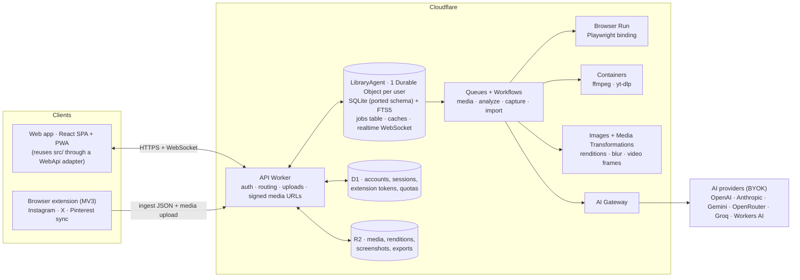

# Shelfy online — platform decision & migration analysis

> **Superseded in part (2026-10-02).** The platform is now self-hosted on the osn VPS, with a Rust core: see the plan of record, [IMPLEMENTATION-PLAN.md](IMPLEMENTATION-PLAN.md).
> - Kept for reference only: sections 2–3, 4.x (the Cloudflare mappings), 10 and 11.
> - Still valid: the feature analysis, risks and defects (§5–§8).
> - Product decisions (§12) still apply, except the "auth via Cloudflare Access" consequence of decision 1. Auth is native to the app (invite-only, passkeys + magic links); Access gates only the owner-only phase P0–P1.

> Status: proposal, 2026-10-02. Input: the [feature index](README.md) (381 features, `dev` working tree). Platform facts (limits, prices) were checked against the vendors' docs on 2026-10-02.

## 1. Summary

- **Platform:** a custom backend on **Cloudflare** — Workers, Durable Objects with SQLite (one per user, via the Agents SDK), R2, Queues/Workflows, Containers, Browser Run and AI Gateway. **Not Supabase, not Convex.**
- **Why:** Shelfy is a per-user SQLite library with heavy media, plus jobs that need native binaries and a headless browser.
  - A SQLite Durable Object per user keeps the engine, the SQL dialect and the synchronous API of `better-sqlite3`.
  - The 6.2k-line `db.ts` gets an adapter instead of a rewrite, and the multi-tenant key problem disappears.
  - R2 has zero egress on gigabytes of video.
  - Containers and Browser Run are needed anyway. Supabase or Convex would add a second platform without removing that need.
- **Social sync moves into a browser extension (MV3).** It reuses `webview-injected.ts`, and platform cookies never leave the user's browser. There is no server-side path for Instagram saved posts: no API exists, and replaying cookies from datacenter IPs endangers the user's account.
- **AI:** local models (VLM, e5 embedder, Whisper) are dropped. A server-side provider layer covers chat, vision, embeddings and STT, with BYOK keys encrypted at rest and calls routed through AI Gateway.
- **Portability:** of the 381 features:

  | Bucket | Features | Share |
  |---|---|---|
  | Port directly | 208 | 55% |
  | Need platform infrastructure (jobs, browser, containers, extension, AI API) | 89 | 23% |
  | Need a redesign | 30 | 8% |
  | Are desktop-only and get dropped | 54 | 14% |

## 2. Platform decision

| Criterion | Cloudflare (custom backend) | Supabase | Convex |
|---|---|---|---|
| Port of `db.ts` | **Same engine.** Durable Object SQLite has a synchronous `sql.exec`, FTS5, JSON and math. `INSERT/UPDATE OR IGNORE`, `unixepoch()`, `rowid`, `HAVING` aliases and the bare `GROUP BY` column run unchanged. | Postgres rewrite of the whole query layer: `LIKE`→`ILIKE`, `UPDATE OR IGNORE` has no equivalent, aliases, `unixepoch()`, `RETURNING`… | Full rewrite to a document model. Limits: 1 s per query, 32k documents scanned per transaction. IDF full scans over 10k+ posts don't fit. |
| Multi-tenancy | One database per user. Today's global keys (`posts.id`, `tag_alias`, `jobs`) stay valid as they are. In-process caches become per-user DO memory. | `user_id` added to every PK and index, plus RLS and per-user caches | per-user indexes on every table |
| Media (GBs per user, video) | R2 $0.015/GB-month, **egress free**. Images binding for renditions. | Storage $0.0213/GB over 100 GB; egress $0.09/GB over 250 GB | Storage $0.03/GB; egress $0.12/GB over 50 GB |
| yt-dlp / ffmpeg / Chromium | Containers + Browser Run (Playwright binding) + Media Transformations, on the same account | Not possible (Edge Functions) → second vendor | Not possible → second vendor |
| Job orchestration | Queues, Workflows, DO alarms | `pg_cron`, `pgmq`, Edge Functions | scheduled functions, actions (10 min on Node) |
| Realtime (15 push channels) | DO WebSocket / Agents SDK state sync, multi-device | Realtime | native reactivity (best) |
| Vector search (net-new) | int8 BLOBs in per-user SQLite, or Vectorize (1536 dims, namespaces) | **pgvector (best)** | at most 256 results, one vector field |
| Auth | to build (Better Auth on D1, or Cloudflare Access) | **built in** | Convex Auth / Clerk |
| Existing assets | Account, `niccolofanton.dev` zone and the feedback Worker are already there | new vendor | new vendor |

**Trade-offs we accept:**

- There is no turnkey auth.
- Vector search is less ergonomic than pgvector, but it is not needed for parity.
- Cross-user analytics are harder; Analytics Engine covers them if ever needed.

**Supabase would win** for a product centred on cross-user SQL analytics or with an existing Postgres team. Neither applies.

## 3. Target architecture

### Desktop module → cloud component

| Desktop (`electron/`, `src/`) | Cloud |
|---|---|
| Main process: the single-threaded owner of the DB, queues and caches | `LibraryAgent` Durable Object, one per user — same single-threaded model |
| `db.ts` (better-sqlite3) | Same SQL behind a thin adapter (`prepare().all/get/run` → `sql.exec().toArray()/one()`, transactions → `ctx.storage.transactionSync()`) |
| `ipc.ts` + `preload.ts` (155 invoke channels) | `@callable` RPC methods on the agent, plus HTTP endpoints for uploads and media |
| 15 push channels (`webContents.send`) | One typed WebSocket stream per user (`broadcast` / state sync), shared by all devices |
| `jobs` table + in-memory queues | `jobs` stays the source of truth inside the DO. Heavy work is dispatched to Queues/Workflows; DO alarms handle scheduling and retries. |
| `asset://` + `thumbs.ts` (`?w=`) | R2 keys, short-lived signed URLs verified by the Worker, and a 640 px WebP rendition plus blur data URI generated **at ingest** (Images binding) |
| `<webview>` + `webview-injected.ts` + `browserScripts.ts` | MV3 extension (MAIN-world content scripts reused) |
| In-page parsers, `browserSanitize.ts`, `browserUrls.ts` | Shared `core` package, run in the extension **and** re-validated server-side |
| `downloader.ts` (yt-dlp/ffmpeg) | The extension uploads media; a container (yt-dlp + ffmpeg) is the server-side fallback |
| `analyzer.ts` (llama.cpp VLM) | Provider layer via AI Gateway; one Workflow per post |
| `embeddings.ts` (e5-small) | Provider embeddings API (tag clustering only) |
| `stt.ts` (whisper.cpp) | Provider speech-to-text (one-shot) |
| `webcapture-playwright.ts`, `web-enrich.ts`, `weborchestrator.ts` | Browser Run Playwright binding inside Workflows; enrichment code reused |
| ffmpeg (frames, WebP, bands) | Media Transformations (frames), Images binding (resize/WebP), Playwright `clip` bands; container only as a fallback |
| `net-safety.ts` | Kept, plus DNS-aware checks on server fetch paths |
| `feedback.ts` + `workers/feedback` | Worker kept; adds auth, Turnstile and MIME checks |
| `updater.ts`, `binaries.ts`, `hardware.ts`, model downloads, `capture-mvp.ts`, OSR engine | Dropped |

## 4. Port plan by area

### 4.1 Library data & API (area 1)

**What survives unchanged:**

- the schema (12 tables)
- the SQLite-only syntax
- the global primary keys, safe because each database belongs to one user
- the `jobs` table as the queue's source of truth

**Required changes:**

1. **Search.** The `word_match` JS UDF can't be registered in DO SQLite. Add an FTS5 table (`unicode61`, `remove_diacritics`) to select candidates, and keep the whole-word and IDF scoring in TS over the candidate set (the DO holds the data and the caches).
2. **Bound parameters.** At most **100 bound parameters** per statement; today chunks go up to 500 ids. Use `IN (SELECT value FROM json_each(?))` with one JSON parameter.
3. **Migrations.**
   - Replace `PRAGMA user_version` with a `_schema_version` table.
   - Drop WAL and checkpoint pragmas.
   - `BEGIN`/`SAVEPOINT` aren't allowed in `exec`, so use `transactionSync`.
4. **Atomic writes.** Make `upsertWebReference`, `addManualBookmark` and `importFromJSON` single transactions.
5. **Paths → object keys.** Rewrite absolute paths to R2 keys: `posts.*_path`, `post_media.local_path`, manual `source_url`, and inside `web_pages_json` / `web_snapshots.web_pages_json`.
6. **Canonical identity.** Normalize Instagram ids (`pk` vs `pk_owner` vs shortcode) and add `UNIQUE(platform, shortcode)`. Key Pinterest boards by their numeric id.
7. **Lists.**
   - Project the list columns, so `web_pages_json` stays out of `getPosts`.
   - Use keyset cursors.
   - Add a "bulk action by filter" so "select all" no longer ships 100k ids.
8. **Server trust boundary.**
   - Whitelist ingest fields server-side and never accept paths or storage keys from clients.
   - Treat batch payloads as untrusted; the platform is declared by the page today.
9. **Export v2** (zip with media and a manifest), which is also the desktop → cloud migration vehicle (§6).

**Limits that fit:**

| Item | Limit | Shelfy today |
|---|---|---|
| DB size | 10 GB per DO | ~50–150 MB per 10k posts |
| Row size | 2 MB | web rows are 20–300 KB |
| Memory | 128 MB per isolate | per-user IDF and tag caches fit |
| CPU | 30 s per request, configurable to 5 min | heavy work goes to Workflows |
| Backups | point-in-time recovery, 30 days | covers backups |

### 4.2 Social sync & downloads (area 2)

- **Engine:** an MV3 extension, Chrome-family first (Chrome, Edge, Brave, Arc), Firefox next, Safari later (needs an Xcode wrapper).
  - Manifest `content_scripts` with `world: "MAIN"` and `run_at: document_start`.
  - Reused as-is: `webview-injected.ts` (fetch/XHR hooks, parsers, Pinterest SSR replay, X DOM fallback) and `webview-select.ts` (selection overlay). Both already fall back to `postMessage`.
  - `browserScripts.ts` must become functions or files: MV3 rejects code strings.
- **Orchestration** runs in a dedicated tab or window, not the service worker (MV3 suspends idle workers). The termination rules of `useBrowserSync`/`useSourceSync` and `buildSyncSteps` are reused.
- **Ingest:**
  - sanitized batches go to `POST /ingest`, are validated again server-side with the shared sanitizer, and land in the DO via `bulkUpsert`
  - every write is idempotent on the canonical `(platform, id)`
  - new: incremental sync, with per-source watermarks and "stop after N known items"
- **Media:**
  - The extension fetches CDN images and **direct video URLs** and uploads them to R2: IG `video_versions`, X `video_info.variants`, Pinterest MP4. The parsers drop those URLs today, so keeping them is the first code change.
  - Signed IG URLs expire, so bytes are captured right after ingest.
  - Uploads over 100 MB use R2 multipart (the Worker request-body limit is 100 MB on Free/Pro zones).
- **Server fallback:** a container with yt-dlp + ffmpeg, anonymous only, for public X and Pinterest, re-downloads of expired media, and links added from mobile.
  - Instagram from datacenter IPs is high-risk, so best effort only.
  - **Platform cookies are never stored server-side.**
- **Pairing:** the web app hands the extension a scoped, revocable ingest-only token (`externally_connectable` + token exchange).
- **Official connectors (optional, later):** Pinterest API v5 (boards, sections and pins, server-side OAuth). X API v2 bookmarks is paid and capped at about 800, so it's not planned.
- **Mobile:** no extension. The library is read-only, plus a Web Share Target to add a single URL (server-side fetch of public metadata + container fallback).
- **Dropped:** webview session plumbing, `interceptor.ts`, `binaries.ts`, the `capture-mvp.ts` spike (the extension replaces capture-on-view), and the duplicate parsers in `ig-parser.ts`/`tw-parser.ts`.

### 4.3 AI (area 3) — local models → third-party providers

| Today (local) | Task | Online replacement |
|---|---|---|
| Qwen3-VL 4B/8B, Gemma 4 (llama.cpp) | cataloging, screenshot QC, chat search, query→tags, cluster naming, aliases | vision LLM with multi-image input and JSON-schema output (any provider; the user chooses) |
| multilingual-e5-small (384 dims) | tag clustering weights only (low impact) | provider embeddings API, or drop |
| Whisper base/small/large-v3-turbo | voice dictation | provider STT (one-shot) |
| ffmpeg | 4 keyframes per video, 448 px stills, QC crop | Media Transformations `frame`/`spritesheet` (input ≤100 MB, ≤10 min), Images binding for stills, container fallback |

**Provider layer** (server-side, replacing `ai-providers.ts`):

- **Capabilities:** chat (streaming), vision, embeddings and STT.
- **Adapters:**
  - OpenAI-compatible: OpenAI, OpenRouter, Groq, Workers AI
  - native Anthropic and native Gemini — the current URL logic breaks Gemini's compatible path
- **Routing:** through AI Gateway, which adds logs, caching, rate limits and fallback.
- **Keys:**
  - BYOK keys are encrypted with AES-GCM under a master key in Secrets Store and kept in the user's DO.
  - They are write-only from the UI, as today.
  - AI Gateway's own stored keys are account-level, so they only fit a "managed key" mode.

**Coverage:** all 7 LLM call sites get a remote route; today 3 of them have none (query→tags, cluster naming, aliases).

**Per-post pipeline (Workflow):**

1. Read the media from R2.
2. Extract frames and stills.
3. Make one vision call with the existing `video_catalog` / `web_catalog` schemas (they are strict-compatible).
4. Apply the result in the DO with `applyAiAnalysis` (tags, entities, aliases).

Each step retries on its own.

**Search:** ported as-is — the LLM picks from the user's real tags, plus SQL ranking with FTS5 for candidates. Semantic search is **net-new**: about one int8 vector per post stored in the per-user SQLite, brute-force cosine after the SQL pre-filter (10³–10⁴ vectors per user). It's planned after parity.

**Dictation:** redesigned to a single recording → one STT call. Today the full buffer is re-sent every 1.2 s, so paid audio grows with the square of speech time (60 s ≈ 25 min billed). The STT language follows the UI locale.

**Cost (tokens, measured from today's prompts):**

| Action | Volume |
|---|---|
| Cataloging | ≈1.5–2.4 M input + 0.15–0.35 M output tokens per 1,000 multi-image posts |
| Website screenshot QC | 6–16 calls per site |
| Chat search | ≈1.2–1.5 k tokens of system prompt per turn; history needs truncation |

**Dropped:**

- the llama, whisper and embedder sidecars
- `hardware.ts`
- model catalogs and downloads, concurrency and tuning settings
- Pi discovery, the Tailscale check and the Keychain

Onboarding becomes "connect a provider" plus consent to send saved media to that provider.

### 4.4 Websites capture & imports (area 4)

- **Capture:** the Browser Run **Playwright binding** (not the REST quick actions), one session per page, driven by Workflows.
  - Session budget: today a page takes ≤150 s; Browser Run allows ≤10 min with `keep_alive`.
  - Concurrency: today's pool is 4 pages per site; Paid includes 10 concurrent browsers, then $2 per extra.
  - The prep IIFEs (cookie banners, animation kill, autoscroll, GSAP, flatten) run verbatim through `page.evaluate`.
  - The palette, font and tech probes stay in the live page.
- **Replacing ffmpeg:**
  - 2000 px bands come from Playwright `clip`, so no cropping.
  - WebP encoding uses the Images binding.
  - Flat-tail trim and frame diff move to wasm, or are dropped.
- **Discovery** (robots, sitemaps): plain `fetch` in a queue consumer.
- **Lost:**
  - GPU-quality WebGL (software rendering)
  - logged-in captures (no cookies server-side)
  - the Electron OSR fallback engine
- **SSRF:**
  - Worker `fetch` can't reach private networks unless explicitly connected, so the blast radius is smaller than on a VM.
  - Still keep the scheme/host/port and per-redirect checks, block metadata hostnames, and rate-limit per user.
  - Decide the robots `Disallow` and User-Agent policy: today robots is ignored and the UA is spoofed.
- **Imports:**
  - Manual bookmarks keep the File API and client-side previews (canvas, pdfjs).
  - The ≤500 MB IPC payload becomes chunked uploads to R2 plus a "finalize" call.
  - Serve user uploads from an isolated origin.
  - JSON import gets fixed (non-IG posts become `twitter` today, and `web_*`/`user_*` are lost), is versioned (v2 bundle), and is parsed in a background job.
- **Favicons:** store them at capture time. Today they're hot-linked from Google's favicon service, which leaks the user's site list.

### 4.5 App shell, UI & settings (area 5)

- **SPA reuse:** a `WebApi` implements the existing `ElectronAPI` interface (`types/electron-api.d.ts`; 39 renderer files use 162 of its 173 members).
  - `invoke` calls become agent RPC; `on*` events become WebSocket events.
  - Desktop-only members become flagged no-ops.
  - Views and hooks stay almost untouched.
- **New:**
  - URL routing (today navigation is in-memory state)
  - responsive layout and touch: long-press selection, pinch on the canvas, a drawer sidebar
  - PWA: manifest, service worker, `share_target`, Web Push on job completion
  - a React error boundary
- **Settings:**
  - localStorage and `userData` JSON become per-user settings in the DO, synced across devices.
  - The AI cards become provider configuration.
  - Updates, Runtime, Performance and the model pickers are dropped.
- **Security:**
  - a strict CSP header (it is likely not applied today in the packaged `file://` build)
  - per-user signed media URLs
  - auth on every endpoint
  - Turnstile on signup and feedback
- **i18n:** the engine and its 30 namespaces are reused as-is. The server returns error codes, not Italian prose.

## 5. Dropped (desktop-only, 54 features)

Grouped:

- **Local AI:**
  - VLM, Whisper and embedder sidecars, idle stop
  - model catalogs and downloads, onboarding downloads
  - hardware probe and tuning, concurrency settings
- **Runtime binaries:** yt-dlp/ffmpeg provisioning, platform packs, Windows ffmpeg download.
- **Updater:** stable/beta channels, macOS DMG flow, Windows self-rebuild, Linux notice.
- **Window chrome:** frameless controls, drag regions, app menu, mic permission handler.
- **Local file actions:** `shell.openPath`, `showItemInFolder`, the `asset://` protocol, session CSP.
- **Engines and spikes:** the OSR capture engine, the `capture-mvp.ts` spike, Pi/Tailscale/Keychain provider plumbing.

## 6. Data migration (desktop → cloud)

1. Fix export/import first:
   - non-IG posts are relabelled `twitter` (`electron/db.ts:5101`)
   - `userNote`, `userTags` and `web_*` are dropped
   - snapshots, aliases and clusters are not exported
2. Add **export v2**: a zip with the DB rows, media and a manifest. Because the cloud DB is also SQLite, rows can be imported almost verbatim.
3. The server-side importer (a Workflow):
   - uploads media to R2
   - rewrites every path, including the JSON blobs
   - dedups by canonical id
   - rebuilds `post_tags` and the FTS index
4. Optional: a "Move to Shelfy Cloud" button in the desktop app that streams the bundle.

## 7. Defects found during indexing that matter for the port

| # | Defect | Ref |
|---|---|---|
| 1 | JSON import turns Pinterest, web and manual posts into `twitter` | `electron/db.ts:5101` |
| 2 | Instagram id is not canonical and has no `UNIQUE(platform, shortcode)`, so duplicates are possible | area 1 risk 4, area 2 risk 4 |
| 3 | Three multi-step writes are not atomic | `db.ts:2422`, `:2763`, `:5137` |
| 4 | Bulk "analyze missing" applies the social prompt to websites | area 3 |
| 5 | Onboarding never activates the models it downloads | `AiOnboarding.tsx:510-548` |
| 6 | Websites panel lists only the 500 **oldest** sites | `src/views/AiWebsites.tsx:1804` |
| 7 | Capture bands after the hero are never deleted (disk leak) | area 4 |
| 8 | Login fallback for private videos removed in the working tree (HEAD still has it): those videos now error | `electron/downloader.ts` |
| 9 | Security on desktop: • `asset://` serves all of userData, including the DB and the cookie store • the API key is passed in argv to `security` • the feedback Worker has no auth/CORS • the Windows update runs with `-ExecutionPolicy Bypass` | areas 1, 3, 5 |
| 10 | `docs/ai-providers.md` (untracked) contains a private Tailscale IP and the `ORNITH_API_KEY` name — clean it before committing to the public repo | `docs/ai-providers.md:36` |

## 8. Risks

| Risk | Impact | Mitigation |
|---|---|---|
| ToS and copyright: automated collection plus hosting copies of third-party media in the cloud | high (public launch) | per-user private storage, takedown process, privacy policy/GDPR, legal review before going public |
| Platforms change their internal APIs or DOM | sync breaks | parsers versioned in `core`, server-side validation; extension auto-update through the store |
| Datacenter IPs blocked for server-side downloads | videos missing | extension-first media; container fallback only for public X/Pinterest |
| Chrome Web Store review (broad host permissions, MAIN-world scripts on social sites) | delayed launch | single-purpose justification, minimal permissions, unlisted distribution first |
| AI cost per user | the user's bill | BYOK, per-user quotas, "analyze" stays opt-in, dictation one-shot |
| Mobile without an extension | sync is desktop-only | share target + read-only library |
| Volume: tens of GB per user with full video archives | storage | covers by default, full media opt-in per source, R2 Infrequent Access for old media |

## 9. Phases

| Phase | Scope | Size |
|---|---|---|
| 0 Foundations | Monorepo (`core`, `web`, `api`, `extension`); Worker + `LibraryAgent` + schema port; auth; R2 + signed media; `WebApi` adapter; CI/deploy to staging | M |
| 1 Library parity | Gallery, filters, collections, tags, FTS5 search, post modal, settings; export v2 + desktop→cloud importer | M |
| 2 Sync extension | IG/X/Pinterest capture, media upload, canonical ids, incremental sync, realtime Activity Center | L |
| 3 AI | Provider layer + key vault, per-post Workflow, frames, tags/clusters/aliases, AI Search chat, dictation | M |
| 4 Websites & fallback | Browser Run capture pipeline, SSRF, manual uploads, yt-dlp container | M |
| 5 Hardening | PWA/share target, quotas and rate limits, observability, PITR runbooks, legal pages | S–M |

## 10. Infrastructure cost (indicative, excluding AI)

| Item | Price | Heavy user (10k posts) |
|---|---|---|
| Workers Paid (required for Containers) | $5/month per account | — |
| R2 storage | $0.015/GB-month, egress free | covers + images ≈ 2–5 GB → $0.03–0.08/month; full video archive 20–100 GB → $0.30–1.50/month |
| DO SQLite | 5 GB-month included, then $0.20/GB | ~50–150 MB → included |
| Media Transformations | 5k unique ops/month free, then $0.50 per 1k | for 5k videos, one-off: 1 spritesheet per video ≈ $0; 4 separate frames per video ≈ $7.5 |
| Browser Run | 10 h/month included, then $0.09/h | ~3–12 browser-minutes per site → ~50–200 sites/month included |
| Containers | per vCPU-s / GiB-s; 375 vCPU-min/month included | fallback only |
| AI providers | BYOK (user's own account) | cataloging ≈1.5–2.4 M input tokens per 1k posts |

## 11. Cloudflare requirements

| Product | Use | Plan |
|---|---|---|
| Workers + Static Assets | API + SPA | Paid |
| Durable Objects (SQLite) + Agents SDK | per-user library, RPC, realtime | Free/Paid (Paid: storage beyond 5 GB) |
| D1 | accounts, sessions, extension tokens, quotas | Free/Paid |
| R2 | media and exports | requires R2 enabled |
| Queues, Workflows | jobs | Free/Paid |
| Containers | ffmpeg, yt-dlp | **Paid only** |
| Browser Run | website capture | Paid (Free: 10 min/day) |
| Images (binding) + Media Transformations | renditions, blur, video frames | Transformations enabled on the zone |
| AI Gateway (+ optional Workers AI) | provider routing | Free |
| Secrets Store | master encryption key, platform keys | — |
| Turnstile, Rate Limiting binding | abuse protection | — |
| DNS / Workers Custom Domain | `shelfy.niccolofanton.dev` (staging) | zone `niccolofanton.dev` |
| Email Service or the existing Resend | auth emails, feedback | — |
| Access (Zero Trust) | auth for the owner and invited users (decision 1) | Zero Trust Free (≤50 users) |

## 12. Product decisions (2026-10-02)

| # | Decision | Consequence |
|---|---|---|
| 1 | **Audience: personal + invited users**, not a public service | Auth through Cloudflare Access (Zero Trust Free, ≤50 users); no signup, billing or public quotas. Keep `user_id`-ready boundaries (one DO per user) so opening up later stays possible. Lower legal exposure (no public hosting of third-party media). |
| 2 | **AI keys: BYOK per user only** | No platform AI spend. Keys are encrypted server-side and write-only in the UI. AI Gateway is used for routing, logging and rate limits, without stored account keys. |
| 3 | **Desktop app stays**, with a shared core | Monorepo with a `core` package (types, parsers, sanitizers, prompts/schemas, cluster-core) shared by desktop, web, API and extension. The desktop keeps local AI; export v2 doubles as the desktop → cloud bridge. |
| 4 | **Sync only from the desktop-browser extension** | Mobile = browse + Web Share Target to add links. No server-side use of platform cookies. |
