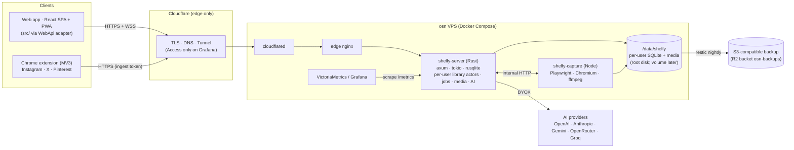

> **Superseded (2026-10-02)** by [../IMPLEMENTATION-PLAN.md](../IMPLEMENTATION-PLAN.md), an independent plan adopted after the comparison in [plan-comparison.md](plan-comparison.md). Kept only as the review record; do not implement from this file.

# Shelfy Web — implementation plan (self-hosted, Rust core)

> Status: proposal, 2026-10-02. It supersedes the Cloudflare-native platform choice in [ONLINE-MIGRATION.md](../ONLINE-MIGRATION.md). That document's feature analysis, risks and product decisions (§12) still apply.
>
> Inputs:
> - the [feature index](../README.md) (381 features)
> - the osn VPS infrastructure (Docker Compose + Ansible + SOPS + restic + Cloudflare Tunnel/Access + Grafana/VictoriaMetrics)

## 0. Principles

1. **Self-hosted on the osn VPS** (Hetzner CX33: 4 vCPU, 8 GB RAM). There is no vendor lock-in at the application level.
   - Cloudflare is used only as the edge: Tunnel, Access, DNS. It can be replaced by Caddy + Authelia/oauth2-proxy without touching app code.
   - Backups go to any S3-compatible store.
2. **Rust where performance and footprint matter:** the server core (API, realtime, per-user databases, search, jobs, media pipeline, AI layer). **The goal is to maximize the number of users a small VPS can serve** (see §6.1): low RAM per active user, efficient media CPU, no GC pauses.
   **TypeScript where the platform demands it:**
   - the SPA (reuses `src/`)
   - the browser extension (reuses `webview-injected.ts`)
   - the website-capture sidecar: Playwright on Node, reusing `webcapture-playwright.ts` and `web-enrich.ts`
3. **One SQLite database per user** (rusqlite, bundled SQLite with FTS5), owned by a single-writer actor. These are the same semantics as today's Electron main process, without its single-user limits.
4. **Performance by design, verified by numbers.** Every phase has budgets (§12) that CI checks.
5. **The desktop app stays.**
   - The two products share contracts: JSON schemas, golden fixtures for parsers and ranking, AI prompts and schemas.
   - Later, the `shelfy-core` crate can replace `db.ts` inside Electron through napi-rs, giving one core and two shells.

## 1. Architecture



| Component | Tech | Responsibility | Limits on the VPS |
|---|---|---|---|
| `shelfy-server` | Rust: tokio, axum, rusqlite (bundled, FTS5), serde, reqwest (rustls), tracing, metrics; child processes ffmpeg + yt-dlp | Auth, RPC API, WebSocket events, per-user library actors, durable jobs, media ingest/renditions/serving, AI provider layer, static SPA | `mem_limit: 1.5g` (ffmpeg/yt-dlp children included), `cpus: 2` |
| `shelfy-capture` | Node 22, Playwright, chromium-headless-shell, ffmpeg | Website capture only (no cookies), driven by the server over internal HTTP | `mem_limit: 2g`, `cpus: 1.5`, 2 pages in parallel |
| SPA | React 18 + Vite; reuses `src/` views, components, hooks and i18n | UI. `window.electronAPI` is replaced by a typed `WebApi`. | static, immutable hashed assets |
| Extension | MV3, TypeScript | Sync from the user's logged-in browser, media capture and upload | Chrome first |

**Per-user library actor** — the Electron main process, per user:

- **Writes:** one dedicated thread owns the write connection (WAL) and receives commands over a channel.
- **Reads:** a small pool of read-only connections (WAL lets reads run concurrently).
- **Memory:** per-user caches (IDF, tag counts, alias map — the same ones that are process-global today) and a broadcast channel for events.
- **Idle:** idle libraries close after 15 minutes.

## 2. Repository layout (monorepo in this repo)

```
crates/
  shelfy-core/      domain types, schema + migrations, queries, FTS ranking, tag logic,
                    platform parsers (raw JSON → Post), AI prompts/validators, job model
  shelfy-media/     probing, renditions (WebP), thumbhash, ffmpeg/yt-dlp wrappers
  shelfy-ai/        provider clients (OpenAI-compatible, Anthropic, Gemini), streaming, STT
  shelfy-server/    axum app: auth, RPC, WebSocket, actors, scheduler, uploads, media serving, metrics
  shelfy-import/    desktop library importer (reads a desktop shelfy.sqlite + assets)
apps/
  desktop/          current Electron app (moved, unchanged)
  web/              SPA build target (shared src/ + WebApi adapter + PWA)
  extension/        MV3 extension
  capture/          Node capture sidecar
packages/
  contracts/        TS types generated from Rust (ts-rs), JSON schemas, AI prompt/schema files
fixtures/           golden fixtures: recorded platform payloads → expected posts; ranking cases
```

Tooling: a Cargo workspace plus a pnpm workspace.

## 3. Data model (server schema v1)

Start from the desktop schema (12 tables, see [01-library-data-and-ipc.md](../features/01-library-data-and-ipc.md)) and fix the defects found during indexing.

| Change | Why |
|---|---|
| `posts.native_id` with `UNIQUE(platform, native_id)`; unique IG shortcode; canonical id at ingest | Duplicates today: IG id varies by capture path |
| Content-addressed `blobs(sha256, mime, bytes, w, h, duration)`; `post_media` references blobs | No absolute paths, deduplication, immutable URLs, paths never come from clients |
| `post_fts` (FTS5: text, author, AI description, tags, keywords, entities, note) kept in sync in the write path | Replaces `LIKE` + the JS UDF. The IDF/tag ranking is ported on top of `bm25()`. |
| `sources(platform, external_id, name, cursor_watermark, last_sync_at)` | Incremental sync, rename-safe Pinterest boards |
| `jobs(id, kind, key, state, attempts, next_run_at, progress, error, payload)` | A durable queue, not an in-memory mirror |
| `settings`, `activity`, `api_tokens`, `ai_providers` (keys under AES-256-GCM) | Moves localStorage, userData JSON and Keychain into per-user data shared across devices |
| Timestamps as INTEGER epoch ms | Replaces ISO TEXT with `''`/NULL sentinels |
| `system.sqlite`: users (email, role, quotas), passkeys, sessions, invitations, magic-link tokens, blob refcounts | The only global state |

Kept as they are: `collections`, `post_collections`, `post_tags`, `post_entities`, `tag_alias`, `tag_cluster*`, `web_snapshots` (with blob references).

**Disk layout** (blobs are global and deduplicated, §6.1):

```
/data/shelfy/
  system.sqlite
  users/<uid>/library.sqlite
  blobs/<aa>/<sha256>
  renditions/<aa>/<sha256>-<w>.webp
  tmp/
  snapshots/
```

## 4. API and realtime contract

- **Calls:** `POST /api/rpc/<method>` with a JSON body. Method names follow `ElectronAPI` where they still make sense, so the SPA adapter is a thin map.
  - Of the 155 invoke channels, about 40 desktop-only ones are dropped: updater, binaries, models, hardware, shell, dialog, webview scripts.
  - The rest are implemented phase by phase.
- **Events:** `GET /api/events` is a WebSocket carrying typed events. It replaces the 15 push channels and the 5 s polling of the Downloads view, and it is shared by all of a user's devices.
- **Media:** `GET /m/<sha>/<variant>` serves files with Range support, `ETag = sha` and `Cache-Control: private, max-age=31536000, immutable`.
- **Uploads:** resumable. `POST /api/uploads` → `PUT /api/uploads/<id>` with ≤ 50 MB chunks (Cloudflare's 100 MB body limit) → `POST …/complete`, which verifies the sha256.
- **Extension:** `/api/ext/*` uses a scoped bearer token per user, with per-user rate limits.
- **Auth: native to the app, invite-only.** This replaces Cloudflare Access for the app, whose free tier caps at 50 users with per-seat pricing beyond, and which would be lock-in.
  - Sign-in is by email magic link (Resend) or passkey (`webauthn-rs`).
  - Sessions are opaque, HttpOnly, SameSite=Lax cookies stored in `system.sqlite`.
  - Signup only through invitation links created by the admin.
  - Rate limits and lockout on login endpoints.
  - Access stays only on the admin surfaces (Grafana).
- **Types:** Rust DTOs generate TS types (ts-rs) into `packages/contracts`, and the SPA adapter is typed end to end.

## 5. Media pipeline

1. **Sources:**
   - extension uploads (images seen in the feed, videos from the direct URLs in the platform JSON)
   - the desktop importer
   - manual uploads
   - capture sidecar artifacts
   - server fetch of covers
   - yt-dlp fallback
2. **Ingest:** stream to `tmp/` → sha256 → if the global blob already exists, only add a reference; otherwise move it to the blob path → probe (image header / `ffprobe`) → renditions at 320 and 640 px WebP (1280 px only when the original is larger than 2 MB) → **thumbhash** (≈25 bytes, replacing the 24 px JPEG data URI) → DB.
3. **Serving:** immutable URLs (browser cache hits on revisits), `srcset` per density step, video posters, Range requests for hover previews.
4. **Rules:**
   - never trust client paths
   - per-user quotas
   - MIME sniffing on upload
   - user uploads served with `Content-Disposition` and a strict CSP

## 6. Jobs and concurrency budget (4 shared vCPU)

| Pool | Concurrency | Notes |
|---|---|---|
| CPU (renditions, thumbhash, parsing) | 2 | `spawn_blocking` under a semaphore |
| ffmpeg | 1–2 | `nice 10` |
| yt-dlp | 2 | anonymous only, per-platform pacing, fallback only |
| Network fetch (covers) | 8 | per-host limits, IG/Pinterest jitter |
| AI calls | per provider (default 4) | backoff on 429 |
| Website capture | 1 site / 2 pages | sidecar |

- Pools are global, with **round-robin across users** so one heavy library can't starve the others.
- The scheduler lives in each user's actor, with retries and exponential backoff, pause/cancel, and progress over WebSocket.
- The `jobs` table is the source of truth, so jobs resume after a restart.
- **Per-user quotas** (configurable): storage, imported posts per day, website captures per day, on-demand video downloads per day.

### 6.1 Capacity model (users per VPS)

The design target is the maximum number of users on a CX33 (4 vCPU, 8 GB, 75 GB disk). Shelfy's own budget is ~3.5 GB of RAM and 2–3.5 vCPU, next to hermes and observability.

| Resource | Cost per user (estimate, to validate in F5 load tests) | What it bounds on the CX33 |
|---|---|---|
| RAM (active user) | ~5–10 MB: open SQLite with a 2–4 MB page cache, caches, buffers. Idle libraries are closed after 15 min, so an idle user costs ~0. | ~100–200 concurrently active users inside the server's 1.5 GB |
| RAM (job peaks) | bounded by the global pools, not by the number of users | fixed ~300–500 MB |
| Disk | 10k posts with covers + images ≈ 1–3 GB (videos on demand); global dedup lowers it | **the binding limit**: ~15–40 users on the ~48 GB free disk; ~150–500 with a 500 GB volume (€28.60/month) |
| CPU | onboarding a 2k-post library ≈ 3–4 min of renditions on 2 cores; steady state is negligible; AI runs at the provider (BYOK) | onboarding throughput, not the user count |
| Website capture | 1–3 min of Chromium per page, 2 pages in parallel | captures/hour → per-user daily quota |

**How the cost per user is kept down:**

- **Global content-addressed storage:** `blobs/<sha256>` is shared across users and referenced per user, so a post saved by several users is stored once. Access control stays on the references.
- **Lean renditions:** keep the original plus 320 px and 640 px WebP only. The lightbox serves the original; 1280 px is generated only when the original is larger than 2 MB. thumbhash goes in the DB.
- **Small SQLite footprint:** `cache_size` of a few MB per DB, `mmap` off, WAL auto-checkpoint, lazy open.
- **Bounded memory:** mimalloc, bounded channels, streaming uploads and downloads (never a whole file in RAM).
- **No per-user processes:** one Rust process; users are cheap actors.

## 7. Sync extension

- **Reused:**
  - `webview-injected.ts` (fetch/XHR hooks; MAIN world, `document_start`)
  - `webview-select.ts` (selection overlay)
  - `browserScripts.ts`, rewritten as functions because MV3 rejects code strings
  - the termination and step logic of `useBrowserSync` / `useSourceSync`, driven from a tab
- **Raw JSON goes to the server; the parsers run in Rust.** Parser fixes ship with a server deploy, without a store review.
  - Rust/TS parity is proven with golden fixtures: recorded payloads → expected posts, generated by running today's TS parsers.
- **Media is captured by the extension:**
  - covers and images through a service-worker fetch with `host_permissions`, uploaded as resumable uploads
  - videos are on demand (decision 3): the parsers keep the direct video URLs (IG `video_versions`, X `video_info.variants`, Pinterest MP4) as hints, but the bytes are fetched only when requested
- **Incremental sync:** stop after N consecutive known items (per-source watermark).
- **Pairing:** Settings → "Connect extension" → a scoped token.
- **Distribution:** unpacked for the owner; Chrome Web Store unlisted for invitees.

## 8. AI layer (BYOK)

- **Providers:** OpenAI-compatible (OpenAI, OpenRouter, Groq), native Anthropic, native Gemini. Streaming over SSE, mapping of JSON-schema output, a timeout and retry policy, per-provider concurrency.
- **Prompts and schemas** move to `packages/contracts/ai/` as data files shared with the desktop (all 6 schemas are already strict-compatible).
- **Per-post analysis job:**
  1. Inputs: 448 px stills from the renditions, ffmpeg keyframes for videos, screenshot bands for websites.
  2. One vision call.
  3. Validate the output.
  4. Apply it in the actor: tags, entities, alias canonicalization.
- **Call sites:** all 7 LLM call sites get a remote route; today 3 are local-only.
- **Clustering:** `cluster-core.ts` (215 lines) is ported; embeddings are optional (low impact).
- **Dictation:** record in the browser → one STT call (fixes today's quadratic re-sending); the language follows the UI locale.
- **Keys:** AES-256-GCM with a master key from SOPS, never returned to the UI, with a rotation procedure.
- **After parity:** semantic search with `sqlite-vec` inside each user's SQLite (one vector per post, SQL pre-filter).

## 9. Website capture sidecar

- **Moved, not rewritten:** `webcapture-playwright.ts`, `web-enrich.ts` and the capture parts of `weborchestrator.ts`, exposed as `POST /capture` (internal network only) with progress over SSE and a JSON result. Artifacts are written under the user's `captures/` directory.
- **Removed:**
  - session-cookie mirroring
  - the Electron OSR engine
  - the Google favicon hotlink (favicons are stored at capture time instead)
- **SSRF:** DNS resolution plus a block on private, reserved, CGNAT, NAT64 and 6to4 ranges, checked on every request and redirect, including the browser's.
- **Screenshot QC** vision calls run in the Rust AI layer, which can ask the sidecar for a re-capture.

## 10. Deployment on the osn VPS

| Step | Where |
|---|---|
| `/data/shelfy` bind mount on the root disk (decision 2). A Hetzner Volume comes later via `ansible/roles/storage`. | `ansible/roles/app` |
| `shelfy-server` and `shelfy-capture` services (images pinned by digest, healthchecks, limits) | `compose.yml` |
| `shelfy.niccolofanton.dev` server block (WebSocket upgrade, `client_max_body_size 64m`, no buffering for media) | `edge/nginx.conf` |
| Tunnel ingress hostname | `ansible/roles/cloudflared` |
| DNS CNAME `shelfy` → tunnel. No Access app: auth is native to the app. | `tofu/cloudflare-access` (`dns.tf`) |
| Secrets: AI-key master key, session secret, capture shared token, Resend key for magic links (already in SOPS) | `secrets/osn.sops.yaml` |
| Generic backup role: nightly SQLite online backups → restic → R2 bucket `osn-backups`; restore drill | `ansible/roles/backup` |
| `/metrics` scrape, "Shelfy" dashboard, alerts (down, job failures, volume > 85%) | `observability/` |
| CI in this repo: cargo fmt/clippy/nextest, TS lint/typecheck/vitest, e2e, images pushed to GHCR | `.github/workflows` |
| Deploy: bump the pinned image digests in osn → `just apply --tags shelfy` | osn |

## 11. Phases

Durations assume one developer with AI assistance.

| Phase | Deliverables | Exit criterion | Indicative |
|---|---|---|---|
| **F0 Foundations** | Monorepo; Rust skeleton (config, tracing, metrics, Access auth, actors, migrations v1, RPC + WebSocket, SPA serving); WebApi adapter skeleton; Docker images; osn integration; CI | `shelfy.niccolofanton.dev` behind Access shows the SPA shell signed in; health and metrics visible in Grafana | 1–2 wk |
| **F1 Library on the web** | Desktop importer (reads `shelfy.sqlite` + assets, canonical ids, blobs, renditions, thumbhash, FTS); list, filter, sort, keyset paging, search, stats, collections, tags, notes, bulk-by-filter, delete; media serving; gallery and post modal on WebApi | **Your desktop library is browsable and searchable on the web**, within the §12 budgets; ranking parity with the desktop on the `search-eval` cases | 2–3 wk |
| **F2 Sync extension** | MV3 extension; pairing; raw ingest + Rust parsers (golden fixtures); media upload; watermarks; realtime Activity Center | A sync of IG saved posts, X bookmarks and Pinterest boards lands on the web with media | 3–4 wk |
| **F3 AI** | Provider layer + key vault; analysis jobs; tags, aliases, clusters; AI Search chat (streaming); query→tags; dictation | AI feature parity using your keys; cost per 1,000 posts measured | 2–3 wk |
| **F4 Websites & downloads** | Capture sidecar + SSRF; yt-dlp fallback; manual uploads; JSON import v2 | "Add site" and manual uploads work end to end | 2 wk |
| **F5 Hardening** | PWA (manifest, service worker, share target); backup + restore drill; dashboards and alerts; security review (CSP, tokens, rate limits); perf regression gate in CI | Restore drill passes; budgets enforced in CI | 1–2 wk |
| **F6 Desktop convergence** | napi-rs bindings; the desktop on `shelfy-core`; one-shot DB migration | Desktop e2e green on the Rust core; parity cases identical | 2–3 wk |

## 12. Performance budgets and verification

The test library is synthetic: 20k posts, plus your real imported library.

| Metric | Budget | Measured with |
|---|---|---|
| Gallery page (50 posts, filters) | p95 < 25 ms server-side | criterion benches + k6 |
| Full-text search | p95 < 40 ms | criterion + `search-eval` cases |
| Cached rendition response | < 5 ms server-side; browser cache hit on revisit | k6, DevTools |
| Gallery LCP | warm < 1.0 s, cold < 2.0 s (desktop broadband) | Playwright perf (`perf-gallery.spec.ts` adapted) |
| Scrolling a 10k-post grid | 60 fps, no long tasks > 50 ms | Playwright trace |
| Event latency (job progress → UI) | < 100 ms | e2e timing |
| `shelfy-server` idle RSS | < 100 MB | cAdvisor |
| RAM per active library | ≤ 10 MB | load test, RSS delta per opened library |
| Library cold open (idle → active) | < 20 ms | criterion |
| **Capacity load test** | 200 simulated active users (browse, search, ingest mix) inside 1.5 GB with the p95 budgets held | k6 scenario in F5 |
| Ingest (parse + upsert) | ≥ 500 posts/s | criterion |
| Renditions on 2 cores | ≥ 20 images/s | criterion |

SPA techniques:

- keyset pagination with an evicting window
- slim list DTOs (no `web_pages_json` in lists)
- thumbhash placeholders
- `srcset` + `fetchpriority` with lower overscan
- WebSocket push instead of polling
- route-level code splitting
- service-worker cache of the app shell and renditions

## 13. Risks

| Risk | Mitigation |
|---|---|
| Rewrite risk (TS → Rust: ~10–12k lines of portable logic out of 31k in `electron/`) | Golden fixtures; desktop/server parity tests on the same imported library; phase gates |
| Contention on a shared 8 GB VPS (hermes, observability) | Container limits, global pools, `nice`, capture concurrency of 2 pages |
| Datacenter IP blocks for server-side fetches | Extension-first media; yt-dlp is a fallback only |
| Chrome Web Store review | Unpacked for the owner, unlisted for invitees |
| Single VPS, no HA | Nightly backups to a different vendor, a tested restore, IaC clean-install |
| ToS / copyright | Private instance for invited users only, no public sharing of media |
| Auth is now in-app (larger security surface) | Passkeys first; single-use, short-lived magic links; login rate limits; security review in F5 |
| Resend free tier (100 emails/day) | Passkeys reduce emails; upgrade the Resend plan if needed |

## 14. Decisions (2026-10-02)

| # | Decision | Consequence |
|---|---|---|
| 1 | **Rust core + Node capture sidecar** | As in §1. Website capture keeps Playwright on Node. |
| 2 | **Media on the root disk for now**; a Hetzner Volume later | `/data/shelfy` lives on the root disk (~48 GB free after the Docker cleanup). Per-user quotas and the existing disk alert (≥ 85%) stay active. Moving to a volume later = attach + `rsync` + bind-mount switch, with no app change. |
| 3 | **Videos on demand only** | The extension captures covers and images seen in the feed; video bytes are not uploaded at sync. "Download video" works like this: (a) `shelfy-server` runs yt-dlp anonymously from the VPS; (b) if that is blocked or the link has expired, the request is queued for the extension, which fetches it from the user's browser and IP the next time it is active. This is today's desktop behaviour, so storage stays small. |
| 4 | **Desktop converges on the Rust core after F3** | Adds phase F6. `shelfy-core` is exposed to Electron through napi-rs and replaces `db.ts`, the parsers and the AI validators; the Electron shell, local models and the webview sync stay. One domain logic for web and desktop. |
| 5 | **The purpose of Rust is to maximize users per small VPS** | Native invite-only auth replaces Access (no 50-seat cap, no lock-in); global deduplicated blobs; lean renditions; per-user quotas and fair scheduling; a capacity model (§6.1) checked by a load test in F5. This supersedes the "auth through Cloudflare Access" consequence of decision 1 in ONLINE-MIGRATION §12. Invite-only stays. |

### F6 — Desktop convergence (after F3, indicative 2–3 wk)

- `crates/shelfy-node`: napi-rs bindings for the library actor API.
- The desktop calls it in place of `db.ts`.
- On first launch, a one-shot migration converts the desktop DB to schema v1 (the same code as `shelfy-import`).
- Exit criterion: the desktop e2e suite is green on the Rust core, and the ranking/search parity cases are identical between desktop and web.
